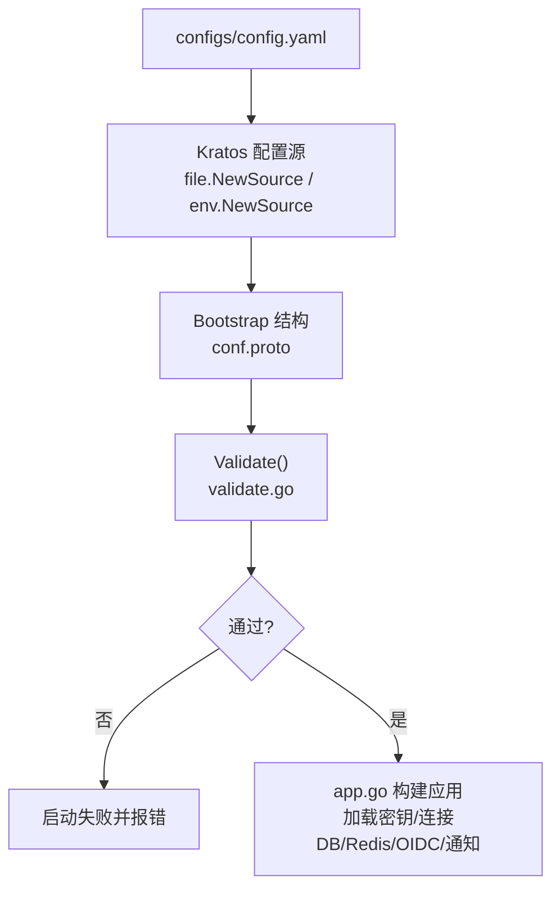
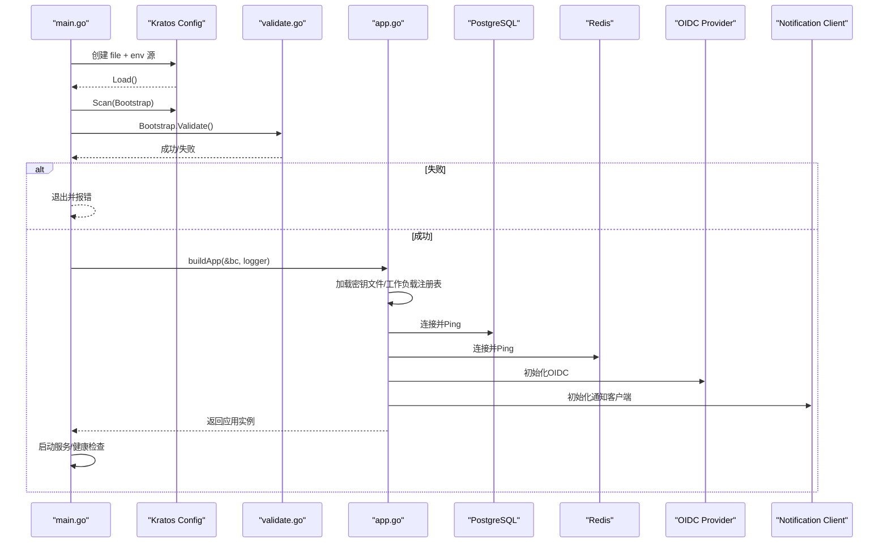
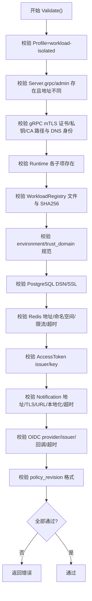
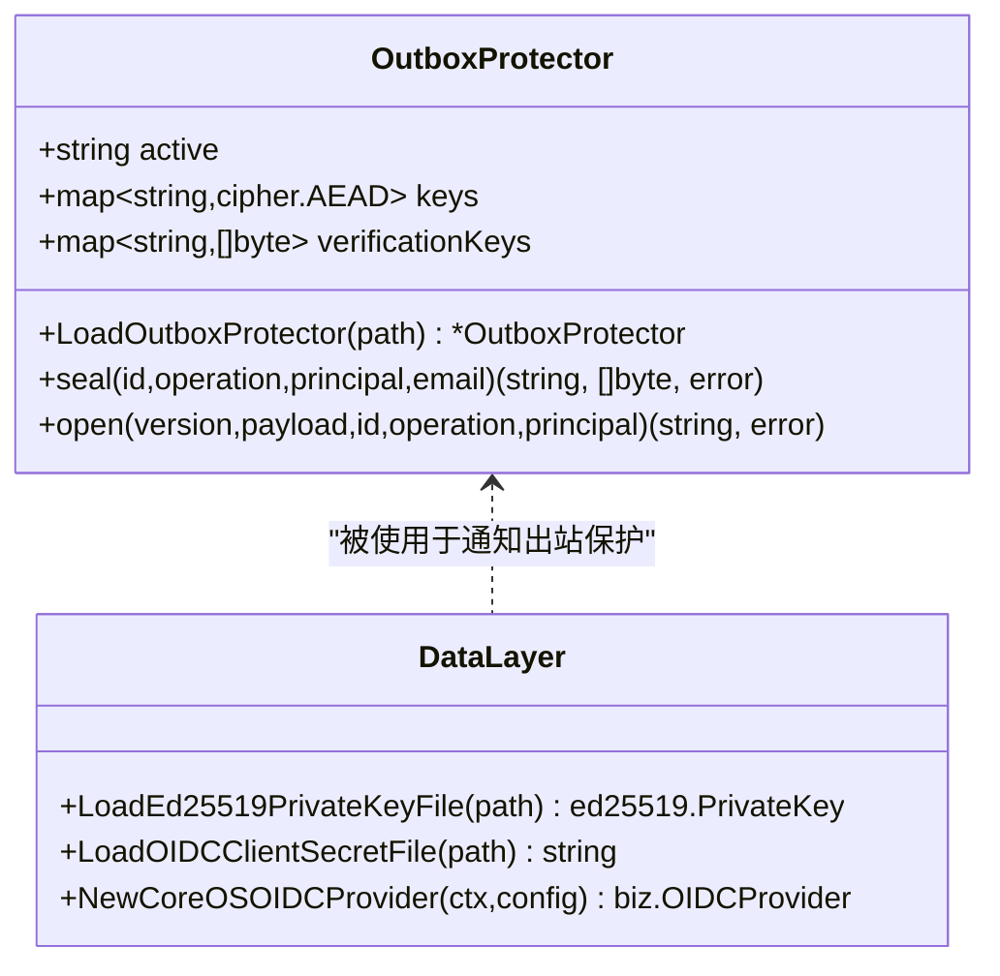
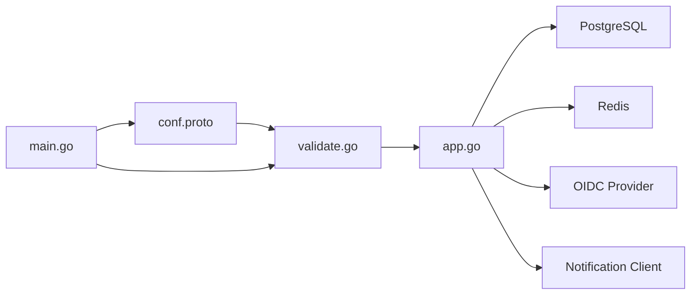

# 配置管理系统

<cite>
**本文引用的文件**
- [configs/config.yaml](file://configs/config.yaml)
- [internal/conf/conf.proto](file://internal/conf/conf.proto)
- [internal/conf/validate.go](file://internal/conf/validate.go)
- [cmd/server/main.go](file://cmd/server/main.go)
- [cmd/server/app.go](file://cmd/server/app.go)
- [internal/data/access_token_key_file.go](file://internal/data/access_token_key_file.go)
- [internal/data/oidc_provider.go](file://internal/data/oidc_provider.go)
- [internal/data/outbox_protector.go](file://internal/data/outbox_protector.go)
</cite>

## 目录
1. [简介](#简介)
2. [项目结构](#项目结构)
3. [核心组件](#核心组件)
4. [架构总览](#架构总览)
5. [详细组件分析](#详细组件分析)
6. [依赖关系分析](#依赖关系分析)
7. [性能与可靠性](#性能与可靠性)
8. [故障排查指南](#故障排查指南)
9. [结论](#结论)
10. [附录：最佳实践、模板与迁移策略](#附录最佳实践模板与迁移策略)

## 简介
本文件面向 ANI IAM 项目的配置管理系统，系统性说明配置文件的结构与层次（基础配置、运行时配置、环境特定配置）、配置验证机制（必填字段、类型校验、业务规则）、环境变量支持与覆盖优先级、安全敏感配置处理（密钥文件加载、环境变量注入、配置加密存储）、配置热重载与变更通知现状，以及最佳实践、常见场景示例与排障指引。

## 项目结构
ANI IAM 的配置体系由三部分构成：
- 配置文件：YAML 形式的静态配置，位于 configs/config.yaml，定义服务监听、运行时依赖（PostgreSQL、Redis、OIDC、通知等）及安全相关路径。
- 配置模型与校验：基于 Protobuf 的强类型配置结构 internal/conf/conf.proto，配合 internal/conf/validate.go 中的严格校验逻辑。
- 配置加载与组装：启动入口 cmd/server/main.go 使用 Kratos 配置源（文件 + 环境变量），将配置扫描到 Bootstrap 结构并调用 Validate；cmd/server/app.go 在构建应用时读取密钥文件、连接数据库与缓存、初始化各子系统。

图表来源
- [cmd/server/main.go:82-95](file://cmd/server/main.go#L82-L95)
- [internal/conf/conf.proto:9-58](file://internal/conf/conf.proto#L9-L58)
- [internal/conf/validate.go:19-45](file://internal/conf/validate.go#L19-L45)
- [cmd/server/app.go:369-448](file://cmd/server/app.go#L369-L448)

章节来源
- [configs/config.yaml:1-61](file://configs/config.yaml#L1-L61)
- [internal/conf/conf.proto:9-58](file://internal/conf/conf.proto#L9-L58)
- [cmd/server/main.go:82-95](file://cmd/server/main.go#L82-L95)

## 核心组件
- 配置模型（Bootstrap/Server/Runtime）：以 Protobuf 定义，确保强类型与可序列化。
- 配置校验器（validate.go）：对网络地址、超时、TLS、DSN、Redis、OIDC、通知、工作负载注册表等进行严格校验。
- 配置加载器（main.go）：组合文件源与环境变量源，扫描为 Bootstrap，执行校验后进入应用构建。
- 应用装配器（app.go）：根据配置实例化 gRPC/HTTP 服务器、数据库连接池、Redis 客户端、OIDC 提供者、通知客户端、维护任务等。

章节来源
- [internal/conf/conf.proto:9-113](file://internal/conf/conf.proto#L9-L113)
- [internal/conf/validate.go:19-168](file://internal/conf/validate.go#L19-L168)
- [cmd/server/main.go:82-95](file://cmd/server/main.go#L82-L95)
- [cmd/server/app.go:369-744](file://cmd/server/app.go#L369-L744)

## 架构总览
配置生命周期从启动开始：
1. main 解析命令行参数，创建 Kratos 配置源（文件 + KRATOS_ 前缀的环境变量）。
2. 加载并扫描到 conf.Bootstrap。
3. 调用 Bootstrap.Validate() 进行全量校验。
4. 校验通过后，app.go 依据配置加载密钥文件、建立数据库与 Redis 连接、初始化 OIDC、通知、权限目录等。
5. 启动 gRPC/Admin/可观测性/后台任务，完成就绪检查。

图表来源
- [cmd/server/main.go:82-95](file://cmd/server/main.go#L82-L95)
- [internal/conf/validate.go:19-45](file://internal/conf/validate.go#L19-L45)
- [cmd/server/app.go:369-448](file://cmd/server/app.go#L369-L448)

## 详细组件分析

### 配置文件结构与层次
- 基础配置（profile/server）
  - profile：当前运行画像，固定为 workload-isolated。
  - server.grpc：gRPC 监听网络、地址、超时、mTLS 证书与 CA 路径、网关客户端 DNS 身份。
  - server.admin：管理端点监听信息。
  - server.shutdown_timeout：优雅关闭超时。
- 运行时配置（runtime）
  - 工作负载注册表：workload_registry_file 与 workload_registry_sha256，用于目标能力清单与版本锁定。
  - 环境与信任域：environment、trust_domain，用于隔离与鉴权边界。
  - PostgreSQL：dsn，要求受限角色与显式主机，非回环需 verify-full 与 CA。
  - Redis：addr、database、namespace、登录限流窗口与次数、读写超时。
  - access_token：issuer、active_key_id、private_key_file。
  - notification：通知服务地址、TLS 证书、服务端 CA、DNS 名称、出站消息保护密钥文件、控制台/平台邀请链接基址、本地化、调度间隔与提交超时。
  - oidc：provider、issuer_url、client_id、client_secret_file、回调 URI、重认证时间窗、HTTP 超时。
  - policy_revision：策略修订指纹，强制 sha256 格式。

章节来源
- [configs/config.yaml:1-61](file://configs/config.yaml#L1-L61)
- [internal/conf/conf.proto:9-113](file://internal/conf/conf.proto#L9-L113)

### 配置验证机制
- 必填字段检查
  - Server 必须包含 grpc 与 admin 监听配置，且地址不可冲突。
  - Runtime 必须包含 PostgreSQL、Redis、AccessToken、Notification、OIDC。
  - 工作负载注册表文件必须为绝对路径，SHA256 必须为精确小写十六进制。
  - environment、trust_domain 必须为非空规范标识。
- 类型与范围校验
  - 所有超时均为 durationpb.Duration，且有上限约束。
  - Redis namespace 必须为非空 token，login_limit 必须为正数。
  - Notification locale 仅支持 en-US 或 zh-CN。
- 业务规则校验
  - gRPC mTLS 必需，证书/私钥/CA 必须为绝对路径，网关客户端 DNS 身份必须非空且无空白字符。
  - PostgreSQL DSN 必须使用 postgres/postgresql 方案，用户名为受限角色 ani_iam_runtime，非回环时必须启用 verify-full 并指定 CA。
  - OIDC provider 必须为 dex，issuer_url 必须为规范 HTTPS 或隔离回环 HTTP，回调 URI 必须为规范 HTTPS。
  - BOSS OIDC 若启用，需独立 origin、独立 client-secret 文件，且与 console 不共享。
  - policy_revision 必须以 sha256: 开头且长度为 32 字节。

图表来源
- [internal/conf/validate.go:19-168](file://internal/conf/validate.go#L19-L168)

章节来源
- [internal/conf/validate.go:19-168](file://internal/conf/validate.go#L19-L168)

### 环境变量支持与覆盖优先级
- 配置源
  - 文件源：file.NewSource(flagconf)，默认指向 -conf 指定的目录/文件。
  - 环境变量源：env.NewSource("KRATOS")，即 KRATOS_ 前缀的环境变量会作为配置源。
- 覆盖顺序
  - Kratos 默认行为中，后添加的源优先覆盖先前的值。因此，环境变量（KRATOS_*）会覆盖 YAML 中的同名配置项。
- 动态更新
  - 代码未实现运行时热重载；配置在进程启动时一次性加载并校验，后续不会自动刷新。

章节来源
- [cmd/server/main.go:82-95](file://cmd/server/main.go#L82-L95)

### 安全敏感配置处理
- 密钥文件加载
  - Access Token 私钥：通过 data.LoadEd25519PrivateKeyFile 从 PEM PKCS#8 文件中加载并校验。
  - OIDC 客户端密钥：通过 data.LoadOIDCClientSecretFile 读取并限制长度与可见 ASCII 字符。
  - 通知出站保护密钥：通过 data.LoadOutboxProtector 从 JSON 文件加载多版本 AEAD 密钥，并设置 active key。
- 环境变量注入
  - 通过 KRATOS_* 环境变量覆盖配置项，便于在容器编排中注入敏感值（如 DSN、密码、密钥路径等）。
- 配置加密存储
  - 通知出站消息使用 OutboxProtector 进行 AEAD 加密封装，绑定记录 ID、操作 ID、主体 ID 与密钥版本，防止篡改与替换。

图表来源
- [internal/data/outbox_protector.go:17-97](file://internal/data/outbox_protector.go#L17-L97)
- [internal/data/access_token_key_file.go:12-30](file://internal/data/access_token_key_file.go#L12-L30)
- [internal/data/oidc_provider.go:23-42](file://internal/data/oidc_provider.go#L23-L42)

章节来源
- [internal/data/access_token_key_file.go:12-30](file://internal/data/access_token_key_file.go#L12-L30)
- [internal/data/oidc_provider.go:23-42](file://internal/data/oidc_provider.go#L23-L42)
- [internal/data/outbox_protector.go:17-97](file://internal/data/outbox_protector.go#L17-L97)

### 配置热重载与变更通知
- 现状
  - 未在代码中发现配置热重载或变更监听机制；配置仅在启动阶段加载并校验。
- 建议
  - 如需热重载，可在 Kratos 配置源上增加 Watcher，并在配置变更后触发受影响组件的重置（如重新加载密钥文件、重建连接池等）。
  - 对于密钥轮换，应提供安全的双活密钥期与灰度切换流程，避免中断。

[本节为概念性说明，不直接分析具体文件]

## 依赖关系分析
- 配置模型与校验
  - conf.proto 定义 Bootstrap/Server/Runtime 及其子结构。
  - validate.go 对每个子结构进行强约束校验，确保部署安全与一致性。
- 启动与装配
  - main.go 负责配置源与扫描。
  - app.go 根据配置实例化 gRPC/HTTP、数据库、Redis、OIDC、通知、权限目录、后台维护任务等。

图表来源
- [internal/conf/conf.proto:9-113](file://internal/conf/conf.proto#L9-L113)
- [internal/conf/validate.go:19-168](file://internal/conf/validate.go#L19-L168)
- [cmd/server/main.go:82-95](file://cmd/server/main.go#L82-L95)
- [cmd/server/app.go:369-744](file://cmd/server/app.go#L369-L744)

章节来源
- [internal/conf/conf.proto:9-113](file://internal/conf/conf.proto#L9-L113)
- [internal/conf/validate.go:19-168](file://internal/conf/validate.go#L19-L168)
- [cmd/server/main.go:82-95](file://cmd/server/main.go#L82-L95)
- [cmd/server/app.go:369-744](file://cmd/server/app.go#L369-L744)

## 性能与可靠性
- 连接与健康检查
  - 启动时对 PostgreSQL 与 Redis 进行 Ping，快速失败并释放资源。
  - 使用 pgxpool 与 go-redis 的连接池与超时控制，避免阻塞。
- 后台任务
  - API Key 使用聚合与维护任务按周期批量写入，降低数据库压力。
  - 通知派发任务按配置间隔与提交超时执行，具备重试与上下文取消。
- 安全与合规
  - 严格的 TLS、DSN、OIDC 校验，防止误配导致的安全风险。
  - 出站消息使用 AEAD 加密封装，绑定上下文，防篡改。

[本节提供通用指导，不直接分析具体文件]

## 故障排查指南
- 启动失败
  - 检查 -conf 路径是否正确，YAML 是否完整。
  - 查看 Validate 错误信息，定位缺失或非法字段（如 DSN、TLS 路径、OIDC 回调等）。
- 数据库连接失败
  - 确认 DSN 使用受限角色 ani_iam_runtime，非回环需 sslmode=verify-full 与 CA。
  - 检查网络连通性与防火墙策略。
- Redis 连接失败
  - 确认 addr、database、namespace 正确，登录限流窗口与次数合理。
- OIDC 集成问题
  - 确认 provider=dex，issuer_url 为规范 HTTPS 或隔离回环 HTTP，回调 URI 为规范 HTTPS。
  - 检查 client_secret_file 内容合法且可读。
- 通知发送失败
  - 检查 notification.address、TLS 证书与 CA、outbox_key_file 是否存在且可读。
  - 关注 dispatch_interval 与 submission_timeout 是否合理。
- 日志脱敏
  - 日志已过滤敏感键（如 password、token、dsn 等），若仍泄露，请检查自定义日志处理器。

章节来源
- [cmd/server/main.go:104-131](file://cmd/server/main.go#L104-L131)
- [internal/conf/validate.go:170-273](file://internal/conf/validate.go#L170-L273)
- [cmd/server/app.go:414-448](file://cmd/server/app.go#L414-L448)

## 结论
ANI IAM 的配置系统采用“强类型模型 + 严格校验 + 启动时加载”的设计，确保生产环境的稳定性与安全。配置通过 YAML 与环境变量组合管理，关键敏感信息通过外部密钥文件与加密出站保护机制处理。当前未实现配置热重载，建议在需要时引入安全的重载与密钥轮换流程。

[本节为总结性内容，不直接分析具体文件]

## 附录：最佳实践、模板与迁移策略

- 最佳实践
  - 始终使用 workload-isolated 画像，避免遗留模式。
  - 所有证书与密钥路径必须为绝对路径，并由最小权限账户挂载。
  - PostgreSQL 非回环必须启用 verify-full 并指定 CA；禁止禁用 SSL。
  - Redis namespace 唯一且不含空白字符，登录限流窗口与次数符合业务预期。
  - OIDC 回调必须为规范 HTTPS，禁止携带查询与片段。
  - 策略修订 policy_revision 使用 sha256 指纹，随工件发布同步更新。
- 配置模板
  - 参考 configs/config.yaml 的结构组织基础、运行时与环境特定配置。
  - 将敏感值放入密钥文件并通过环境变量注入路径，不在 YAML 中明文存放。
- 迁移策略
  - 新增字段时先在 conf.proto 中声明，再在 validate.go 中添加校验。
  - 对破坏性变更，提供向后兼容的过渡期与灰度发布计划。
  - 密钥轮换时保留旧密钥一段时间，逐步切换到新 active key，并确保出站消息能解密历史数据。

[本节为通用指导，不直接分析具体文件]