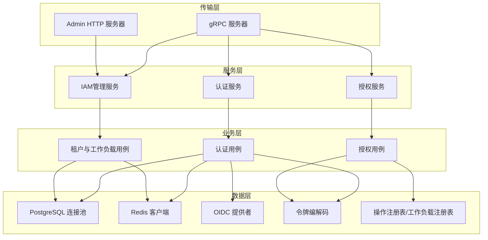
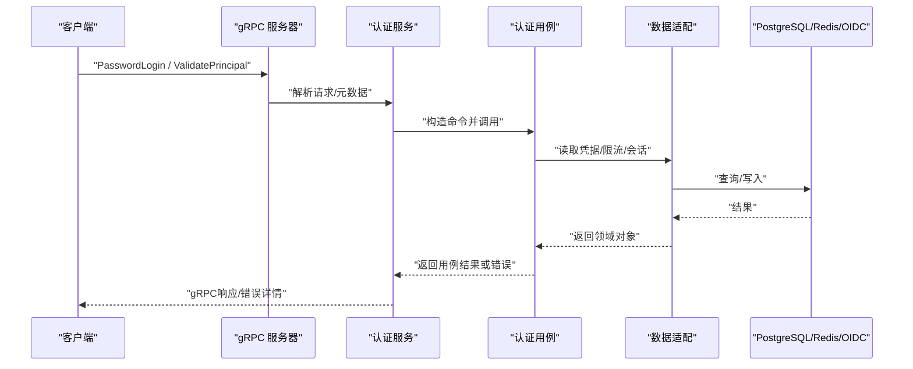
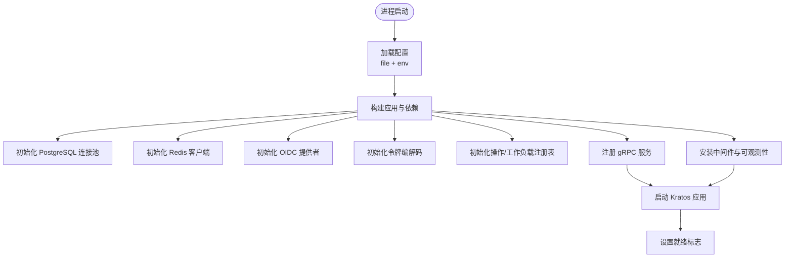
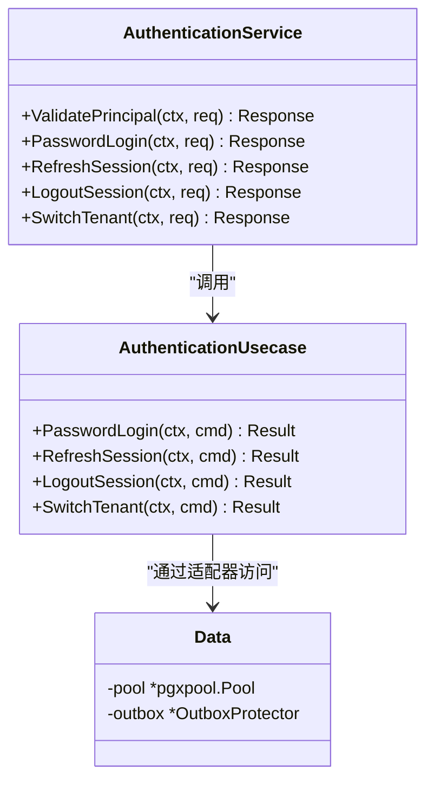
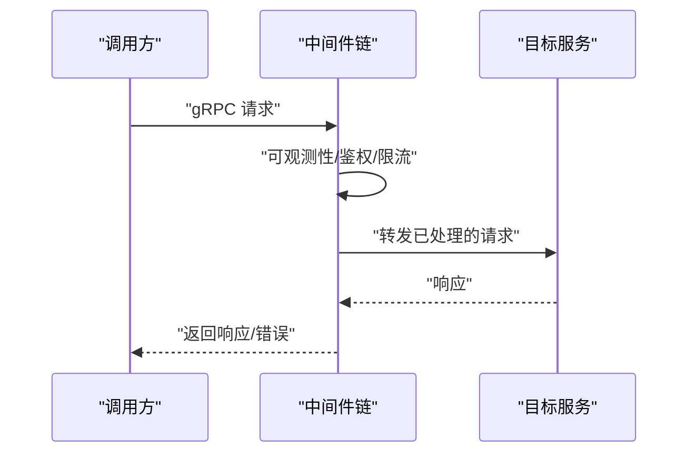
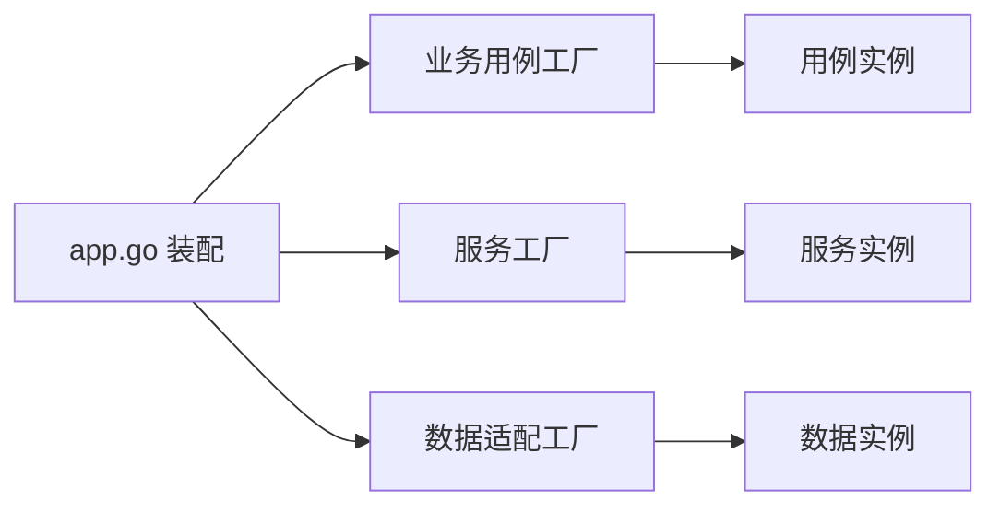
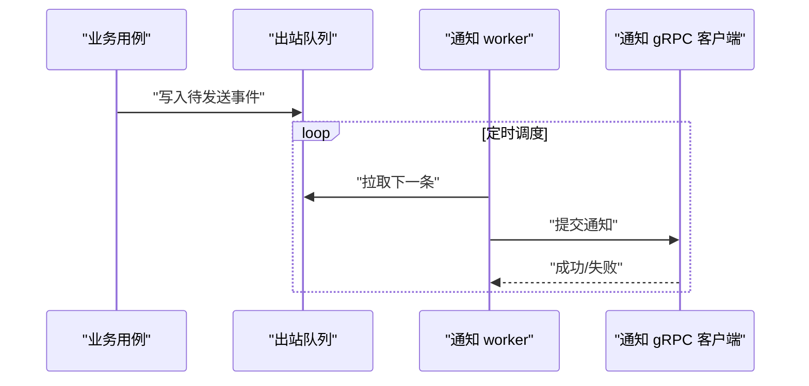
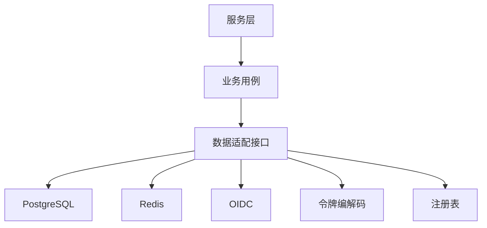

# 架构概览

<cite>
**本文引用的文件**
- [cmd/server/main.go](file://cmd/server/main.go)
- [cmd/server/app.go](file://cmd/server/app.go)
- [internal/conf/conf.proto](file://internal/conf/conf.proto)
- [configs/config.yaml](file://configs/config.yaml)
- [api/README.md](file://api/README.md)
- [internal/server/grpc.go](file://internal/server/grpc.go)
- [internal/service/authentication.go](file://internal/service/authentication.go)
- [internal/biz/authentication.go](file://internal/biz/authentication.go)
- [internal/data/data.go](file://internal/data/data.go)
</cite>

## 目录
1. [简介](#简介)
2. [项目结构](#项目结构)
3. [核心组件](#核心组件)
4. [架构总览](#架构总览)
5. [详细组件分析](#详细组件分析)
6. [依赖关系分析](#依赖关系分析)
7. [性能考量](#性能考量)
8. [故障排查指南](#故障排查指南)
9. [结论](#结论)
10. [附录](#附录)

## 简介
本文件面向ANI IAM项目的开发者与运维人员，提供分层架构、微服务组件交互、配置与运行时管理、中间件与横切关注点、API网关与服务发现、异步与事件驱动机制的系统性说明。文档以代码仓库为依据，结合启动流程、服务装配、数据访问与业务用例的调用链，给出架构图、数据流图与组件交互图，帮助快速理解整体设计。

## 项目结构
ANI IAM采用清晰的分层组织：
- 传输层（Server）：基于Kratos构建gRPC与Admin HTTP服务，注册IAM服务并挂载中间件。
- 服务层（Service）：将外部请求映射为领域用例命令，负责协议转换、错误映射与审计上下文注入。
- 业务层（Biz）：框架无关的用例与实体，封装认证、授权、会话、租户与工作负载等核心规则。
- 数据层（Data）：基础设施适配，包括PostgreSQL连接池、Redis缓存、OIDC提供者、令牌编解码、操作注册表与通知客户端等。
- 配置（Conf）：使用Protobuf定义配置模型，由Kratos从配置文件与环境变量加载。
- API契约（api）：独立的gRPC契约模块，仅包含DTO与生成代码，不包含服务器实现。

图表来源
- [internal/server/grpc.go:14-51](file://internal/server/grpc.go#L14-L51)
- [cmd/server/app.go:716-743](file://cmd/server/app.go#L716-L743)
- [internal/service/authentication.go:91-106](file://internal/service/authentication.go#L91-L106)
- [internal/biz/authentication.go:286-339](file://internal/biz/authentication.go#L286-L339)
- [internal/data/data.go:6-20](file://internal/data/data.go#L6-L20)

章节来源
- [cmd/server/main.go:34-101](file://cmd/server/main.go#L34-L101)
- [cmd/server/app.go:369-743](file://cmd/server/app.go#L369-L743)
- [internal/conf/conf.proto:9-113](file://internal/conf/conf.proto#L9-L113)
- [configs/config.yaml:1-61](file://configs/config.yaml#L1-L61)
- [api/README.md:1-8](file://api/README.md#L1-L8)

## 核心组件
- 启动与装配：main解析命令行与配置，app组装运行时依赖（数据库、缓存、OIDC、令牌、注册表），创建服务与中间件，启动Kratos应用。
- gRPC服务：NewTargetGRPCServer统一注册认证、授权、管理三个服务，强制启用双向TLS与最小版本限制。
- 认证服务：AuthenticationService将gRPC请求转换为biz命令，调用认证用例完成登录、刷新、登出、切换租户、OIDC流程等，并将业务错误映射为带元数据的gRPC状态。
- 业务用例：AuthenticationUsecase实现密码登录、限流、会话与刷新令牌生命周期、访问令牌签发、审计记录等核心逻辑。
- 数据适配：Data持有PostgreSQL连接池与出站保护器；其他适配器实现Redis限流、OIDC存储、令牌编解码、操作注册表等。

章节来源
- [cmd/server/main.go:34-101](file://cmd/server/main.go#L34-L101)
- [cmd/server/app.go:369-743](file://cmd/server/app.go#L369-L743)
- [internal/server/grpc.go:14-51](file://internal/server/grpc.go#L14-L51)
- [internal/service/authentication.go:91-106](file://internal/service/authentication.go#L91-L106)
- [internal/biz/authentication.go:286-339](file://internal/biz/authentication.go#L286-L339)
- [internal/data/data.go:6-20](file://internal/data/data.go#L6-L20)

## 架构总览
ANI IAM采用“传输-服务-业务-数据”四层分离的微服务架构。服务层通过接口抽象业务用例，业务层保持框架无关，数据层屏蔽基础设施差异。配置通过Protobuf建模并由Kratos集中加载，支持环境变量覆盖。gRPC服务强制双向TLS，配合工作负载身份中间件实现跨服务可信调用。异步任务（通知派发、API Key用量聚合）作为独立后台Worker运行，保障主路径低延迟。

图表来源
- [internal/server/grpc.go:29-51](file://internal/server/grpc.go#L29-L51)
- [internal/service/authentication.go:150-194](file://internal/service/authentication.go#L150-L194)
- [internal/biz/authentication.go:341-530](file://internal/biz/authentication.go#L341-L530)
- [internal/data/data.go:6-20](file://internal/data/data.go#L6-L20)

## 详细组件分析

### 启动与配置管理
- 配置模型：Bootstrap/Server/Runtime等结构体由conf.proto定义，Runtime包含PostgreSQL、Redis、AccessToken、Notification、OIDC、策略修订与工作负载注册表等。
- 配置加载：main使用Kratos file/env源加载配置，扫描到Bootstrap后传入buildApp。
- 运行时装配：app.go中依次初始化PostgreSQL连接池、Redis客户端、OIDC提供者、令牌编解码、操作注册表、限流器、通知客户端、工作负载身份中间件等，并注册gRPC服务与Admin服务器。
- 可观测性与就绪：Readiness检查数据库与缓存连通性，Observability收集指标与追踪。

图表来源
- [cmd/server/main.go:82-101](file://cmd/server/main.go#L82-L101)
- [cmd/server/app.go:412-448](file://cmd/server/app.go#L412-L448)
- [cmd/server/app.go:492-528](file://cmd/server/app.go#L492-L528)
- [cmd/server/app.go:669-743](file://cmd/server/app.go#L669-L743)
- [internal/conf/conf.proto:9-113](file://internal/conf/conf.proto#L9-L113)

章节来源
- [cmd/server/main.go:34-101](file://cmd/server/main.go#L34-L101)
- [cmd/server/app.go:369-743](file://cmd/server/app.go#L369-L743)
- [internal/conf/conf.proto:9-113](file://internal/conf/conf.proto#L9-L113)
- [configs/config.yaml:1-61](file://configs/config.yaml#L1-L61)

### 服务层与业务层职责划分
- 服务层（service）：负责协议映射、参数校验、审计上下文提取、错误映射为gRPC状态码与详细信息。例如AuthenticationService将请求转为biz命令，并在失败时附加operation_id、credential_kind、dependency等元数据。
- 业务层（biz）：实现框架无关的用例，如认证、授权、会话、租户与工作负载管理。AuthenticationUsecase处理密码登录、限流、会话与刷新令牌生命周期、访问令牌签发与审计。
- 数据层（data）：提供持久化与缓存适配，如PostgreSQL连接池、Redis限流与聚合、OIDC存储、令牌编解码、操作注册表、通知客户端等。

图表来源
- [internal/service/authentication.go:91-106](file://internal/service/authentication.go#L91-L106)
- [internal/biz/authentication.go:286-339](file://internal/biz/authentication.go#L286-L339)
- [internal/data/data.go:6-20](file://internal/data/data.go#L6-L20)

章节来源
- [internal/service/authentication.go:108-194](file://internal/service/authentication.go#L108-L194)
- [internal/biz/authentication.go:341-530](file://internal/biz/authentication.go#L341-L530)
- [internal/data/data.go:6-20](file://internal/data/data.go#L6-L20)

### 中间件机制与横切关注点
- 传输层中间件：gRPC服务器通过NewGRPCServer接收middlewares参数，统一挂载可观测性、工作负载身份验证等横切能力。
- 工作负载身份中间件：在请求进入服务前，基于工作负载注册表与凭证进行身份与授权校验，确保跨服务调用的可信性。
- 可观测性：日志、指标与追踪在服务启动时装配，Readiness探针用于健康检查。

图表来源
- [internal/server/grpc.go:14-27](file://internal/server/grpc.go#L14-L27)
- [cmd/server/app.go:706-723](file://cmd/server/app.go#L706-L723)

章节来源
- [internal/server/grpc.go:14-51](file://internal/server/grpc.go#L14-L51)
- [cmd/server/app.go:706-723](file://cmd/server/app.go#L706-L723)

### 依赖注入与工厂模式
- 依赖注入：所有关键组件通过构造函数显式注入，避免隐式全局状态。例如app.go中将PostgreSQL、Redis、OIDC、令牌、注册表、限流器等注入到各用例与服务。
- 工厂模式：new*函数作为工厂，组合多个依赖并返回可用实例，如newTenantIAMAdminRuntime、newPasswordActionNotificationRuntime、newApp等。

图表来源
- [cmd/server/app.go:335-367](file://cmd/server/app.go#L335-L367)
- [cmd/server/app.go:628-644](file://cmd/server/app.go#L628-L644)
- [cmd/server/app.go:747-783](file://cmd/server/app.go#L747-L783)

章节来源
- [cmd/server/app.go:335-367](file://cmd/server/app.go#L335-L367)
- [cmd/server/app.go:628-644](file://cmd/server/app.go#L628-L644)
- [cmd/server/app.go:747-783](file://cmd/server/app.go#L747-L783)

### API网关与服务发现
- API契约：api模块提供gRPC契约与生成代码，明确认证、授权与管理服务的输入输出，便于独立版本管理与测试。
- 服务发现：工作负载注册表（workload registry）在启动时加载，用于工作负载身份与授权决策；通知客户端通过DNS名称与证书建立安全连接。
- 网关集成：配置中包含gateway_client_dns_name与server_dns_name，表明IAM通过双向TLS与网关通信，网关承担入口路由与策略执行。

章节来源
- [api/README.md:1-8](file://api/README.md#L1-L8)
- [configs/config.yaml:7-11](file://configs/config.yaml#L7-L11)
- [configs/config.yaml:37-50](file://configs/config.yaml#L37-L50)
- [cmd/server/app.go:378-381](file://cmd/server/app.go#L378-L381)

### 异步处理与事件驱动
- 通知派发：password-action通知通过Outbox与gRPC客户端异步提交，worker按间隔轮询并发送，支持超时与重试标记。
- API Key用量聚合：后台worker定期flush用量并更新操作快照，供可观测性消费。
- 事件一致性：通过Outbox保护器与事务边界保证消息最终一致，避免丢失与重复。

图表来源
- [cmd/server/app.go:185-272](file://cmd/server/app.go#L185-L272)
- [cmd/server/app.go:628-644](file://cmd/server/app.go#L628-L644)

章节来源
- [cmd/server/app.go:185-272](file://cmd/server/app.go#L185-L272)
- [cmd/server/app.go:628-644](file://cmd/server/app.go#L628-L644)

## 依赖关系分析
- 服务对用例的依赖：服务层仅依赖用例接口，便于替换实现与测试。
- 用例对数据层的依赖：用例通过接口（Reader/UnitOfWork/Throttle/Codec等）访问数据，降低耦合。
- 运行时依赖：PostgreSQL与Redis在启动时探测连通性，失败则中止启动，确保服务可用性。
- 外部依赖：OIDC提供者、工作负载注册表、通知服务通过配置与证书管理，增强安全性与可维护性。

图表来源
- [internal/service/authentication.go:91-106](file://internal/service/authentication.go#L91-L106)
- [internal/biz/authentication.go:257-284](file://internal/biz/authentication.go#L257-L284)
- [internal/data/data.go:6-20](file://internal/data/data.go#L6-L20)

章节来源
- [internal/service/authentication.go:91-106](file://internal/service/authentication.go#L91-L106)
- [internal/biz/authentication.go:257-284](file://internal/biz/authentication.go#L257-L284)
- [internal/data/data.go:6-20](file://internal/data/data.go#L6-L20)

## 性能考量
- 连接池与超时：PostgreSQL连接池与Redis客户端均配置了超时与命名空间，避免资源耗尽与冲突。
- 批量与节流：API Key用量聚合采用批量flush，登录限流使用Redis窗口计数，防止滥用与雪崩。
- 异步解耦：通知派发与快照发布走后台worker，减少主路径延迟。
- 安全与最小权限：双向TLS与最小版本要求，减少攻击面。

[本节为通用指导，不直接分析具体文件]

## 故障排查指南
- 启动失败：检查PostgreSQL与Redis连通性、OIDC配置与证书路径、工作负载注册表文件与哈希。
- 认证失败：查看gRPC错误中的reason与metadata（如CREDENTIAL_INVALID、AUTH_RATE_LIMITED、TENANT_IAM_NOT_READY），定位是凭据、限流还是依赖不可用。
- 会话问题：确认刷新令牌家族状态、绝对过期时间与空闲过期时间策略。
- 通知失败：检查Outbox保护器、通知客户端地址与证书、DNS名称与超时配置。

章节来源
- [internal/service/authentication.go:476-683](file://internal/service/authentication.go#L476-L683)
- [cmd/server/app.go:412-448](file://cmd/server/app.go#L412-L448)
- [cmd/server/app.go:628-644](file://cmd/server/app.go#L628-L644)

## 结论
ANI IAM通过清晰的分层与明确的职责划分，实现了高内聚、低耦合的可扩展架构。服务层专注协议与错误映射，业务层聚焦领域规则，数据层屏蔽基础设施差异。配置与运行时管理集中且可验证，中间件提供统一的横切能力，异步任务保障主路径性能。该设计便于独立演进、测试与部署，适合大规模多租户与平台化管理场景。

[本节为总结，不直接分析具体文件]

## 附录
- 配置示例：参考configs/config.yaml中的gRPC监听、TLS证书、PostgreSQL DSN、Redis命名空间与限流、OIDC提供商与回调、通知服务地址与Outbox密钥等。
- API契约：参考api/README.md，了解gRPC契约的独立版本管理与调用约定。

章节来源
- [configs/config.yaml:1-61](file://configs/config.yaml#L1-L61)
- [api/README.md:1-8](file://api/README.md#L1-L8)