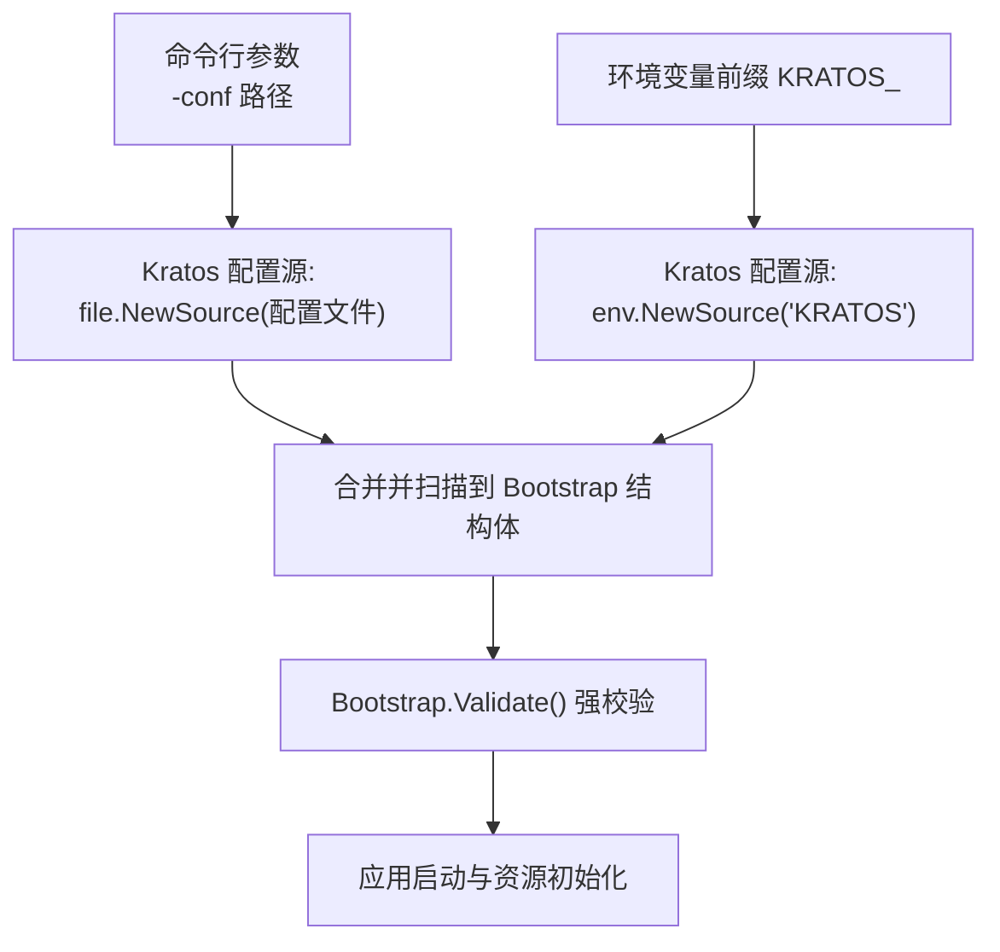
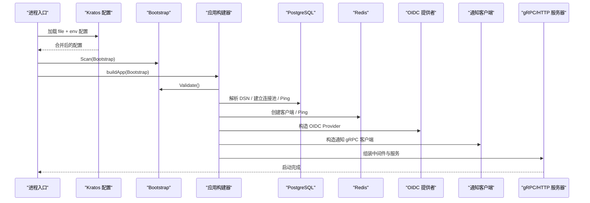
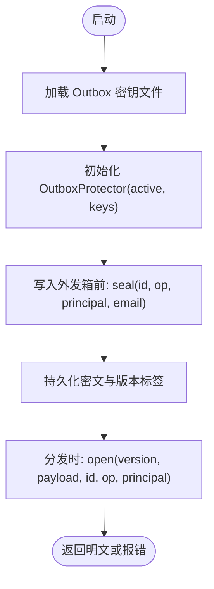
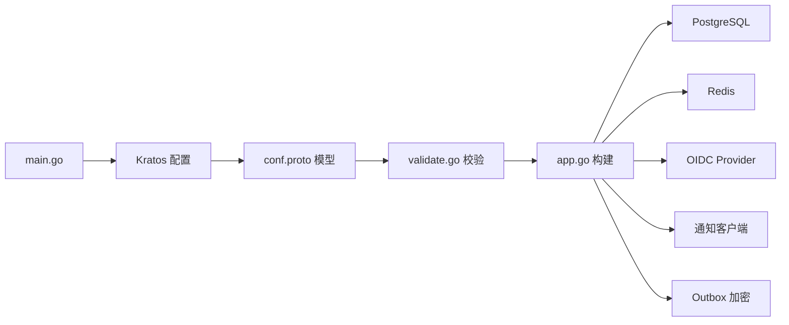

# 配置管理系统

<cite>
**本文引用的文件**
- [configs/config.yaml](file://configs/config.yaml)
- [internal/conf/conf.proto](file://internal/conf/conf.proto)
- [internal/conf/validate.go](file://internal/conf/validate.go)
- [cmd/server/main.go](file://cmd/server/main.go)
- [cmd/server/app.go](file://cmd/server/app.go)
- [internal/data/outbox_protector.go](file://internal/data/outbox_protector.go)
- [CLAUDE.md](file://CLAUDE.md)
</cite>

## 目录
1. [简介](#简介)
2. [项目结构](#项目结构)
3. [核心组件](#核心组件)
4. [架构总览](#架构总览)
5. [详细组件分析](#详细组件分析)
6. [依赖关系分析](#依赖关系分析)
7. [性能考量](#性能考量)
8. [故障排查指南](#故障排查指南)
9. [结论](#结论)
10. [附录](#附录)

## 简介
本文件为 ANI IAM 项目的“配置管理系统”提供完整、可操作的文档。内容覆盖：
- 配置文件结构与环境变量映射机制
- 类型安全的配置解析与强校验规则
- 运行时配置更新与热重载现状说明
- 多环境策略与生产安全配置要点
- 敏感信息加密存储与管理方案
- 配置版本控制与迁移策略
- 最佳实践与常见问题排查

## 项目结构
ANI IAM 使用 Kratos 框架进行配置加载，采用“文件 + 环境变量”的组合方式，并通过 Protobuf 定义配置模型，实现类型安全与集中校验。

**图表来源**
- [cmd/server/main.go:82-95](file://cmd/server/main.go#L82-L95)
- [internal/conf/conf.proto:9-13](file://internal/conf/conf.proto#L9-L13)
- [internal/conf/validate.go:19-45](file://internal/conf/validate.go#L19-L45)

**章节来源**
- [cmd/server/main.go:22-32](file://cmd/server/main.go#L22-L32)
- [cmd/server/main.go:82-95](file://cmd/server/main.go#L82-L95)
- [internal/conf/conf.proto:9-13](file://internal/conf/conf.proto#L9-L13)
- [CLAUDE.md:71-72](file://CLAUDE.md#L71-L72)

## 核心组件
- 配置模型定义：通过 Protobuf 声明 Bootstrap、Server、Runtime、PostgreSQL、Redis、AccessToken、Notification、OIDC 等结构，确保类型安全。
- 配置加载：main 入口使用 Kratos 的 file 和 env 两个 Source，按优先级合并后扫描到 Bootstrap。
- 配置校验：在应用构建前调用 Validate()，对网络地址、TLS 文件、DSN、URL、超时、命名空间等进行严格检查。
- 运行时装配：根据已验证的配置创建数据库连接池、Redis 客户端、OIDC 提供者、通知客户端、工作负载注册表等。

**章节来源**
- [internal/conf/conf.proto:9-113](file://internal/conf/conf.proto#L9-L113)
- [cmd/server/main.go:82-95](file://cmd/server/main.go#L82-L95)
- [internal/conf/validate.go:19-168](file://internal/conf/validate.go#L19-L168)
- [cmd/server/app.go:369-744](file://cmd/server/app.go#L369-L744)

## 架构总览
下图展示了从配置加载到服务启动的关键流程，包括配置合并、校验、以及关键运行时组件的初始化顺序。

**图表来源**
- [cmd/server/main.go:82-95](file://cmd/server/main.go#L82-L95)
- [cmd/server/app.go:369-744](file://cmd/server/app.go#L369-L744)
- [internal/conf/validate.go:19-168](file://internal/conf/validate.go#L19-L168)

## 详细组件分析

### 配置文件结构与字段说明
- 顶层 profile：当前仅支持隔离模式的工作负载运行配置。
- server.grpc：监听网络、地址、超时、mTLS 证书与 CA 文件、网关客户端 DNS 名称。
- server.admin：管理端点网络、地址、超时。
- runtime：
  - postgresql.dsn：必须使用受限运行时角色，非回环地址需强制 verify-full 并指定 CA。
  - redis：地址、库号、命名空间、登录限流、读写超时等。
  - access_token：签发者、活动密钥 ID、私钥文件路径。
  - notification：通知服务地址、TLS 文件、动作 URL、本地化、调度间隔与提交超时。
  - oidc：提供商、签发者 URL、客户端 ID、客户端密钥文件、回调 URI、重认证窗口与 HTTP 超时。
  - environment/trust_domain：环境与信任域，要求规范小写且无空白字符。
  - workload_registry_file/sha256：工作负载目标清单及其不可变摘要。
  - policy_revision：策略修订，必须以 sha256: 前缀加 64 位十六进制。

示例配置参考：
- [configs/config.yaml](file://configs/config.yaml)

**章节来源**
- [configs/config.yaml:1-61](file://configs/config.yaml#L1-L61)
- [internal/conf/conf.proto:15-113](file://internal/conf/conf.proto#L15-L113)
- [internal/conf/validate.go:106-168](file://internal/conf/validate.go#L106-L168)

### 环境变量映射机制
- 配置加载使用 Kratos 的 file 与 env 两个 Source。
- env.Source 使用固定前缀 “KRATOS”，即环境变量以 KRATOS_ 开头，用于覆盖或补充配置文件中的值。
- 加载顺序：先文件，再环境变量；后者可覆盖前者（由 Kratos 内部合并逻辑决定）。
- 日志中会过滤敏感键（如 dsn、password、token 等），避免泄露。

**章节来源**
- [cmd/server/main.go:82-85](file://cmd/server/main.go#L82-L85)
- [cmd/server/main.go:104-131](file://cmd/server/main.go#L104-L131)

### 类型安全的配置解析与校验规则
- 所有配置项均通过 Protobuf 类型定义，Scan 时自动进行类型转换。
- 启动前执行 Bootstrap.Validate()，包含但不限于：
  - 监听地址必须为 tcp，且绑定显式 IP 与端口；禁止通配符与解析器 URI。
  - mTLS 证书、私钥、CA 文件必须为绝对路径；网关客户端 DNS 名称必填且合法。
  - PostgreSQL DSN 必须使用 postgres/postgresql 协议，限定用户名为受限运行时角色，非回环地址必须启用 verify-full 并指定 CA 文件。
  - Redis 地址必须为回环地址；命名空间非空且不含空白；登录限制与窗口、读写超时必须在允许范围。
  - Access Token 签发者固定为 ani-iam；活动密钥 ID 必填；私钥文件为绝对路径。
  - Notification 地址必须为显式部署端点；TLS 文件为绝对路径；server DNS 名称规范；console/boss action URL 必须为 HTTPS 且无多余片段；locale 仅限 en-US 或 zh-CN。
  - OIDC provider 固定为 dex；issuer_url 必须为规范 HTTPS 或隔离环境的回环 HTTP；client_id 固定为 ani-console；回调 URI 必须为 HTTPS；重认证与 HTTP 超时在允许范围。
  - policy_revision 必须以 sha256: 前缀加 64 位十六进制。
  - 可选 Boss OIDC 需要独立 origin、独立 client-secret 文件，且与 console 不共享。

**章节来源**
- [internal/conf/validate.go:19-168](file://internal/conf/validate.go#L19-L168)
- [internal/conf/validate_test.go:76-177](file://internal/conf/validate_test.go#L76-L177)
- [internal/conf/validate_test.go:179-217](file://internal/conf/validate_test.go#L179-L217)

### 运行时配置更新与热重载
- 当前实现未提供运行时热重载能力。配置在进程启动时一次性加载、校验并装配。
- 若需动态调整，应通过滚动重启或蓝绿发布方式生效。
- 建议将易变参数（如超时、调度间隔）置于外部配置中心或环境变量，以便在部署层快速切换。

**章节来源**
- [cmd/server/main.go:82-95](file://cmd/server/main.go#L82-L95)
- [cmd/server/app.go:369-744](file://cmd/server/app.go#L369-L744)

### 不同环境下的配置管理策略
- 开发/隔离环境：可使用回环地址与禁用 SSL 的 DSN（仅限本地调试），但生产严禁。
- 独立部署环境：必须启用 mTLS、显式绑定 IP、非回环数据库需 verify-full 与 CA 文件。
- 多边界集成（Boss）：需要独立的 OIDC 客户端、回调域名与 action URL，且不得与 Console 共享密钥或域名。
- 环境与信任域：environment 与 trust_domain 必须为规范的小写字符串，禁止空白与非法字符。

**章节来源**
- [internal/conf/validate.go:106-168](file://internal/conf/validate.go#L106-L168)
- [configs/config.yaml:17-61](file://configs/config.yaml#L17-L61)

### 生产环境的安全配置要点
- 强制 mTLS：gRPC 服务端必须配置证书、私钥与客户端 CA，并设置网关客户端 DNS 名称。
- 数据库安全：非回环地址必须启用 verify-full 并指定 CA 根证书；使用受限运行时角色访问隔离数据库。
- 通知服务：所有 TLS 文件必须为绝对路径；action URL 必须为 HTTPS；locale 限定为受支持值。
- OIDC：provider 固定为 dex；issuer_url 必须为规范 HTTPS 或隔离回环 HTTP；回调 URI 必须为 HTTPS。
- 策略与清单：policy_revision 与工作负载清单必须附带不可变摘要，防止篡改。

**章节来源**
- [internal/conf/validate.go:47-65](file://internal/conf/validate.go#L47-L65)
- [internal/conf/validate.go:170-196](file://internal/conf/validate.go#L170-L196)
- [internal/conf/validate.go:237-273](file://internal/conf/validate.go#L237-L273)
- [internal/conf/validate.go:275-305](file://internal/conf/validate.go#L275-L305)
- [internal/conf/validate.go:159-167](file://internal/conf/validate.go#L159-L167)

### 敏感信息的加密存储与管理方案
- 密钥与凭据以文件形式挂载到容器（如 /run/secrets/*），配置中仅保留路径引用。
- 通知外发箱（Outbox）消息使用 AEAD（AES-GCM）进行加密，密钥版本化管理，并绑定记录主键与操作 ID，防止替换与篡改。
- 启动时从 outbox_key_file 加载密钥集，选择 active 版本进行加解密。
- 日志过滤器屏蔽敏感字段，避免凭证泄露。

**图表来源**
- [internal/data/outbox_protector.go:23-69](file://internal/data/outbox_protector.go#L23-L69)
- [internal/data/outbox_protector.go:73-97](file://internal/data/outbox_protector.go#L73-L97)

**章节来源**
- [internal/data/outbox_protector.go:1-98](file://internal/data/outbox_protector.go#L1-L98)
- [cmd/server/main.go:104-131](file://cmd/server/main.go#L104-L131)

### 配置文件的版本控制与迁移策略
- 配置模型通过 Protobuf 定义，变更需重新生成代码，保证类型一致。
- 工作负载清单与策略修订通过不可变摘要（SHA256）锁定，避免运行时漂移。
- 数据库迁移通过迁移脚本管理（见 migrations 目录），与配置解耦。
- 建议在 CI/CD 中校验配置摘要与策略修订，确保部署一致性。

**章节来源**
- [internal/conf/conf.proto:1-113](file://internal/conf/conf.proto#L1-L113)
- [internal/conf/validate.go:117-123](file://internal/conf/validate.go#L117-L123)
- [internal/conf/validate.go:159-167](file://internal/conf/validate.go#L159-L167)

## 依赖关系分析
- 配置加载依赖 Kratos 的 file 与 env 源。
- 配置校验依赖网络、URL、时间长度等工具函数与常量。
- 应用构建依赖已验证的配置来初始化数据库、缓存、OIDC、通知等子系统。
- 敏感数据保护依赖 AES-GCM 与密钥版本管理。

**图表来源**
- [cmd/server/main.go:82-95](file://cmd/server/main.go#L82-L95)
- [internal/conf/conf.proto:9-113](file://internal/conf/conf.proto#L9-L113)
- [internal/conf/validate.go:19-168](file://internal/conf/validate.go#L19-L168)
- [cmd/server/app.go:369-744](file://cmd/server/app.go#L369-L744)
- [internal/data/outbox_protector.go:23-97](file://internal/data/outbox_protector.go#L23-L97)

**章节来源**
- [cmd/server/main.go:82-95](file://cmd/server/main.go#L82-L95)
- [internal/conf/conf.proto:9-113](file://internal/conf/conf.proto#L9-L113)
- [internal/conf/validate.go:19-168](file://internal/conf/validate.go#L19-L168)
- [cmd/server/app.go:369-744](file://cmd/server/app.go#L369-L744)
- [internal/data/outbox_protector.go:23-97](file://internal/data/outbox_protector.go#L23-L97)

## 性能考量
- 配置加载与校验发生在进程启动阶段，影响冷启动时间；建议保持配置精简与稳定。
- 数据库与 Redis 连接池在启动时建立并 Ping，失败则快速失败，避免长时间阻塞。
- 通知调度间隔与提交超时可通过配置调节，平衡吞吐与延迟。
- 日志过滤减少 I/O 开销并降低敏感信息泄露风险。

[本节为通用指导，无需特定文件来源]

## 故障排查指南
- 启动失败：检查 Bootstrap.Validate() 错误信息，常见原因包括监听地址非法、TLS 文件路径错误、DSN 不符合要求、OIDC 回调非 HTTPS、policy_revision 格式不正确等。
- 数据库连接失败：确认 DSN 使用受限角色、非回环地址启用 verify-full 并指定 CA；检查网络可达性与权限。
- Redis 连接失败：确认地址为回环、命名空间有效、登录限制与窗口合理。
- 通知发送失败：检查 TLS 文件、server DNS 名称、action URL 是否为 HTTPS、locale 是否受支持。
- OIDC 问题：确认 provider 为 dex、issuer_url 规范、回调 URI 为 HTTPS、重认证与 HTTP 超时合理。
- 敏感信息泄露：检查日志过滤键是否生效，避免打印 dsn、password、token 等。

**章节来源**
- [internal/conf/validate.go:19-168](file://internal/conf/validate.go#L19-L168)
- [cmd/server/main.go:104-131](file://cmd/server/main.go#L104-L131)

## 结论
ANI IAM 的配置系统通过 Protobuf 类型定义与集中校验，实现了高内聚、强约束的配置管理。结合 Kratos 的文件与环境变量加载机制，既便于多环境部署，又保证了安全性与可维护性。生产环境应严格遵循 mTLS、数据库安全、OIDC 与通知服务的配置要求，并使用不可变摘要锁定策略与清单。敏感信息通过文件挂载与 AEAD 加密保护，日志过滤进一步降低泄露风险。当前不支持热重载，建议通过滚动发布更新配置。

[本节为总结，无需特定文件来源]

## 附录

### 配置最佳实践
- 使用最小权限原则：数据库使用受限运行时角色，仅访问隔离数据库。
- 强制 mTLS：所有对外通信启用双向 TLS，明确服务端与客户端身份。
- 不可变清单与策略：通过 SHA256 摘要锁定工作负载清单与策略修订。
- 环境变量优先：将易变参数放入环境变量，便于部署层切换。
- 日志脱敏：确保敏感键被过滤，避免凭证泄露。
- 多边界隔离：Boss 与 Console 使用独立 OIDC 客户端与域名，不共享密钥。

**章节来源**
- [internal/conf/validate.go:106-168](file://internal/conf/validate.go#L106-L168)
- [cmd/server/main.go:104-131](file://cmd/server/main.go#L104-L131)

### 环境变量使用示例
- 通过 KRATOS_ 前缀的环境变量覆盖配置文件中的值（例如 KRATOS_SERVER_GRPC_ADDR、KRATOS_RUNTIME_REDIS_ADDR 等）。
- 建议仅在必要时覆盖，保持配置的可审计性与可追溯性。

**章节来源**
- [cmd/server/main.go:82-85](file://cmd/server/main.go#L82-L85)