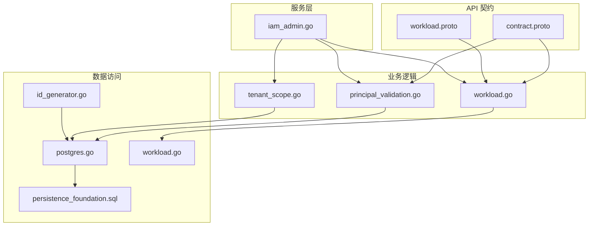
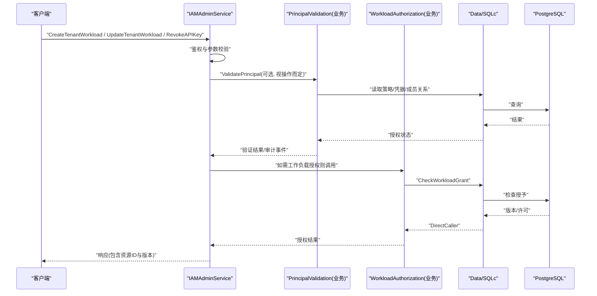
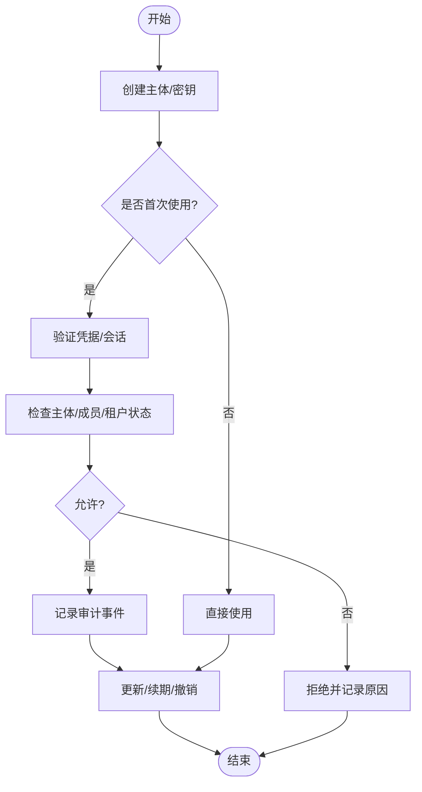
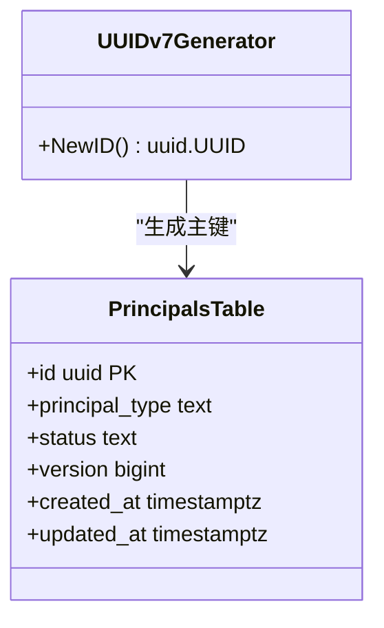
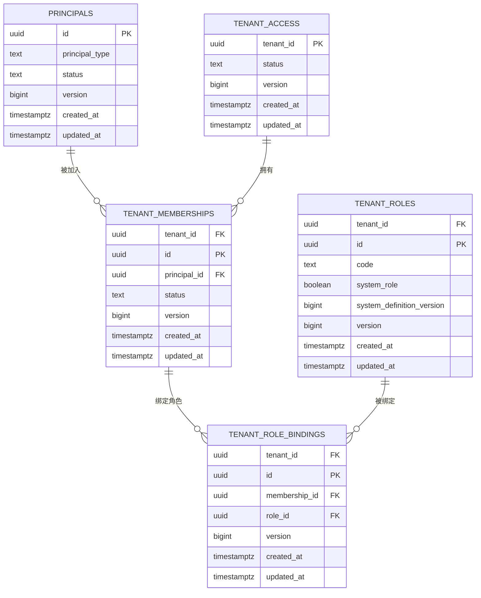
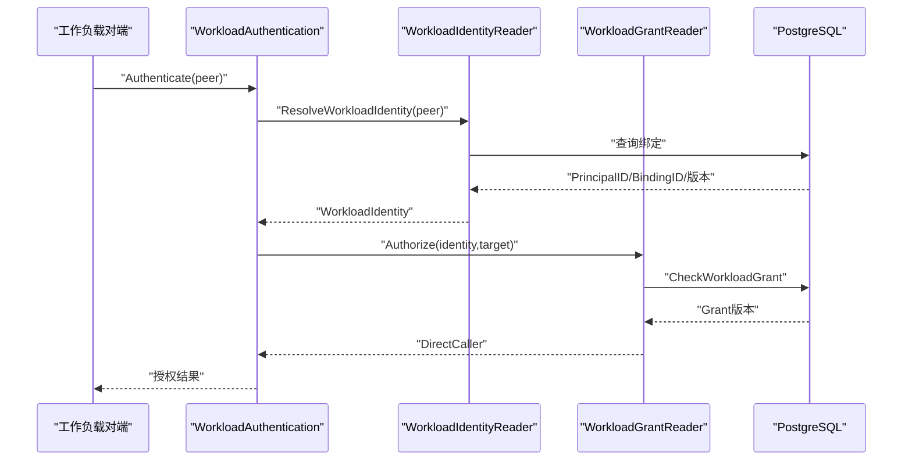
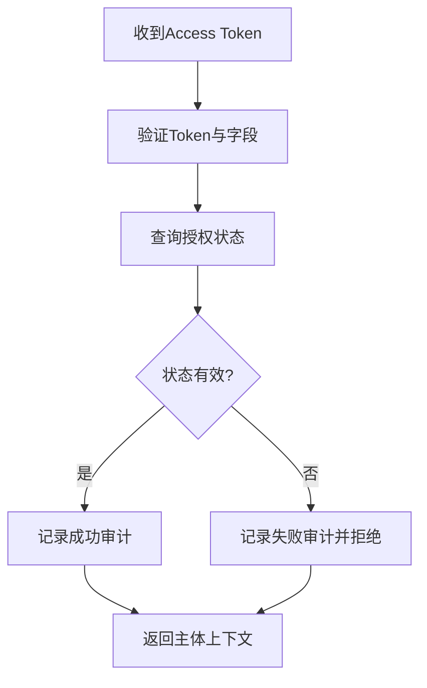
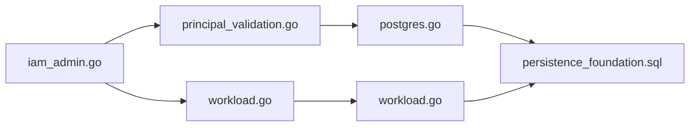

# 主体管理

<cite>
**本文引用的文件**
- [contract.proto](file://api/iam/v1/contract.proto)
- [workload.proto](file://api/iam/v1/workload.proto)
- [principal_validation.go](file://internal/biz/principal_validation.go)
- [workload.go](file://internal/biz/workload.go)
- [tenant_scope.go](file://internal/biz/tenant_scope.go)
- [id_generator.go](file://internal/data/id_generator.go)
- [postgres.go](file://internal/data/postgres.go)
- [workload.go](file://internal/data/workload.go)
- [202609040001_persistence_foundation.sql](file://migrations/202609040001_persistence_foundation.sql)
- [iam_admin.go](file://internal/service/iam_admin.go)
</cite>

## 目录
1. [简介](#简介)
2. [项目结构](#项目结构)
3. [核心组件](#核心组件)
4. [架构总览](#架构总览)
5. [详细组件分析](#详细组件分析)
6. [依赖关系分析](#依赖关系分析)
7. [性能考虑](#性能考虑)
8. [故障排查指南](#故障排查指南)
9. [结论](#结论)
10. [附录：API与使用示例](#附录api与使用示例)

## 简介
本文件面向 ANI IAM 项目的“主体管理系统”，围绕 Principal（主体）的核心概念、生命周期、身份标识、多租户隔离以及工作负载（Workload）与人类（Human）两类主体的差异进行系统化说明。文档同时提供创建与管理不同主体类型的操作路径、错误处理模式，并给出可追溯的代码级来源与图示，帮助读者从业务到实现全面理解该子系统。

## 项目结构
ANI IAM 将主体相关能力分层组织：
- API 契约层：定义主体类型、状态、边界、会话与授权等核心枚举与消息。
- 业务逻辑层：封装主体验证、工作负载身份解析与授权、租户边界等。
- 数据访问层：通过 SQLc 生成查询、PostgreSQL 事务与权限校验、UUID v7 生成器。
- 服务层：对外暴露 gRPC 管理接口，负责参数校验、鉴权、编排调用与 DTO 转换。
- 迁移脚本：定义持久化基础表结构与约束，确保 UUID v7 与多租户隔离。

图表来源
- [contract.proto:21-35](file://api/iam/v1/contract.proto#L21-L35)
- [workload.proto:27-81](file://api/iam/v1/workload.proto#L27-L81)
- [principal_validation.go:80-99](file://internal/biz/principal_validation.go#L80-L99)
- [workload.go:62-106](file://internal/biz/workload.go#L62-L106)
- [tenant_scope.go:16-39](file://internal/biz/tenant_scope.go#L16-L39)
- [id_generator.go:5-13](file://internal/data/id_generator.go#L5-L13)
- [postgres.go:27-59](file://internal/data/postgres.go#L27-L59)
- [workload.go:32-65](file://internal/data/workload.go#L32-L65)
- [202609040001_persistence_foundation.sql:17-25](file://migrations/202609040001_persistence_foundation.sql#L17-L25)
- [iam_admin.go:66-148](file://internal/service/iam_admin.go#L66-L148)

章节来源
- [contract.proto:21-35](file://api/iam/v1/contract.proto#L21-L35)
- [workload.proto:27-81](file://api/iam/v1/workload.proto#L27-L81)
- [principal_validation.go:80-99](file://internal/biz/principal_validation.go#L80-L99)
- [workload.go:62-106](file://internal/biz/workload.go#L62-L106)
- [tenant_scope.go:16-39](file://internal/biz/tenant_scope.go#L16-L39)
- [id_generator.go:5-13](file://internal/data/id_generator.go#L5-L13)
- [postgres.go:27-59](file://internal/data/postgres.go#L27-L59)
- [workload.go:32-65](file://internal/data/workload.go#L32-L65)
- [202609040001_persistence_foundation.sql:17-25](file://migrations/202609040001_persistence_foundation.sql#L17-L25)
- [iam_admin.go:66-148](file://internal/service/iam_admin.go#L66-L148)

## 核心组件
- 主体类型与状态
  - 主体类型：Human（人类）与 Workload（工作负载），用于区分人员与会话式/长期运行的软件实体。
  - 主体状态：Active（活跃）、Disabled（禁用）。
  - 认证方法：Password、OIDC、API Key、Workload Token 等。
- 边界与会话
  - Boundary：TenantBoundary 或 PlatformBoundary，限定作用域。
  - Session/Grant：人类会话与边界范围授予，支持续期与撤销。
- 工作负载身份与授权
  - VerifiedWorkloadPeer：经 mTLS 验证的传输层对端身份。
  - WorkloadIdentity：解析后的主体与绑定信息（含版本）。
  - DirectCaller：一次调用的可信来源与目标上下文。
- 租户边界
  - TenantScope：不可提升的租户边界，所有租户内操作必须携带。

章节来源
- [contract.proto:21-35](file://api/iam/v1/contract.proto#L21-L35)
- [contract.proto:129-159](file://api/iam/v1/contract.proto#L129-L159)
- [workload.proto:27-81](file://api/iam/v1/workload.proto#L27-L81)
- [tenant_scope.go:16-39](file://internal/biz/tenant_scope.go#L16-L39)

## 架构总览
下图展示了从外部请求到内部决策的关键路径：服务层接收管理或运行时请求，进入业务层进行策略校验与主体验证，再经由数据层完成持久化与权限检查，最终返回结构化响应。

图表来源
- [iam_admin.go:66-148](file://internal/service/iam_admin.go#L66-L148)
- [principal_validation.go:80-99](file://internal/biz/principal_validation.go#L80-L99)
- [workload.go:87-106](file://internal/biz/workload.go#L87-L106)
- [workload.go:46-65](file://internal/data/workload.go#L46-L65)
- [postgres.go:27-59](file://internal/data/postgres.go#L27-L59)

## 详细组件分析

### 主体类型与区别：Human vs Workload
- Human（人类）
  - 典型认证方式：Password、OIDC。
  - 会话模型：Session + Grant，支持续期、撤销与过期。
  - 适用场景：控制台登录、管理员操作、需要交互式会话的业务流程。
- Workload（工作负载）
  - 典型认证方式：API Key、Workload Token（结合 mTLS 对端身份）。
  - 无会话：以绑定（Binding）和授予（Grant）直接授权具体目标（Audience/Operation）。
  - 适用场景：服务间调用、后台任务、自动化流水线。

章节来源
- [contract.proto:21-46](file://api/iam/v1/contract.proto#L21-L46)
- [workload.proto:27-81](file://api/iam/v1/workload.proto#L27-L81)

### 主体生命周期管理
- 创建
  - 创建工作负载主体：通过管理接口创建并分配角色，返回主体 ID 与版本。
  - 创建 API Key：为工作负载主体签发密钥，支持设置过期时间。
- 验证
  - 人类主体：校验 Access Token，验证会话与授予状态，记录审计事件。
  - 工作负载主体：校验 API Key 或 Workload Token，检查绑定与授予，记录审计事件。
- 更新
  - 更新主体状态（启用/禁用）：需传入期望版本以实现乐观并发控制。
- 删除
  - 删除成员关系：通过移除成员关系实现“软删除”语义；主体本身保留以便审计与关联。

图表来源
- [principal_validation.go:80-99](file://internal/biz/principal_validation.go#L80-L99)
- [principal_validation.go:120-220](file://internal/biz/principal_validation.go#L120-L220)
- [principal_validation.go:241-307](file://internal/biz/principal_validation.go#L241-L307)
- [iam_admin.go:66-148](file://internal/service/iam_admin.go#L66-L148)

章节来源
- [iam_admin.go:66-148](file://internal/service/iam_admin.go#L66-L148)
- [principal_validation.go:80-99](file://internal/biz/principal_validation.go#L80-L99)
- [principal_validation.go:120-220](file://internal/biz/principal_validation.go#L120-L220)
- [principal_validation.go:241-307](file://internal/biz/principal_validation.go#L241-L307)

### 主体身份标识系统：UUID 生成与唯一性保证
- 生成策略
  - 使用 UUID v7 作为主键与关联 ID，具备时间有序性与全局唯一性。
- 唯一性保证
  - 数据库层面通过主键约束与唯一索引保障。
  - 迁移脚本中对 principals.id 增加校验，确保生成的 UUID 符合 v7 格式。
  - 业务层在创建时通过幂等键避免重复提交导致的数据不一致。

图表来源
- [id_generator.go:5-13](file://internal/data/id_generator.go#L5-L13)
- [202609040001_persistence_foundation.sql:17-25](file://migrations/202609040001_persistence_foundation.sql#L17-L25)

章节来源
- [id_generator.go:5-13](file://internal/data/id_generator.go#L5-L13)
- [202609040001_persistence_foundation.sql:17-25](file://migrations/202609040001_persistence_foundation.sql#L17-L25)

### 主体与租户的关系模型与多租户隔离
- 关系模型
  - principals：主体表，存储主体 ID、类型、状态、版本与时间戳。
  - tenant_access：租户访问状态表，表示租户边界。
  - tenant_memberships：租户成员关系表，将主体与租户关联，并维护状态与版本。
  - tenant_roles / tenant_role_bindings：角色与绑定，决定主体在租户内的权限集合。
- 多租户隔离机制
  - 所有租户内操作必须携带 TenantScope，且不可提升。
  - 事务边界与租户范围一致，防止跨租户越权。
  - 数据库外键与唯一索引限制跨租户引用与重复成员关系。

图表来源
- [202609040001_persistence_foundation.sql:17-95](file://migrations/202609040001_persistence_foundation.sql#L17-L95)
- [tenant_scope.go:16-39](file://internal/biz/tenant_scope.go#L16-L39)

章节来源
- [202609040001_persistence_foundation.sql:17-95](file://migrations/202609040001_persistence_foundation.sql#L17-L95)
- [tenant_scope.go:16-39](file://internal/biz/tenant_scope.go#L16-L39)

### 工作负载身份与授权流程
- 身份解析
  - 基于 mTLS 对端证书链与 DNS 身份，解析出 Environment、TrustDomain、IdentityKind、IdentityValue。
  - 查询绑定表得到 PrincipalID、BindingID 及对应版本。
- 授权检查
  - 根据 Audience 与 Operation 查找注册项，确认已启用。
  - 检查授予（Grant）是否存在且版本有效，返回 DirectCaller 与目标修订号。

图表来源
- [workload.go:62-106](file://internal/biz/workload.go#L62-L106)
- [workload.go:32-65](file://internal/data/workload.go#L32-L65)

章节来源
- [workload.go:62-106](file://internal/biz/workload.go#L62-L106)
- [workload.go:32-65](file://internal/data/workload.go#L32-L65)

### 人类主体认证流程（Access Token）
- 校验 Access Token 的签名与有效期。
- 提取 Subject、SessionID、GrantID、TenantID、GrantVersion。
- 查询授权状态，验证主体、成员、租户状态与授予版本。
- 成功则记录审计事件，失败则记录失败原因。

图表来源
- [principal_validation.go:241-307](file://internal/biz/principal_validation.go#L241-L307)
- [principal_validation.go:331-358](file://internal/biz/principal_validation.go#L331-L358)

章节来源
- [principal_validation.go:241-307](file://internal/biz/principal_validation.go#L241-L307)
- [principal_validation.go:331-358](file://internal/biz/principal_validation.go#L331-L358)

## 依赖关系分析
- 服务层依赖业务层：IAMAdminService 调用 PrincipalValidation 与 WorkloadAuthorization。
- 业务层依赖数据层：通过 sqlc 生成查询访问 PostgreSQL，并使用 UUID v7 生成器。
- 数据层依赖迁移脚本：确保 schema、角色与约束满足运行要求。
- 租户边界贯穿全链路：所有写操作与敏感读操作均受 TenantScope 保护。

图表来源
- [iam_admin.go:66-148](file://internal/service/iam_admin.go#L66-L148)
- [principal_validation.go:80-99](file://internal/biz/principal_validation.go#L80-L99)
- [workload.go:87-106](file://internal/biz/workload.go#L87-L106)
- [postgres.go:27-59](file://internal/data/postgres.go#L27-L59)
- [workload.go:32-65](file://internal/data/workload.go#L32-L65)
- [202609040001_persistence_foundation.sql:17-25](file://migrations/202609040001_persistence_foundation.sql#L17-L25)

章节来源
- [iam_admin.go:66-148](file://internal/service/iam_admin.go#L66-L148)
- [principal_validation.go:80-99](file://internal/biz/principal_validation.go#L80-L99)
- [workload.go:87-106](file://internal/biz/workload.go#L87-L106)
- [postgres.go:27-59](file://internal/data/postgres.go#L27-L59)
- [workload.go:32-65](file://internal/data/workload.go#L32-L65)
- [202609040001_persistence_foundation.sql:17-25](file://migrations/202609040001_persistence_foundation.sql#L17-L25)

## 性能考虑
- 使用 UUID v7 提升索引效率与写入顺序性，减少页分裂。
- 通过租户边界与细粒度索引（如成员关系、审计事件）优化查询。
- 工作负载授权采用注册表与授予版本检查，降低频繁鉴权开销。
- 审计事件追加式写入，避免热点冲突。

[本节为通用指导，不直接分析具体文件]

## 故障排查指南
- 常见错误与定位
  - 凭据无效：检查 Access Token 或 API Key 的状态与过期时间。
  - 权限不足：确认主体在租户中的成员关系与角色绑定是否生效。
  - 租户未就绪：等待租户生命周期达到 Active，或检查生命周期新鲜度。
  - 版本冲突：更新操作需传入正确的 expected_version。
- 审计追踪
  - 通过安全审计事件表查看每次验证的成功/失败详情，包括主体、方法、目标、版本与原因。

章节来源
- [principal_validation.go:331-358](file://internal/biz/principal_validation.go#L331-L358)
- [principal_validation.go:360-405](file://internal/biz/principal_validation.go#L360-L405)
- [postgres.go:150-182](file://internal/data/postgres.go#L150-L182)

## 结论
ANI IAM 的主体管理系统以清晰的类型划分（Human/Workload）、严格的租户边界与明确的授权模型为核心，配合 UUID v7 与审计事件，实现了高可靠、可观测、可扩展的身份与权限管理能力。通过管理接口与工作负载运行时协议，既能满足人类用户的交互需求，也能支撑大规模机器间的自动化调用。

[本节为总结，不直接分析具体文件]

## 附录：API与使用示例
以下示例展示如何创建与管理不同类型的主体与密钥，并提供错误处理建议。为避免泄露敏感信息，示例仅描述调用步骤与关键参数，不包含代码内容。

- 创建工作负载主体（人类管理员操作）
  - 调用：CreateTenantWorkload
  - 关键参数：tenant_id、name、role_ids、idempotency_key
  - 返回：principal_id、membership_id、version
  - 错误处理：
    - 参数非法：检查 tenant_id、role_ids、idempotency_key 是否为空或格式错误。
    - 权限不足：确认调用者具有相应操作权限。
    - 版本冲突：重试时带上最新的 expected_version。
  - 参考路径
    - [iam_admin.go:66-106](file://internal/service/iam_admin.go#L66-L106)

- 创建工作负载 API Key
  - 调用：CreateAPIKey
  - 关键参数：principal_id、never_expires/expires_at、idempotency_key
  - 返回：api_key（显示前缀）、secret（一次性返回）、replayed
  - 错误处理：
    - 凭据无效：检查 principal_id 是否存在且属于当前租户。
    - 权限不足：确认调用者有权为该主体签发密钥。
    - 幂等冲突：使用相同的 idempotency_key 会返回 replayed。
  - 参考路径
    - [iam_admin.go:108-148](file://internal/service/iam_admin.go#L108-L148)

- 获取/列出工作负载主体
  - 调用：GetTenantWorkload / ListTenantWorkloads
  - 关键参数：principal_id、page.cursor/page_size、status（可选）
  - 返回：主体信息与分页游标
  - 错误处理：
    - 参数非法：检查 page 与 status 值。
    - 权限不足：确认调用者在目标租户中具有读取权限。
  - 参考路径
    - [iam_admin.go:150-207](file://internal/service/iam_admin.go#L150-L207)

- 更新工作负载主体状态
  - 调用：UpdateTenantWorkload
  - 关键参数：principal_id、status、expected_version、idempotency_key
  - 返回：更新后的主体信息
  - 错误处理：
    - 版本冲突：使用最新 version 重试。
    - 状态非法：检查 status 是否为 active/disabled。
  - 参考路径
    - [iam_admin.go:242-283](file://internal/service/iam_admin.go#L242-L283)

- 撤销 API Key
  - 调用：RevokeAPIKey
  - 关键参数：key_id、idempotency_key
  - 返回：撤销后的 API Key 信息
  - 错误处理：
    - 凭据无效：检查 key_id 是否存在。
    - 权限不足：确认调用者有权撤销该密钥。
  - 参考路径
    - [iam_admin.go:285-315](file://internal/service/iam_admin.go#L285-L315)

- 工作负载运行时调用（Workload Token + mTLS）
  - 步骤：
    1) 通过 mTLS 建立连接，携带对端身份（Environment、TrustDomain、IdentityKind、IdentityValue）。
    2) 调用 VerifyWorkloadCallerRequest 或 IssueDelegationRequest/VerifyWorkloadInvocationRequest 进行在线验证。
    3) 根据返回的 DirectCaller、Subject、Binding 与 expires_at 执行后续业务。
  - 错误处理：
    - 身份无效：检查证书链与 DNS 身份是否符合预期。
    - 授权失败：确认目标 Audience/Operation 已注册且授予有效。
  - 参考路径
    - [workload.proto:27-81](file://api/iam/v1/workload.proto#L27-L81)
    - [workload.go:62-106](file://internal/biz/workload.go#L62-L106)
    - [workload.go:32-65](file://internal/data/workload.go#L32-L65)

章节来源
- [iam_admin.go:66-315](file://internal/service/iam_admin.go#L66-L315)
- [workload.proto:27-81](file://api/iam/v1/workload.proto#L27-L81)
- [workload.go:62-106](file://internal/biz/workload.go#L62-L106)
- [workload.go:32-65](file://internal/data/workload.go#L32-L65)