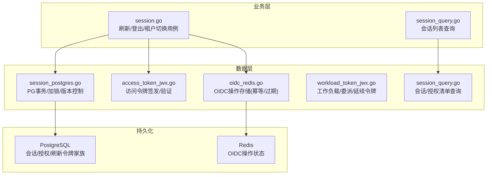
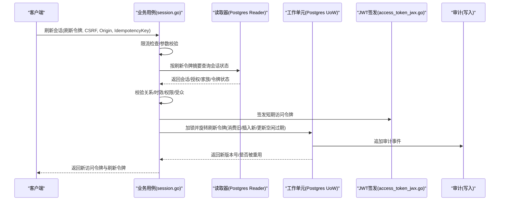
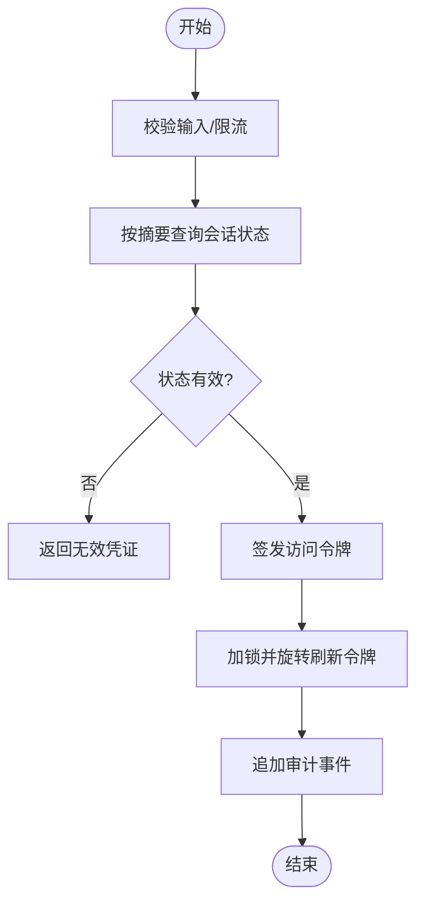
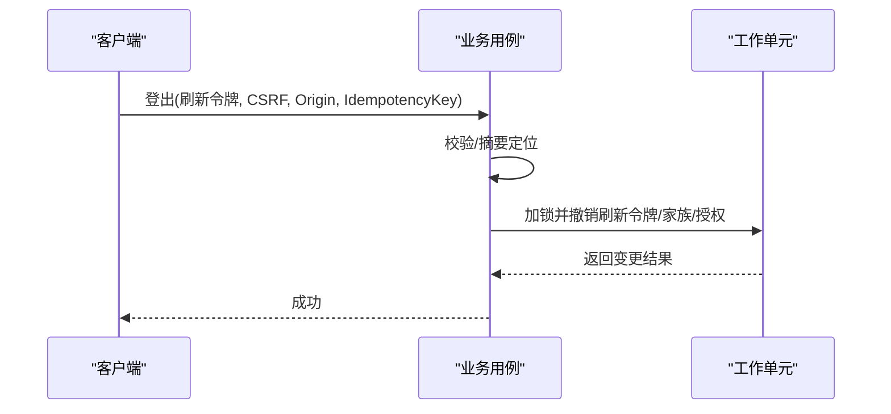
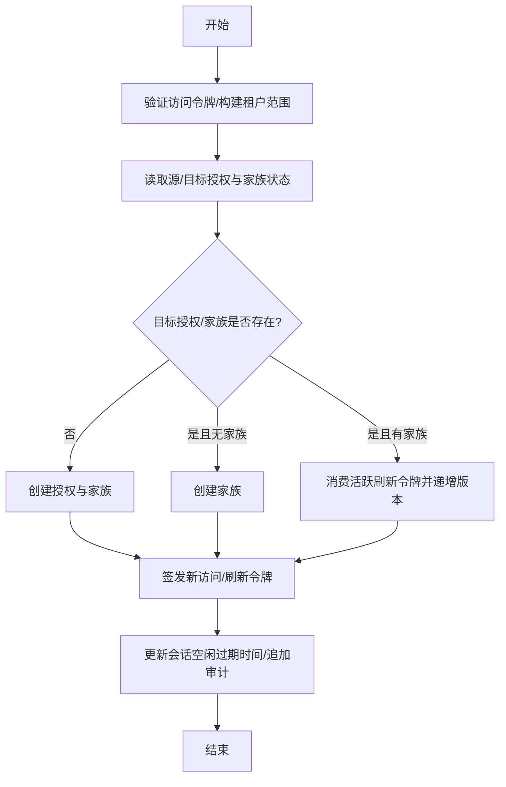
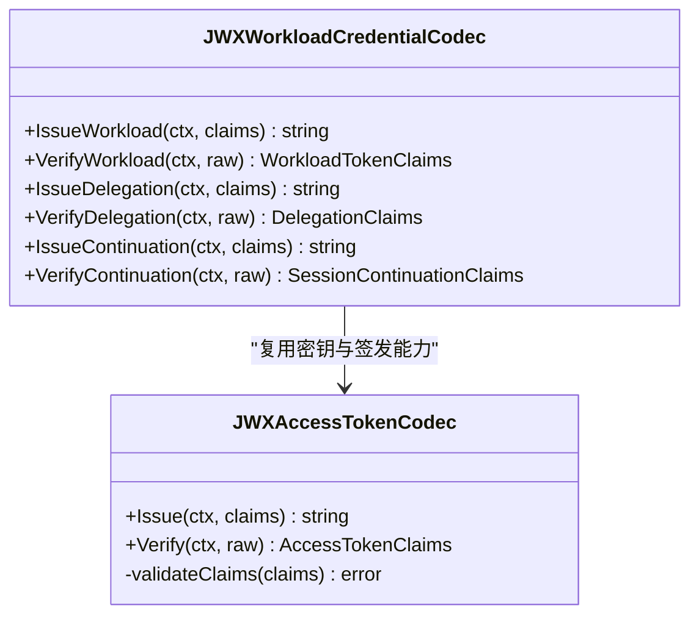
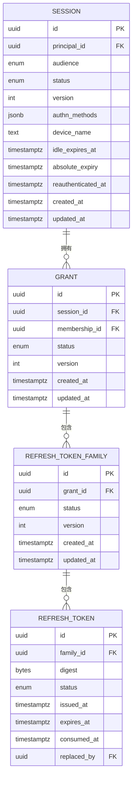
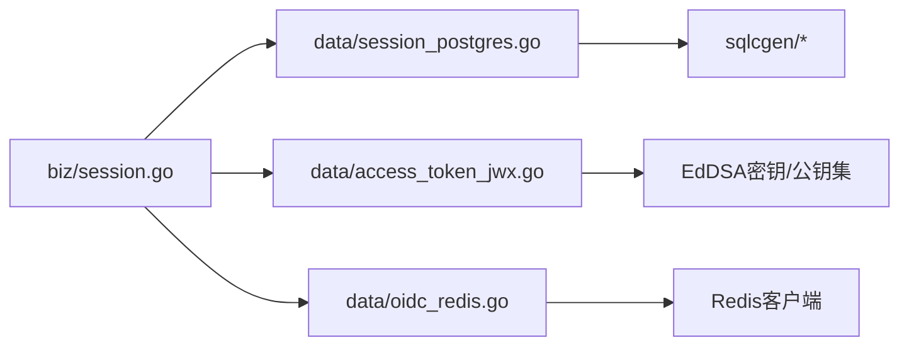

# 会话管理

<cite>
**本文引用的文件**
- [internal/biz/session.go](file://internal/biz/session.go)
- [internal/biz/session_query.go](file://internal/biz/session_query.go)
- [internal/data/session_postgres.go](file://internal/data/session_postgres.go)
- [internal/data/session_query.go](file://internal/data/session_query.go)
- [internal/data/access_token_jwx.go](file://internal/data/access_token_jwx.go)
- [internal/data/workload_token_jwx.go](file://internal/data/workload_token_jwx.go)
- [internal/data/oidc_redis.go](file://internal/data/oidc_redis.go)
- [migrations/202609070002_session_continuity.sql](file://migrations/202609070002_session_continuity.sql)
</cite>

## 目录
1. [简介](#简介)
2. [项目结构](#项目结构)
3. [核心组件](#核心组件)
4. [架构总览](#架构总览)
5. [详细组件分析](#详细组件分析)
6. [依赖关系分析](#依赖关系分析)
7. [性能考虑](#性能考虑)
8. [故障排查指南](#故障排查指南)
9. [结论](#结论)
10. [附录：API调用示例与错误处理模式](#附录api调用示例与错误处理模式)

## 简介
本文件面向ANI IAM项目的会话管理系统，系统性阐述会话生命周期（创建、刷新、续期、销毁）、JWT令牌生成/验证/轮换策略（短期访问令牌与长期刷新令牌的安全设计）、会话状态持久化（PostgreSQL存储结构与Redis缓存策略）、并发会话控制与冲突解决机制，并提供最佳实践、安全配置建议、性能优化技巧以及具体API调用示例与错误处理模式。

## 项目结构
会话管理涉及业务层（biz）、数据层（data）与迁移脚本（migrations），关键职责划分如下：
- 业务层（biz）：定义会话领域模型、命令/结果、审计事件、刷新/登出/租户切换用例及校验逻辑。
- 数据层（data）：实现PostgreSQL事务性操作（加锁、消费/替换刷新令牌、版本控制、审计追加）、Redis OIDC操作存储（幂等与过期）、JWT编解码器（签发与验证）。
- 迁移脚本：定义刷新令牌家族“单活跃”约束与替换边记录，保障并发安全与可追溯性。

图表来源
- [internal/biz/session.go:154-286](file://internal/biz/session.go#L154-L286)
- [internal/data/session_postgres.go:75-165](file://internal/data/session_postgres.go#L75-L165)
- [internal/data/access_token_jwx.go:83-134](file://internal/data/access_token_jwx.go#L83-L134)
- [internal/data/oidc_redis.go:25-54](file://internal/data/oidc_redis.go#L25-L54)

章节来源
- [internal/biz/session.go:154-286](file://internal/biz/session.go#L154-L286)
- [internal/data/session_postgres.go:75-165](file://internal/data/session_postgres.go#L75-L165)
- [internal/data/access_token_jwx.go:83-134](file://internal/data/access_token_jwx.go#L83-L134)
- [internal/data/oidc_redis.go:25-54](file://internal/data/oidc_redis.go#L25-L54)

## 核心组件
- 会话刷新用例：接收刷新令牌、CSRF、来源与幂等键，进行限流检查、状态读取、有效性校验、生成新刷新令牌与访问令牌、并发安全地旋转并记录审计。
- 会话登出用例：基于刷新令牌摘要定位会话，撤销当前会话的刷新令牌、家族与授权，并追加审计事件。
- 租户切换用例：在保持会话连续性的前提下，为目标租户创建或升级授权与刷新令牌家族，颁发新的访问令牌与刷新令牌。
- JWT访问令牌编解码：使用EdDSA签名，严格校验受众、边界、主体、会话ID、授权ID、版本、认证方法、有效期上限等。
- PostgreSQL会话持久化：通过行级锁与唯一索引保证“每家族仅一个活跃刷新令牌”，并在事务内完成消费旧令牌、插入新令牌、更新会话空闲过期时间、追加审计。
- Redis OIDC操作存储：提供幂等的创建/获取与一次性消费，用于OIDC流程的状态机推进。

章节来源
- [internal/biz/session.go:154-286](file://internal/biz/session.go#L154-L286)
- [internal/biz/session.go:288-348](file://internal/biz/session.go#L288-L348)
- [internal/biz/session.go:350-478](file://internal/biz/session.go#L350-L478)
- [internal/data/access_token_jwx.go:83-134](file://internal/data/access_token_jwx.go#L83-L134)
- [internal/data/access_token_jwx.go:169-225](file://internal/data/access_token_jwx.go#L169-L225)
- [internal/data/session_postgres.go:75-165](file://internal/data/session_postgres.go#L75-L165)
- [internal/data/oidc_redis.go:25-54](file://internal/data/oidc_redis.go#L25-L54)

## 架构总览
会话管理的端到端流程包括：客户端发起刷新/登出/租户切换请求；业务层进行参数校验、限流、状态读取与合法性检查；数据层在PostgreSQL中加锁并执行原子性变更（消费旧刷新令牌、插入新令牌、更新会话空闲过期时间、追加审计）；同时签发短期访问令牌；必要时使用Redis维护OIDC操作状态。

图表来源
- [internal/biz/session.go:154-286](file://internal/biz/session.go#L154-L286)
- [internal/data/session_postgres.go:75-165](file://internal/data/session_postgres.go#L75-L165)
- [internal/data/access_token_jwx.go:83-134](file://internal/data/access_token_jwx.go#L83-L134)

## 详细组件分析

### 会话刷新（Refresh Session）
- 输入校验：刷新令牌、CSRF、Origin、幂等键必填；对刷新令牌进行SHA-256摘要作为后续查找与限流键。
- 限流：基于摘要进行刷新频率限制，防止暴力尝试。
- 状态读取与校验：读取会话、授权、家族、刷新令牌状态，校验关系一致性、时效性、主体/成员/租户访问状态、生命周期新鲜度与活动状态。
- 令牌轮换：生成新的刷新令牌（同家族），计算新的空闲过期时间与访问令牌过期时间；签发短期访问令牌；在事务中加锁并原子性地消费旧刷新令牌、插入新刷新令牌、更新会话空闲过期时间、追加审计。
- 并发与重用检测：若检测到并发重用（同一刷新令牌被多次使用），则撤销整个刷新家族并拒绝本次刷新。

图表来源
- [internal/biz/session.go:154-286](file://internal/biz/session.go#L154-L286)
- [internal/data/session_postgres.go:75-165](file://internal/data/session_postgres.go#L75-L165)

章节来源
- [internal/biz/session.go:154-286](file://internal/biz/session.go#L154-L286)
- [internal/data/session_postgres.go:75-165](file://internal/data/session_postgres.go#L75-L165)

### 会话登出（Logout Session）
- 输入校验：刷新令牌、CSRF、Origin、幂等键必填；按摘要定位会话。
- 幂等与安全：若会话不存在或已非活动，直接成功返回；否则撤销当前会话的所有刷新令牌、家族与授权，并将会话置为非活动，追加审计事件。

图表来源
- [internal/biz/session.go:288-348](file://internal/biz/session.go#L288-L348)
- [internal/data/session_postgres.go:268-350](file://internal/data/session_postgres.go#L268-L350)

章节来源
- [internal/biz/session.go:288-348](file://internal/biz/session.go#L288-L348)
- [internal/data/session_postgres.go:268-350](file://internal/data/session_postgres.go#L268-L350)

### 租户切换（Switch Tenant）
- 输入校验：凭据（访问令牌）、目标租户ID、幂等键；解析并验证访问令牌声明。
- 状态读取与校验：读取源租户授权与目标租户可用授权/家族，校验主体/成员/租户访问/生命周期新鲜度与活动状态。
- 授权与刷新家族：若目标授权不存在则创建；若存在但无家族则创建；若已有家族则消费其活跃刷新令牌并递增版本；最后签发新的访问令牌与刷新令牌，更新会话空闲过期时间并追加审计。

图表来源
- [internal/biz/session.go:350-478](file://internal/biz/session.go#L350-L478)
- [internal/data/session_postgres.go:352-498](file://internal/data/session_postgres.go#L352-L498)

章节来源
- [internal/biz/session.go:350-478](file://internal/biz/session.go#L350-L478)
- [internal/data/session_postgres.go:352-498](file://internal/data/session_postgres.go#L352-L498)

### JWT令牌生成、验证与轮换
- 访问令牌（Access Token）：
  - 签发：包含主体、受众、边界、会话ID、授权ID、授权版本、认证方法、签发/过期时间等；使用EdDSA签名，设置Key ID与类型。
  - 验证：强制算法为EdDSA，校验Key ID、类型、受众、必需声明、时间有效性、最大生命周期（Console/Boss不同上限）、认证方法集合。
- 工作负载/委派/延续令牌：
  - 签发与验证遵循严格的类型、受众、主体、时间窗口与注册表校验，确保跨服务调用的可信上下文传递。

图表来源
- [internal/data/access_token_jwx.go:83-134](file://internal/data/access_token_jwx.go#L83-L134)
- [internal/data/access_token_jwx.go:169-225](file://internal/data/access_token_jwx.go#L169-L225)
- [internal/data/workload_token_jwx.go:36-66](file://internal/data/workload_token_jwx.go#L36-L66)
- [internal/data/workload_token_jwx.go:215-228](file://internal/data/workload_token_jwx.go#L215-L228)

章节来源
- [internal/data/access_token_jwx.go:83-134](file://internal/data/access_token_jwx.go#L83-L134)
- [internal/data/access_token_jwx.go:169-225](file://internal/data/access_token_jwx.go#L169-L225)
- [internal/data/workload_token_jwx.go:36-66](file://internal/data/workload_token_jwx.go#L36-L66)
- [internal/data/workload_token_jwx.go:215-228](file://internal/data/workload_token_jwx.go#L215-L228)

### 会话状态持久化设计
- PostgreSQL：
  - 刷新令牌家族“单活跃”约束：通过唯一索引限制每个家族在同一租户下仅有一个活跃刷新令牌，避免并发冲突。
  - 替换边记录：consumed刷新令牌记录replaced_by指向新令牌，形成可追溯的替换链。
  - 事务与加锁：刷新/登出/租户切换均通过会话连续性锁与刷新令牌行锁串行化，保证一致性。
- Redis：
  - OIDC操作存储：使用Lua脚本实现幂等的CreateOrGet与Consume，支持过期与去重，确保OIDC流程状态机正确推进。

图表来源
- [migrations/202609070002_session_continuity.sql:4-18](file://migrations/202609070002_session_continuity.sql#L4-L18)
- [internal/data/session_postgres.go:628-710](file://internal/data/session_postgres.go#L628-L710)

章节来源
- [migrations/202609070002_session_continuity.sql:4-18](file://migrations/202609070002_session_continuity.sql#L4-L18)
- [internal/data/session_postgres.go:628-710](file://internal/data/session_postgres.go#L628-L710)

### 并发会话控制与冲突解决
- 刷新令牌重用保护：当检测到刷新令牌被重复使用时，系统撤销该刷新家族所有活跃令牌并提升授权版本，防止横向越权。
- 会话连续性锁：所有刷新/登出/租户切换操作先锁定会话连续性，再锁定具体刷新令牌行，确保串行化处理。
- 版本控制：会话、授权、家族均带版本号，更新时通过ExpectedVersion进行乐观锁校验，失败返回版本冲突错误。

章节来源
- [internal/data/session_postgres.go:75-165](file://internal/data/session_postgres.go#L75-L165)
- [internal/data/session_postgres.go:167-266](file://internal/data/session_postgres.go#L167-L266)
- [internal/data/session_postgres.go:268-350](file://internal/data/session_postgres.go#L268-L350)
- [internal/data/session_postgres.go:352-498](file://internal/data/session_postgres.go#L352-L498)

## 依赖关系分析
- 业务层依赖数据层的读取器与工作单元接口，解耦了刷新/登出/租户切换的具体实现。
- 数据层依赖PostgreSQL连接池与SQLC生成的查询，以及Redis客户端用于OIDC操作存储。
- JWT编解码器依赖EdDSA密钥管理与时钟抽象，确保签发的令牌可被多实例一致验证。

图表来源
- [internal/biz/session.go:154-286](file://internal/biz/session.go#L154-L286)
- [internal/data/session_postgres.go:75-165](file://internal/data/session_postgres.go#L75-L165)
- [internal/data/access_token_jwx.go:83-134](file://internal/data/access_token_jwx.go#L83-L134)
- [internal/data/oidc_redis.go:25-54](file://internal/data/oidc_redis.go#L25-L54)

章节来源
- [internal/biz/session.go:154-286](file://internal/biz/session.go#L154-L286)
- [internal/data/session_postgres.go:75-165](file://internal/data/session_postgres.go#L75-L165)
- [internal/data/access_token_jwx.go:83-134](file://internal/data/access_token_jwx.go#L83-L134)
- [internal/data/oidc_redis.go:25-54](file://internal/data/oidc_redis.go#L25-L54)

## 性能考虑
- 刷新令牌家族“单活跃”索引：减少并发竞争面，提高刷新吞吐。
- 会话连续性锁粒度：以会话为单位串行化相关操作，避免热点会话上的写放大。
- 访问令牌短生命周期：降低令牌泄露风险与后端校验负担，配合刷新令牌轮转维持用户体验。
- Redis OIDC操作幂等：避免重复创建导致的状态爆炸与网络重试风暴。
- 批量审计追加：在事务末尾统一追加审计事件，减少IO次数。

[本节为通用指导，不直接分析具体文件]

## 故障排查指南
- 刷新令牌无效：检查摘要是否正确、令牌是否已消耗或被撤销、家族是否被吊销、会话是否过期或非活动。
- 版本冲突：检查ExpectedVersion是否与数据库当前版本一致，可能由并发更新导致。
- 租户切换失败：确认源/目标授权与家族状态、成员与租户访问状态、生命周期新鲜度与活动状态。
- JWT验证失败：核对算法、Key ID、受众、边界、主体、会话ID、授权ID、版本、认证方法与有效期上限。
- Redis操作异常：检查命名空间、键过期时间、幂等键冲突与Lua脚本返回值。

章节来源
- [internal/data/session_postgres.go:75-165](file://internal/data/session_postgres.go#L75-L165)
- [internal/data/session_postgres.go:167-266](file://internal/data/session_postgres.go#L167-L266)
- [internal/data/access_token_jwx.go:169-225](file://internal/data/access_token_jwx.go#L169-L225)
- [internal/data/oidc_redis.go:25-54](file://internal/data/oidc_redis.go#L25-L54)

## 结论
ANI IAM的会话管理通过严谨的业务规则、强一致的事务与加锁、严格的JWT校验与轮换策略，实现了高安全、高可用的会话生命周期管理。刷新令牌的家族化与“单活跃”约束、会话连续性锁与版本控制，确保了并发场景下的正确性与安全性。结合Redis的幂等操作存储，进一步提升了整体系统的鲁棒性与可扩展性。

[本节为总结，不直接分析具体文件]

## 附录：API调用示例与错误处理模式

### 刷新会话
- 请求体字段：refresh_token、csrf_token、origin、idempotency_key。
- 成功响应：tenant_id、principal、session、grant、access_token、refresh_token、access_token_expires_at。
- 常见错误：
  - 缺少必要字段：返回对应缺失错误。
  - 刷新令牌无效/已消耗：返回无效凭证。
  - 刷新令牌重用：触发家族吊销并返回无效凭证。
  - 依赖错误：如限流、数据库错误，包装为依赖错误。

章节来源
- [internal/biz/session.go:154-286](file://internal/biz/session.go#L154-L286)
- [internal/data/session_postgres.go:75-165](file://internal/data/session_postgres.go#L75-L165)

### 登出会话
- 请求体字段：refresh_token、csrf_token、origin、idempotency_key。
- 成功响应：空结果（幂等）。
- 常见错误：
  - 缺少必要字段：返回对应缺失错误。
  - 会话不存在或非活动：幂等成功。
  - 依赖错误：包装为依赖错误。

章节来源
- [internal/biz/session.go:288-348](file://internal/biz/session.go#L288-L348)
- [internal/data/session_postgres.go:268-350](file://internal/data/session_postgres.go#L268-L350)

### 租户切换
- 请求体字段：raw_credential（访问令牌）、target_tenant_id、idempotency_key。
- 成功响应：tenant_id、principal、session、grant、access_token、refresh_token、access_token_expires_at。
- 常见错误：
  - 凭据无效/过期：返回无效凭证。
  - 目标租户不可用/生命周期阻塞：返回相应错误。
  - 依赖错误：包装为依赖错误。

章节来源
- [internal/biz/session.go:350-478](file://internal/biz/session.go#L350-L478)
- [internal/data/session_postgres.go:352-498](file://internal/data/session_postgres.go#L352-L498)

### JWT验证与错误
- 验证要点：算法必须为EdDSA；Key ID需匹配；类型必须为JWT；受众、主体、会话ID、授权ID、版本、认证方法必须齐全且合法；有效期不得超过受众上限。
- 常见错误：
  - 非法算法/类型/Key ID：返回无效凭证。
  - 受众/边界不匹配：返回无效凭证。
  - 时间无效/超期：返回无效凭证。
  - 认证方法非法或缺失：返回无效凭证。

章节来源
- [internal/data/access_token_jwx.go:169-225](file://internal/data/access_token_jwx.go#L169-L225)
- [internal/data/access_token_jwx.go:332-378](file://internal/data/access_token_jwx.go#L332-L378)