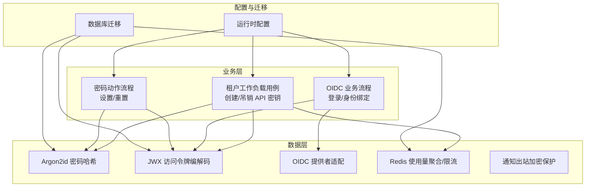
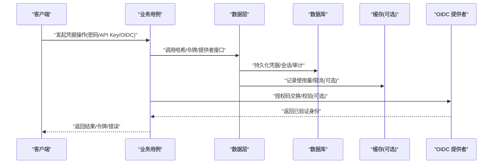
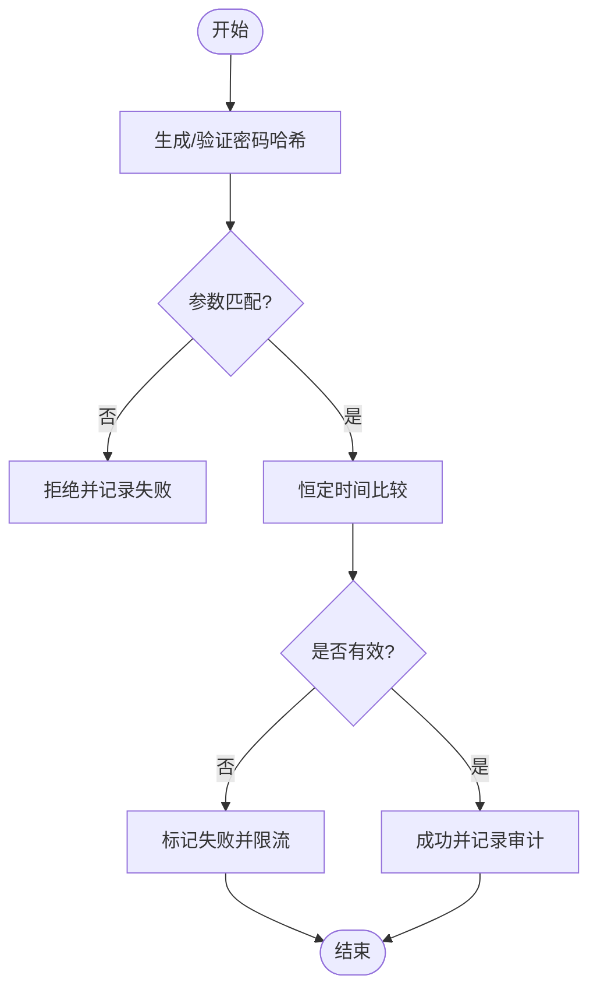
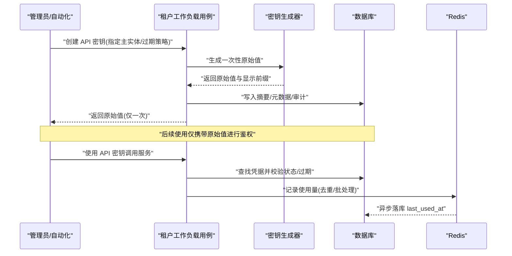
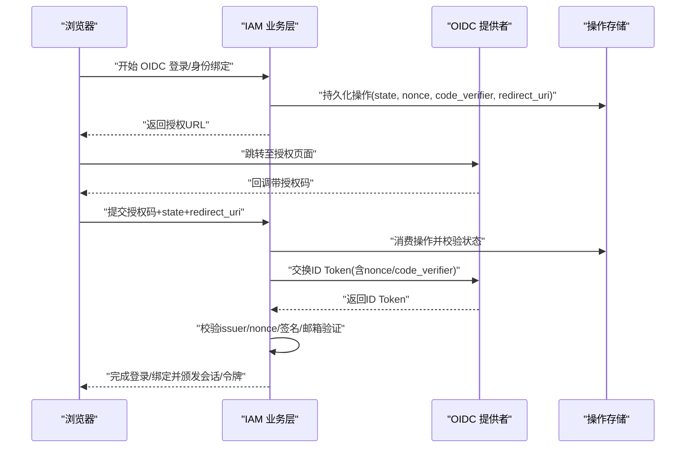
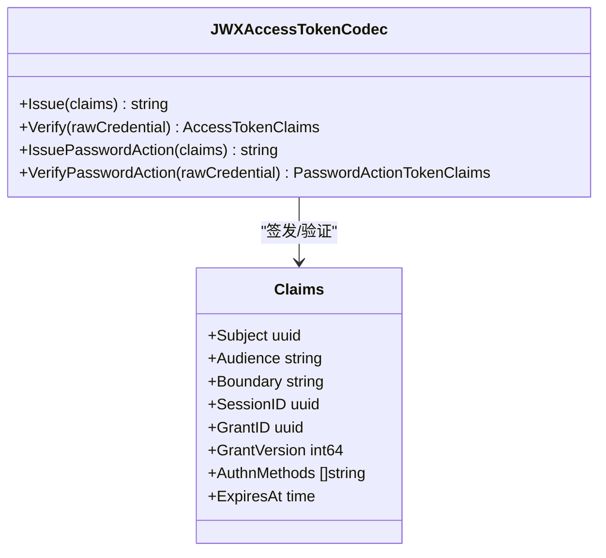
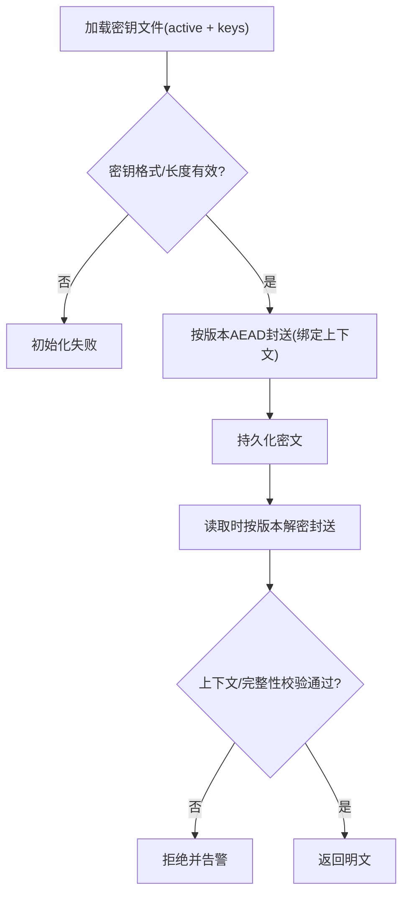
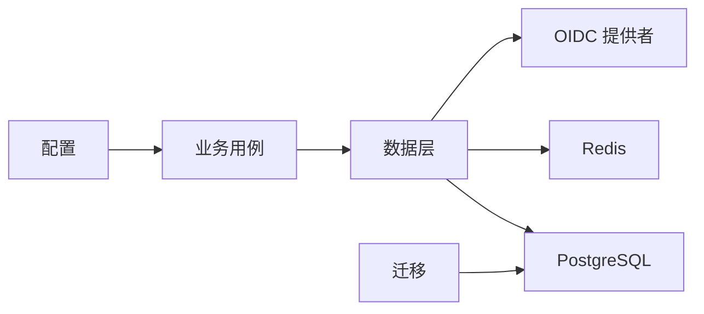

# 凭据管理

<cite>
**本文引用的文件**
- [password_argon2id.go](file://internal/data/password_argon2id.go)
- [secret_generator.go](file://internal/data/secret_generator.go)
- [tenant_workload.go](file://internal/biz/tenant_workload.go)
- [oidc_provider.go](file://internal/data/oidc_provider.go)
- [access_token_jwx.go](file://internal/data/access_token_jwx.go)
- [api_key_usage_redis.go](file://internal/data/api_key_usage_redis.go)
- [config.yaml](file://configs/config.yaml)
- [validate.go](file://internal/conf/validate.go)
- [outbox_protector.go](file://internal/data/outbox_protector.go)
- [202609060001_password_authentication.sql](file://migrations/202609060001_password_authentication.sql)
- [202609080003_tenant_workload_api_key.sql](file://migrations/202609080003_tenant_workload_api_key.sql)
- [oidc.go](file://internal/biz/oidc.go)
- [principal_validation.go](file://internal/biz/principal_validation.go)
- [workload.go](file://internal/biz/workload.go)
</cite>

## 目录
1. [简介](#简介)
2. [项目结构](#项目结构)
3. [核心组件](#核心组件)
4. [架构总览](#架构总览)
5. [详细组件分析](#详细组件分析)
6. [依赖关系分析](#依赖关系分析)
7. [性能考量](#性能考量)
8. [故障排查指南](#故障排查指南)
9. [结论](#结论)
10. [附录](#附录)

## 简介
本文件为 ANI IAM 项目的凭据管理系统提供系统化文档，覆盖密码存储与验证、API 密钥生命周期、OIDC 集成中的凭据处理、敏感信息加密存储与密钥管理策略，以及配置示例与安全建议。目标是帮助读者在不深入源码的情况下理解系统如何安全地生成、存储、轮换和验证各类凭据，并在生产环境中正确配置与运维。

## 项目结构
凭据管理涉及业务层（biz）、数据访问层（data）、配置与迁移（conf/migrations）等模块：
- 业务层负责流程编排、校验与审计事件构造
- 数据层实现哈希、令牌编解码、外部依赖（PostgreSQL/Redis/OIDC）交互
- 配置层约束运行参数与密钥加载路径
- 迁移脚本定义持久化模型与约束

图表来源
- [tenant_workload.go:335-410](file://internal/biz/tenant_workload.go#L335-L410)
- [oidc.go:300-413](file://internal/biz/oidc.go#L300-L413)
- [password_argon2id.go:14-55](file://internal/data/password_argon2id.go#L14-L55)
- [access_token_jwx.go:83-133](file://internal/data/access_token_jwx.go#L83-L133)
- [oidc_provider.go:62-153](file://internal/data/oidc_provider.go#L62-L153)
- [api_key_usage_redis.go:63-123](file://internal/data/api_key_usage_redis.go#L63-L123)
- [outbox_protector.go:23-47](file://internal/data/outbox_protector.go#L23-L47)
- [config.yaml:17-60](file://configs/config.yaml#L17-L60)
- [202609080003_tenant_workload_api_key.sql:149-232](file://migrations/202609080003_tenant_workload_api_key.sql#L149-L232)
- [202609060001_password_authentication.sql:29-135](file://migrations/202609060001_password_authentication.sql#L29-L135)

章节来源
- [config.yaml:17-60](file://configs/config.yaml#L17-L60)
- [validate.go:19-45](file://internal/conf/validate.go#L19-L45)

## 核心组件
- 密码哈希与验证：基于 Argon2id 的固定参数集，强制参数匹配，未知账户防侧信道比较
- API 密钥：高熵随机生成、仅存摘要、显示前缀、过期策略、速率限制、使用量聚合与审计
- OIDC 集成：PKCE、授权码交换、ID Token 校验、邮箱验证、状态绑定与重认证窗口
- 访问令牌：EdDSA 签名的 JWT，严格声明校验、受众/边界控制、短期有效期
- 敏感数据加密：通知出站使用 AES-GCM AEAD，多版本密钥轮换，按记录绑定上下文

章节来源
- [password_argon2id.go:14-55](file://internal/data/password_argon2id.go#L14-L55)
- [secret_generator.go:19-24](file://internal/data/secret_generator.go#L19-L24)
- [tenant_workload.go:335-410](file://internal/biz/tenant_workload.go#L335-L410)
- [oidc_provider.go:62-153](file://internal/data/oidc_provider.go#L62-L153)
- [access_token_jwx.go:83-133](file://internal/data/access_token_jwx.go#L83-L133)
- [outbox_protector.go:23-47](file://internal/data/outbox_protector.go#L23-L47)

## 架构总览
凭据管理的整体流程围绕“请求-验证-持久化-审计”展开：
- 密码设置/重置通过动作令牌驱动，结合 Argon2id 哈希与幂等完成
- API 密钥在创建时生成一次性原始值并返回给调用方，服务端仅保存摘要；使用时进行鉴权与用量统计
- OIDC 登录/身份绑定通过 PKCE 与授权码交换，校验 ID Token 后建立会话或绑定身份
- 访问令牌由 EdDSA 私钥签发，验证时使用公钥集合，严格校验声明与有效期

图表来源
- [oidc.go:636-664](file://internal/biz/oidc.go#L636-L664)
- [oidc_provider.go:115-153](file://internal/data/oidc_provider.go#L115-L153)
- [tenant_workload.go:335-410](file://internal/biz/tenant_workload.go#L335-L410)
- [api_key_usage_redis.go:63-123](file://internal/data/api_key_usage_redis.go#L63-L123)

## 详细组件分析

### 密码存储与验证（Argon2id）
- 使用固定参数的 Argon2id 参数集，确保所有密码哈希具备一致的安全强度与可验证性
- 验证时强制比对参数，防止降级攻击；对未知账户采用固定哈希进行恒定时间比较，避免枚举泄露
- 密码动作流程支持“设置/重置”，通过动作令牌与幂等键保证安全完成

图表来源
- [password_argon2id.go:14-55](file://internal/data/password_argon2id.go#L14-L55)
- [202609060001_password_authentication.sql:29-135](file://migrations/202609060001_password_authentication.sql#L29-L135)

章节来源
- [password_argon2id.go:14-55](file://internal/data/password_argon2id.go#L14-L55)
- [202609060001_password_authentication.sql:29-135](file://migrations/202609060001_password_authentication.sql#L29-L135)

### API 密钥生成、存储与使用
- 生成：使用高熵随机源生成一次性原始值，返回给调用方；服务端仅存储摘要与显示前缀
- 存储：数据库表包含 key_id、principal_id、status、never_expires、expires_at、last_used_at、version 等字段，并通过触发器与约束保证不可变性与有效性
- 使用：鉴权时查找凭据、检查状态与过期时间，记录使用量到 Redis 并异步落库；支持创建速率限制
- 轮换：通过吊销旧密钥并创建新密钥实现；并发场景下保证旧密钥最终失效且不会误用

图表来源
- [tenant_workload.go:335-410](file://internal/biz/tenant_workload.go#L335-L410)
- [secret_generator.go:19-24](file://internal/data/secret_generator.go#L19-L24)
- [api_key_usage_redis.go:63-123](file://internal/data/api_key_usage_redis.go#L63-L123)
- [202609080003_tenant_workload_api_key.sql:149-232](file://migrations/202609080003_tenant_workload_api_key.sql#L149-L232)

章节来源
- [tenant_workload.go:335-410](file://internal/biz/tenant_workload.go#L335-L410)
- [secret_generator.go:19-24](file://internal/data/secret_generator.go#L19-L24)
- [api_key_usage_redis.go:63-123](file://internal/data/api_key_usage_redis.go#L63-L123)
- [202609080003_tenant_workload_api_key.sql:149-232](file://migrations/202609080003_tenant_workload_api_key.sql#L149-L232)

### OIDC 集成中的凭据处理
- 授权阶段：生成 state、nonce、code_verifier，构建授权 URL；回调 URI 白名单校验
- 交换阶段：使用授权码与 code_verifier 交换 ID Token，校验 issuer、nonce、签名与邮箱验证标志
- 登录/身份绑定：根据已验证身份查询/绑定主体，必要时要求重新认证；记录审计事件
- 浏览器证明：在特定流程中校验浏览器端提供的证明摘要，增强安全性

图表来源
- [oidc.go:300-413](file://internal/biz/oidc.go#L300-L413)
- [oidc_provider.go:62-153](file://internal/data/oidc_provider.go#L62-L153)

章节来源
- [oidc.go:300-413](file://internal/biz/oidc.go#L300-L413)
- [oidc_provider.go:62-153](file://internal/data/oidc_provider.go#L62-L153)

### 访问令牌（JWT）签发与验证
- 签发：使用 EdDSA 私钥对包含主体、受众、边界、会话、授权版本、认证方法等声明的 JWT 进行签名
- 验证：解析 JWS，校验算法、key_id、类型、必需声明、受众、边界组合、有效期上限；支持密码动作专用令牌
- 安全策略：Console/Boss 受众分别对应不同最大生命周期；平台边界不允许携带租户 ID

图表来源
- [access_token_jwx.go:83-133](file://internal/data/access_token_jwx.go#L83-L133)
- [access_token_jwx.go:169-225](file://internal/data/access_token_jwx.go#L169-L225)
- [access_token_jwx.go:227-303](file://internal/data/access_token_jwx.go#L227-L303)

章节来源
- [access_token_jwx.go:83-133](file://internal/data/access_token_jwx.go#L83-L133)
- [access_token_jwx.go:169-225](file://internal/data/access_token_jwx.go#L169-L225)
- [access_token_jwx.go:227-303](file://internal/data/access_token_jwx.go#L227-L303)

### 凭据加密存储与密钥管理
- 通知出站使用 AES-GCM AEAD 加密，支持多版本密钥轮换；每个密文绑定记录上下文（如租户、邀请、投递 ID），防止替换与篡改
- 密钥文件以 JSON 形式加载，包含 active 版本与 keys 映射；密钥长度与格式严格校验
- 最佳实践：定期轮换密钥、最小权限访问密钥文件、监控解密失败与异常

图表来源
- [outbox_protector.go:23-47](file://internal/data/outbox_protector.go#L23-L47)

章节来源
- [outbox_protector.go:23-47](file://internal/data/outbox_protector.go#L23-L47)

## 依赖关系分析
- 业务层依赖数据层的哈希、令牌、OIDC 适配器与缓存/数据库
- 数据层依赖 PostgreSQL（持久化）、Redis（限流/使用量）、OIDC 提供者（网络）
- 配置层约束 TLS、数据库连接、OIDC 客户端密钥文件路径、访问令牌私钥文件等
- 迁移层确保数据库结构与约束满足安全要求（不可变性、状态机、索引）

图表来源
- [tenant_workload.go:335-410](file://internal/biz/tenant_workload.go#L335-L410)
- [oidc_provider.go:62-153](file://internal/data/oidc_provider.go#L62-L153)
- [config.yaml:17-60](file://configs/config.yaml#L17-L60)
- [202609080003_tenant_workload_api_key.sql:149-232](file://migrations/202609080003_tenant_workload_api_key.sql#L149-L232)

章节来源
- [tenant_workload.go:335-410](file://internal/biz/tenant_workload.go#L335-L410)
- [oidc_provider.go:62-153](file://internal/data/oidc_provider.go#L62-L153)
- [config.yaml:17-60](file://configs/config.yaml#L17-L60)
- [202609080003_tenant_workload_api_key.sql:149-232](file://migrations/202609080003_tenant_workload_api_key.sql#L149-L232)

## 性能考量
- 密码哈希：Argon2id 参数固定，兼顾安全与性能；避免动态调参导致的不一致
- API 密钥使用量：Redis 批量聚合减少数据库写入压力；批次大小可调但需平衡延迟与吞吐
- OIDC 网络：HTTP 超时与依赖错误分类，区分临时不可用与永久错误，便于重试与降级
- 令牌验证：EdDSA 签名验证开销低，适合高频鉴权场景

[本节为通用指导，不直接分析具体文件]

## 故障排查指南
- 密码动作失败：检查动作令牌是否过期、目的与受众是否正确、幂等键冲突；查看审计事件定位失败原因
- API 密钥鉴权失败：确认密钥未吊销/未过期；检查 Redis 限流是否触发；核对数据库状态与约束
- OIDC 交换失败：核对 state/nonce/code_verifier/redirect_uri；检查 ID Token 的 issuer/nonce/签名与邮箱验证；关注依赖错误分类
- 访问令牌验证失败：检查 key_id、算法、类型、必需声明、受众与边界组合、有效期上限
- 出站加密失败：确认 active 密钥存在且版本匹配；检查密文是否被篡改；核对上下文绑定

章节来源
- [principal_validation.go:149-176](file://internal/biz/principal_validation.go#L149-L176)
- [oidc_provider.go:156-190](file://internal/data/oidc_provider.go#L156-L190)
- [access_token_jwx.go:169-225](file://internal/data/access_token_jwx.go#L169-L225)
- [outbox_protector.go:23-47](file://internal/data/outbox_protector.go#L23-L47)

## 结论
ANI IAM 的凭据管理以“强哈希、短生命周期、严格声明校验、不可变持久化与审计”为核心原则。通过 Argon2id 密码哈希、EdDSA 访问令牌、OIDC PKCE 与严格的数据库约束，系统在保障安全的同时兼顾性能与可运维性。建议在生产环境中遵循密钥轮换、最小权限与监控告警的最佳实践，确保凭据全生命周期的安全可控。

[本节为总结，不直接分析具体文件]

## 附录

### 配置示例与安全建议
- 密码策略：使用固定 Argon2id 参数；禁止自定义弱参数；对未知账户采用恒定时间比较
- API 密钥：启用创建速率限制；设置合理过期策略；定期吊销不再使用的密钥；监控使用量与异常活跃数量
- OIDC：配置 HTTPS 回调与白名单；启用邮箱验证；设置重认证窗口；合理设置 HTTP 超时
- 访问令牌：限定受众与边界；控制最大生命周期；轮换 EdDSA 私钥并维护公钥集合
- 出站加密：定期轮换 AES-GCM 密钥；最小权限访问密钥文件；监控解密失败与异常

章节来源
- [password_argon2id.go:14-55](file://internal/data/password_argon2id.go#L14-L55)
- [tenant_workload.go:335-410](file://internal/biz/tenant_workload.go#L335-L410)
- [oidc_provider.go:62-153](file://internal/data/oidc_provider.go#L62-L153)
- [access_token_jwx.go:83-133](file://internal/data/access_token_jwx.go#L83-L133)
- [outbox_protector.go:23-47](file://internal/data/outbox_protector.go#L23-L47)
- [config.yaml:17-60](file://configs/config.yaml#L17-L60)
- [validate.go:19-45](file://internal/conf/validate.go#L19-L45)