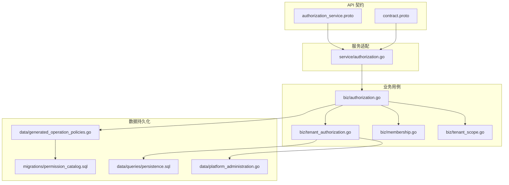
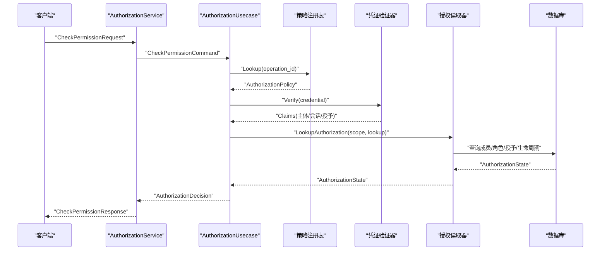
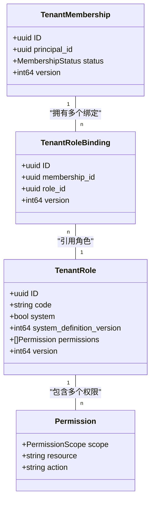
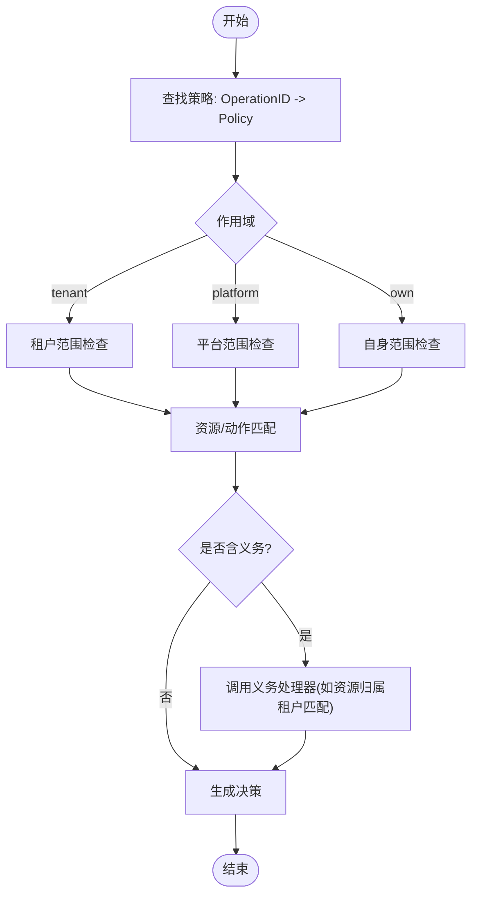
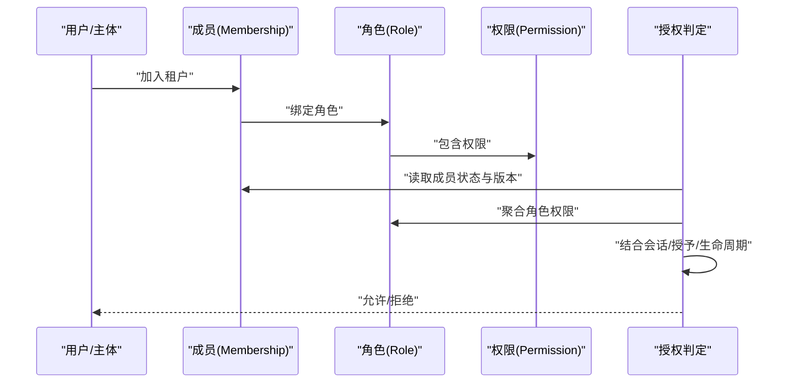
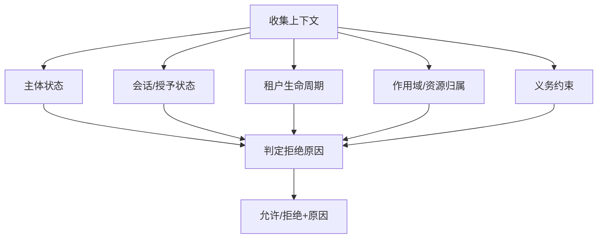
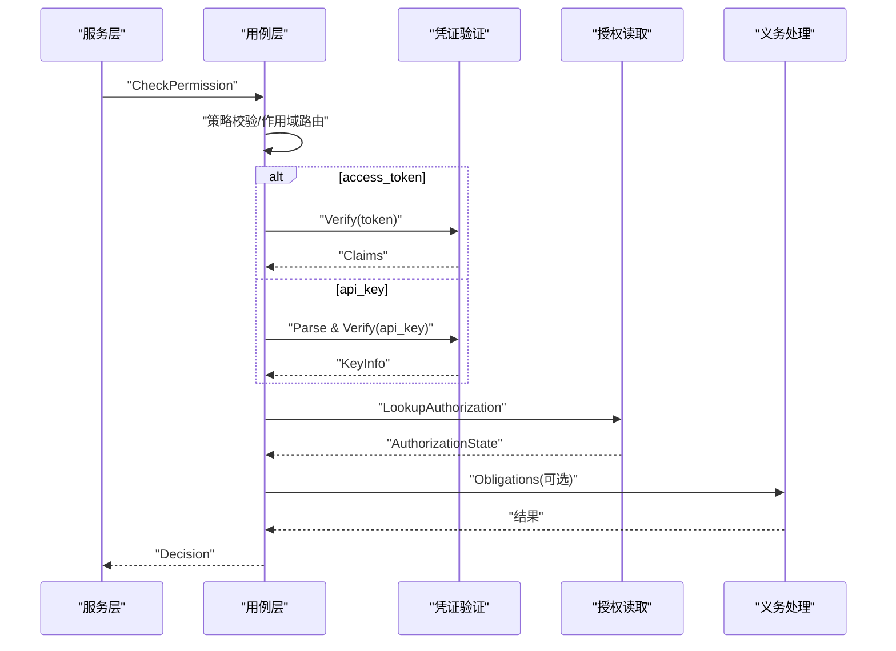
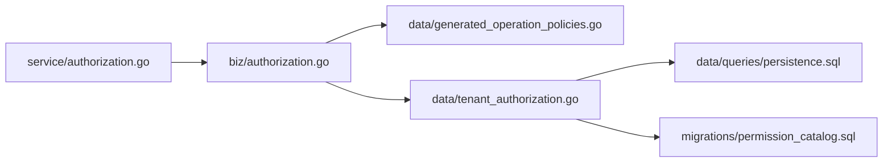

# 权限模型

<cite>
**本文引用的文件**
- [authorization_service.proto](file://api/iam/v1/authorization_service.proto)
- [contract.proto](file://api/iam/v1/contract.proto)
- [authorization.go](file://internal/biz/authorization.go)
- [tenant_authorization.go](file://internal/biz/tenant_authorization.go)
- [membership.go](file://internal/biz/membership.go)
- [tenant_scope.go](file://internal/biz/tenant_scope.go)
- [generated_operation_policies.go](file://internal/data/generated_operation_policies.go)
- [202609080002_permission_catalog.sql](file://migrations/202609080002_permission_catalog.sql)
- [persistence.sql](file://internal/data/queries/persistence.sql)
- [platform_administration.go](file://internal/data/platform_administration.go)
- [authorization.go](file://internal/service/authorization.go)
</cite>

## 目录
1. [简介](#简介)
2. [项目结构](#项目结构)
3. [核心组件](#核心组件)
4. [架构总览](#架构总览)
5. [详细组件分析](#详细组件分析)
6. [依赖关系分析](#依赖关系分析)
7. [性能考量](#性能考量)
8. [故障排查指南](#故障排查指南)
9. [结论](#结论)
10. [附录](#附录)

## 简介
本文件系统性阐述 ANI IAM 的权限模型，围绕 RBAC（基于角色的访问控制）展开，覆盖角色定义、权限定义、绑定关系与细粒度授权。重点说明：
- 资源级与操作级权限的区分与实现
- 成员关系（Membership）在权限判定中的作用，包括直接成员与间接成员的继承规则
- 上下文感知授权的概念与实现方式
- 从请求进入至最终决策的完整流程
- 权限配置示例与调试方法

## 项目结构
权限相关代码主要分布在以下层次：
- API 契约层：定义鉴权服务接口与通用数据结构
- 业务用例层：实现权限检查、租户授权管理、成员管理等核心逻辑
- 数据持久化层：通过 SQL 与迁移脚本维护权限目录、角色、绑定等数据
- 服务适配层：将 gRPC 请求转换为用例命令并返回标准化决策

**图表来源**
- [authorization_service.proto:1-40](file://api/iam/v1/authorization_service.proto#L1-L40)
- [contract.proto:1-212](file://api/iam/v1/contract.proto#L1-L212)
- [authorization.go:225-329](file://internal/biz/authorization.go#L225-L329)
- [tenant_authorization.go:383-439](file://internal/biz/tenant_authorization.go#L383-L439)
- [generated_operation_policies.go:17-269](file://internal/data/generated_operation_policies.go#L17-L269)
- [202609080002_permission_catalog.sql:5-159](file://migrations/202609080002_permission_catalog.sql#L5-L159)
- [persistence.sql:1-200](file://internal/data/queries/persistence.sql#L1-L200)
- [platform_administration.go:81-140](file://internal/data/platform_administration.go#L81-L140)
- [authorization.go:27-67](file://internal/service/authorization.go#L27-L67)

**章节来源**
- [authorization_service.proto:1-40](file://api/iam/v1/authorization_service.proto#L1-L40)
- [contract.proto:1-212](file://api/iam/v1/contract.proto#L1-L212)

## 核心组件
- 策略注册表与权限目录
  - 策略注册表提供 OperationID 到 AuthorizationPolicy 的映射，包含资源、动作、作用域、凭证类型、主体类型及义务约束
  - 权限目录（permission_catalog）是系统可接受的权限白名单，所有角色权限必须落库且受外键约束
- 授权用例
  - 统一入口 CheckPermission，负责策略校验、凭证验证、作用域隔离、成员/会话/授予状态检查、权限匹配与审计记录
- 租户授权用例
  - 管理成员、角色、绑定与租户访问状态；确保角色权限仅允许 tenant 作用域，并通过目录校验
- 成员用例
  - 创建成员并原子写入安全审计事件，保证事务一致性
- 租户作用域
  - 强制每个租户内操作携带可信边界，防止跨租户越权

**章节来源**
- [authorization.go:60-111](file://internal/biz/authorization.go#L60-L111)
- [authorization.go:189-223](file://internal/biz/authorization.go#L189-L223)
- [tenant_authorization.go:49-99](file://internal/biz/tenant_authorization.go#L49-L99)
- [tenant_authorization.go:517-527](file://internal/biz/tenant_authorization.go#L517-L527)
- [membership.go:75-125](file://internal/biz/membership.go#L75-L125)
- [tenant_scope.go:16-39](file://internal/biz/tenant_scope.go#L16-L39)
- [generated_operation_policies.go:17-269](file://internal/data/generated_operation_policies.go#L17-L269)
- [202609080002_permission_catalog.sql:5-159](file://migrations/202609080002_permission_catalog.sql#L5-L159)

## 架构总览
下图展示一次“检查权限”的端到端调用链：服务层接收请求，转换命令，业务层执行策略与上下文检查，最终返回明确决策。

**图表来源**
- [authorization_service.proto:11-39](file://api/iam/v1/authorization_service.proto#L11-L39)
- [authorization.go:225-329](file://internal/biz/authorization.go#L225-L329)
- [authorization.go:108-145](file://internal/biz/authorization.go#L108-L145)
- [authorization.go:113-115](file://internal/biz/authorization.go#L113-L115)

## 详细组件分析

### RBAC 模型：角色、权限与绑定
- 角色（TenantRole）
  - 由 code、system/system_definition_version 标识系统角色或自定义角色
  - 包含一组 Permission（scope/resource/action），其中 tenant 角色仅允许 tenant 作用域
- 权限（Permission）
  - 三元组：作用域、资源、动作
  - 必须在 permission_catalog 中登记，并通过外键约束防止非法权限
- 绑定（TenantRoleBinding）
  - 将 Membership 与 Role 关联，形成成员的角色集合
  - 绑定变更会提升成员版本，影响后续授权判断

**图表来源**
- [tenant_authorization.go:49-99](file://internal/biz/tenant_authorization.go#L49-L99)
- [authorization.go:86-95](file://internal/biz/authorization.go#L86-L95)
- [202609080002_permission_catalog.sql:5-159](file://migrations/202609080002_permission_catalog.sql#L5-L159)

**章节来源**
- [tenant_authorization.go:383-439](file://internal/biz/tenant_authorization.go#L383-L439)
- [tenant_authorization.go:517-527](file://internal/biz/tenant_authorization.go#L517-L527)
- [202609080002_permission_catalog.sql:151-159](file://migrations/202609080002_permission_catalog.sql#L151-L159)

### 细粒度权限：资源级与操作级
- 资源级权限
  - 以 resource 字段标识具体资源类别（如 instances、object-store、networks）
- 操作级权限
  - 以 action 字段标识对资源的动作（如 create、read、delete、execute、mount）
- 作用域
  - tenant：租户内资源
  - platform：平台级能力
  - own：主体自身资源（如配额读取）
- 策略注册表
  - 每个 OperationID 对应一个 AuthorizationPolicy，限定资源、动作、作用域、允许的凭证与主体类型，以及义务约束

**图表来源**
- [authorization.go:60-111](file://internal/biz/authorization.go#L60-L111)
- [authorization.go:225-329](file://internal/biz/authorization.go#L225-L329)
- [generated_operation_policies.go:17-269](file://internal/data/generated_operation_policies.go#L17-L269)

**章节来源**
- [authorization.go:78-95](file://internal/biz/authorization.go#L78-L95)
- [generated_operation_policies.go:17-269](file://internal/data/generated_operation_policies.go#L17-L269)

### 成员关系与权限继承
- 成员（Membership）
  - 表示主体在租户内的身份与状态（active/suspended/removed）
  - 通过绑定获得角色集合，从而继承角色权限
- 直接成员与间接成员
  - 直接成员：主体直接拥有的 Membership
  - 间接成员：通过工作负载（Workload）或平台成员体系获得的访问能力
- 继承规则
  - 权限判定聚合成员的所有角色权限，结合会话与授予状态进行综合判断
  - 成员版本变化会影响授权结果（例如绑定/解绑后版本提升）

**图表来源**
- [membership.go:75-125](file://internal/biz/membership.go#L75-L125)
- [tenant_authorization.go:77-99](file://internal/biz/tenant_authorization.go#L77-L99)
- [authorization.go:491-514](file://internal/biz/authorization.go#L491-L514)

**章节来源**
- [membership.go:140-240](file://internal/biz/membership.go#L140-L240)
- [tenant_authorization.go:301-381](file://internal/biz/tenant_authorization.go#L301-L381)

### 上下文感知授权
- 上下文要素
  - 主体类型与状态（human/workload，active/disabled）
  - 会话状态与授予状态（session/grant）
  - 租户生命周期状态（bootstrap/active/suspended）
  - 作用域与资源归属（tenant/platform/own）
  - 义务约束（如资源必须属于指定租户）
- 实现方式
  - 授权读取器聚合上述上下文，返回 AuthorizationState
  - 决策函数根据状态序列判定拒绝原因（如成员非活跃、授予版本不匹配、生命周期阻塞等）

**图表来源**
- [authorization.go:126-145](file://internal/biz/authorization.go#L126-L145)
- [authorization.go:491-514](file://internal/biz/authorization.go#L491-L514)
- [contract.proto:145-206](file://api/iam/v1/contract.proto#L145-L206)

**章节来源**
- [authorization.go:126-145](file://internal/biz/authorization.go#L126-L145)
- [authorization.go:491-514](file://internal/biz/authorization.go#L491-L514)

### 权限判定完整流程
- 输入
  - 原始凭证（access_token 或 api_key）、OperationID、策略版本、目标租户与资源
- 步骤
  - 策略校验：版本一致性与 OperationID 存在性
  - 作用域路由：platform 走平台路径，tenant 走租户路径
  - 凭证验证：access_token 解析 Claims；api_key 解析 key_id 并校验状态
  - 上下文查询：成员、角色、会话、授予、生命周期
  - 权限匹配：资源/动作与作用域匹配
  - 义务处理：按策略要求调用外部处理器（如资源租户匹配）
  - 决策输出：允许/拒绝，附带原因、决策 ID、主体上下文与义务列表
  - 审计记录：拒绝与认证失败均记录审计事件

**图表来源**
- [authorization.go:225-329](file://internal/biz/authorization.go#L225-L329)
- [authorization.go:331-420](file://internal/biz/authorization.go#L331-L420)
- [authorization.go:477-489](file://internal/biz/authorization.go#L477-L489)

**章节来源**
- [authorization.go:225-329](file://internal/biz/authorization.go#L225-L329)
- [authorization.go:331-420](file://internal/biz/authorization.go#L331-L420)
- [authorization.go:516-576](file://internal/biz/authorization.go#L516-L576)

## 依赖关系分析
- 服务层依赖用例层
  - service/authorization.go 将 gRPC 请求转换为 biz.CheckPermissionCommand 并调用用例
- 用例层依赖策略注册表与持久化读取器
  - 策略注册表提供 OperationID 到 Policy 的映射
  - 持久化读取器提供成员、角色、绑定、会话、授予与生命周期信息
- 数据层依赖迁移与查询
  - permission_catalog 作为权限白名单，角色权限需与其匹配
  - persistence.sql 提供成员、工作负载、API Key 等查询与更新

**图表来源**
- [authorization.go:27-67](file://internal/service/authorization.go#L27-L67)
- [authorization.go:108-145](file://internal/biz/authorization.go#L108-L145)
- [generated_operation_policies.go:17-269](file://internal/data/generated_operation_policies.go#L17-L269)
- [persistence.sql:1-200](file://internal/data/queries/persistence.sql#L1-L200)
- [202609080002_permission_catalog.sql:5-159](file://migrations/202609080002_permission_catalog.sql#L5-L159)

**章节来源**
- [authorization.go:27-67](file://internal/service/authorization.go#L27-L67)
- [authorization.go:108-145](file://internal/biz/authorization.go#L108-L145)

## 性能考量
- 策略注册表为内存映射，Lookup 为 O(1)，减少运行时开销
- 权限目录使用数据库外键约束，避免无效权限写入，降低后续匹配成本
- 授权读取器聚合查询，尽量在一次事务内获取成员、角色、会话、授予与生命周期状态，减少往返
- 审计事件写入采用独立事务或异步追加，避免阻塞主路径

[本节为通用指导，无需特定文件来源]

## 故障排查指南
- 常见错误与原因
  - 凭证无效或缺失：检查 token/api_key 格式、有效期与状态
  - 策略版本不匹配：确认请求中的 policy_revision 与服务端 TargetPolicyRevision 一致
  - 未注册的操作：核对 OperationID 是否在策略注册表中
  - 作用域不匹配：platform 操作需平台凭证，tenant 操作需租户上下文
  - 成员/会话/授予非活跃：检查成员状态、会话状态与授予状态
  - 授予版本不匹配：确认 Claims 中的 grant_version 与当前存储一致
  - 租户生命周期阻塞：检查租户状态是否为 active
  - 权限不在目录：角色权限必须存在于 permission_catalog
- 调试方法
  - 查看审计事件：通过 iam.audit-events 接口查询拒绝与认证失败事件
  - 检查绑定与角色：确认成员已绑定正确角色，角色权限在目录中
  - 验证策略版本：对比请求与生成的 TargetPolicyRevision
  - 使用集成测试：参考 tests/integration 中的场景复现问题

**章节来源**
- [authorization.go:13-23](file://internal/biz/authorization.go#L13-L23)
- [authorization.go:225-329](file://internal/biz/authorization.go#L225-L329)
- [authorization.go:491-514](file://internal/biz/authorization.go#L491-L514)
- [202609080002_permission_catalog.sql:151-159](file://migrations/202609080002_permission_catalog.sql#L151-L159)

## 结论
ANI IAM 的权限模型以 RBAC 为核心，结合细粒度的资源/动作权限、严格的作用域隔离与上下文感知授权，实现了高内聚、低耦合的可扩展鉴权体系。通过策略注册表与权限目录的双重保障，以及成员/角色/绑定的清晰分层，系统在安全性与可维护性之间取得平衡。建议在生产环境中持续监控审计事件与策略版本，确保权限配置的正确性与时效性。

[本节为总结，无需特定文件来源]

## 附录
- 权限配置示例
  - 创建租户角色并绑定权限：通过 BindRole 将角色绑定到成员，确保权限在 permission_catalog 中
  - 设置平台角色：平台角色用于平台管理能力，需使用平台凭证与主体类型
  - 限制操作类型：在策略中限定 action（如 read/create/delete），实现最小权限原则
- 调试清单
  - 确认 OperationID 与策略版本一致
  - 检查凭证类型与主体类型是否符合策略要求
  - 验证成员状态、会话状态、授予状态与租户生命周期
  - 查看审计事件定位拒绝原因

[本节为补充说明，无需特定文件来源]