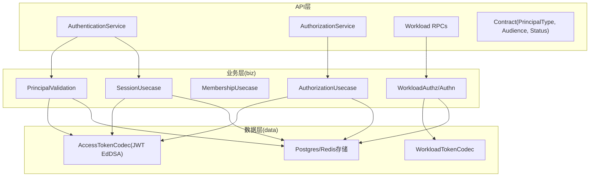
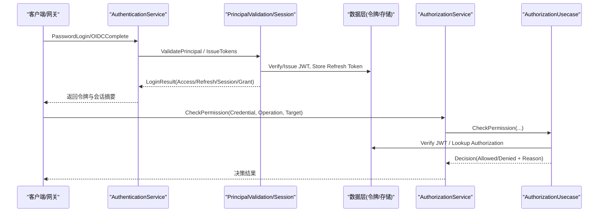
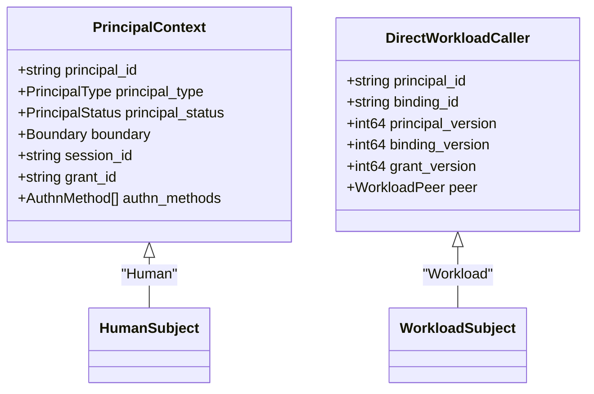
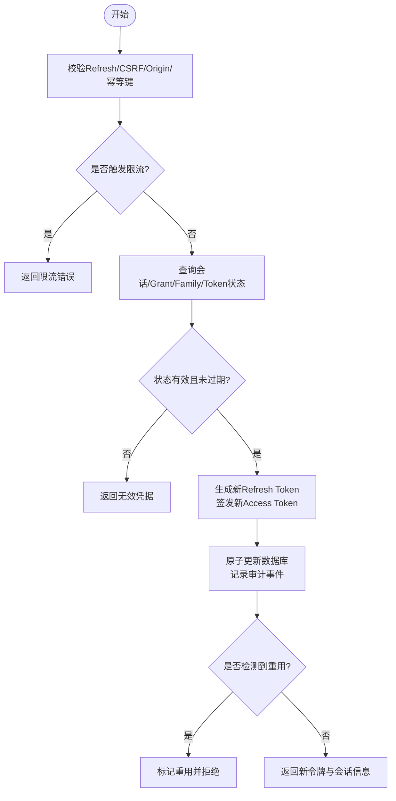
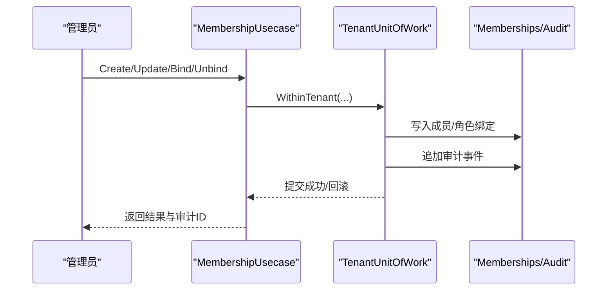
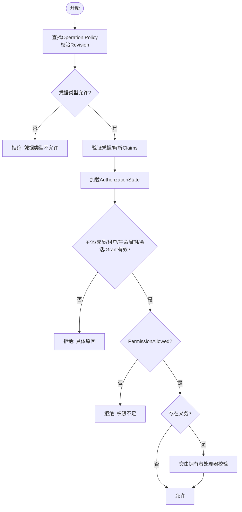
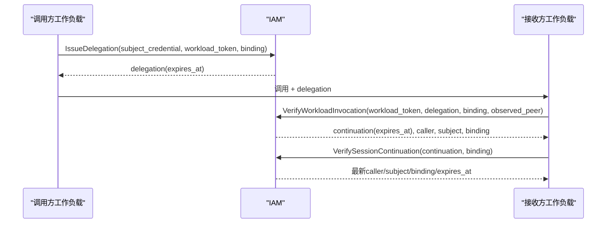
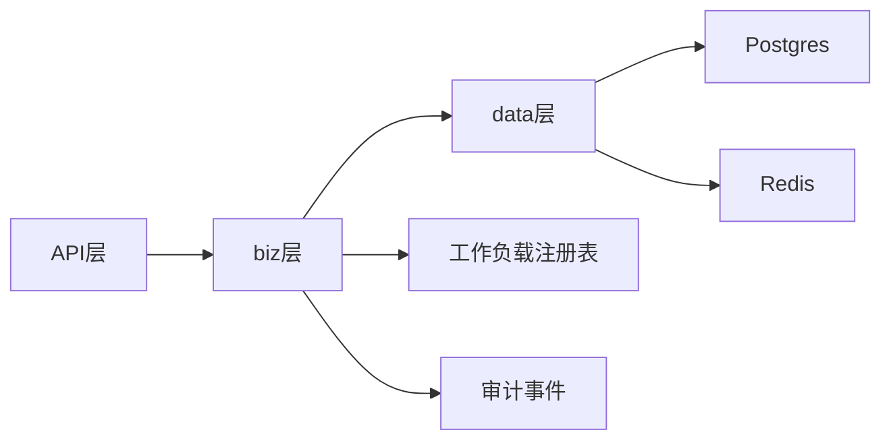

# 核心概念

<cite>
**本文引用的文件**
- [workload.proto](file://api/iam/v1/workload.proto)
- [authentication_service.proto](file://api/iam/v1/authentication_service.proto)
- [authorization_service.proto](file://api/iam/v1/authorization_service.proto)
- [contract.proto](file://api/iam/v1/contract.proto)
- [principal_validation.go](file://internal/biz/principal_validation.go)
- [session.go](file://internal/biz/session.go)
- [membership.go](file://internal/biz/membership.go)
- [authorization.go](file://internal/biz/authorization.go)
- [workload.go](file://internal/biz/workload.go)
- [access_token_jwx.go](file://internal/data/access_token_jwx.go)
- [workload_token_jwx.go](file://internal/data/workload_token_jwx.go)
- [tenant_authorization.go](file://internal/biz/tenant_authorization.go)
- [http.go](file://sdk/grpcworkload/http.go)
</cite>

## 目录
1. [引言](#引言)
2. [项目结构](#项目结构)
3. [核心组件](#核心组件)
4. [架构总览](#架构总览)
5. [详细组件分析](#详细组件分析)
6. [依赖关系分析](#依赖关系分析)
7. [性能与安全考量](#性能与安全考量)
8. [故障排查指南](#故障排查指南)
9. [结论](#结论)
10. [附录：配置与示例路径](#附录配置与示例路径)

## 引言
本文件面向ANI IAM的开发者，系统化阐述以下核心概念与实践：
- Principal（主体）：Human与Workload两种类型的区别、生命周期与使用场景
- Session会话管理：生命周期、令牌轮换、续期与撤销策略
- Membership成员关系与Role/Binding权限绑定模型
- 权限判定系统：RBAC与细粒度授权、操作级策略与义务约束
- 凭据管理最佳实践：Access Token、Refresh Token、API Key、Workload Token的安全设计与轮换

## 项目结构
本项目采用分层与领域驱动相结合的组织方式：
- API层：定义稳定的gRPC契约（认证、授权、工作负载调用、通用合同）
- 业务层（biz）：实现用例与领域规则（主体校验、会话、成员关系、授权、工作负载身份与授权）
- 数据层（data）：持久化与令牌编解码（JWX）、审计事件、Redis限流等
- SDK层：为工作负载提供HTTP/gRPC调用封装与上下文传播

图表来源
- [authentication_service.proto:11-33](file://api/iam/v1/authentication_service.proto#L11-L33)
- [authorization_service.proto:10-16](file://api/iam/v1/authorization_service.proto#L10-L16)
- [workload.proto:10-121](file://api/iam/v1/workload.proto#L10-L121)
- [contract.proto:13-159](file://api/iam/v1/contract.proto#L13-L159)
- [principal_validation.go:80-99](file://internal/biz/principal_validation.go#L80-L99)
- [session.go:154-286](file://internal/biz/session.go#L154-L286)
- [authorization.go:225-329](file://internal/biz/authorization.go#L225-L329)
- [workload.go:62-106](file://internal/biz/workload.go#L62-L106)
- [access_token_jwx.go:83-134](file://internal/data/access_token_jwx.go#L83-L134)
- [workload_token_jwx.go:36-41](file://internal/data/workload_token_jwx.go#L36-L41)

章节来源
- [authentication_service.proto:11-33](file://api/iam/v1/authentication_service.proto#L11-L33)
- [authorization_service.proto:10-16](file://api/iam/v1/authorization_service.proto#L10-L16)
- [workload.proto:10-121](file://api/iam/v1/workload.proto#L10-L121)
- [contract.proto:13-159](file://api/iam/v1/contract.proto#L13-L159)

## 核心组件
- Principal（主体）
  - Human：通过密码或OIDC登录，产生Console/Boss受众的Access Token与Refresh Token，受Session/Grant边界保护
  - Workload：通过mTLS与工作负载注册表验证身份，签发短命Workload Token/Delegation/Continuation，用于服务间调用
- Session与会话管理
  - Refresh Token家族轮换、Idle/Absolute过期、CSRF校验、限流、注销与租户切换
- Membership成员关系与Role/Binding
  - 成员状态机、角色绑定/解绑、审计事件原子写入
- 权限判定
  - 基于Operation Policy的RBAC+细粒度资源/动作控制；支持平台/租户/自有范围；失败可审计
- 凭据管理
  - Access Token（JWT EdDSA，短时效）、Refresh Token（哈希存储、家族轮换）、API Key（前缀解析、按租户边界校验）、Workload Token（类型区分、注册表校验）

章节来源
- [contract.proto:21-78](file://api/iam/v1/contract.proto#L21-L78)
- [principal_validation.go:120-220](file://internal/biz/principal_validation.go#L120-L220)
- [session.go:154-286](file://internal/biz/session.go#L154-L286)
- [authorization.go:60-95](file://internal/biz/authorization.go#L60-L95)
- [membership.go:75-125](file://internal/biz/membership.go#L75-L125)
- [access_token_jwx.go:83-134](file://internal/data/access_token_jwx.go#L83-L134)
- [workload_token_jwx.go:18-41](file://internal/data/workload_token_jwx.go#L18-L41)

## 架构总览
IAM对外暴露三类能力：
- 认证：人类登录、OIDC流程、会话刷新/登出、租户切换、凭据校验
- 授权：统一决策点，返回允许/拒绝及原因、义务约束
- 工作负载调用：对端mTLS身份验证、目标注册表匹配、在线授权检查、委托与延续

图表来源
- [authentication_service.proto:11-33](file://api/iam/v1/authentication_service.proto#L11-L33)
- [authorization_service.proto:10-16](file://api/iam/v1/authorization_service.proto#L10-L16)
- [principal_validation.go:80-99](file://internal/biz/principal_validation.go#L80-L99)
- [session.go:154-286](file://internal/biz/session.go#L154-L286)
- [authorization.go:225-329](file://internal/biz/authorization.go#L225-L329)
- [access_token_jwx.go:169-225](file://internal/data/access_token_jwx.go#L169-L225)

## 详细组件分析

### Principal（主体）：Human与Workload
- Human主体
  - 通过PasswordLogin或OIDC完成登录，生成Console/Boss受众的Access Token与Refresh Token
  - Access Token携带SessionID、GrantID、GrantVersion、TenantID、AuthnMethods等声明，供后续鉴权使用
  - 支持SwitchTenant以在同一会话内切换到另一租户边界并颁发新Grant/Refresh Token
- Workload主体
  - 通过mTLS证书链与信任域校验，结合工作负载注册表确认身份与目标
  - 签发短命Workload Token/Delegation/Continuation，仅用于一次调用或有限延续
  - 不创建人类会话，也不具备管理员权限

图表来源
- [contract.proto:150-159](file://api/iam/v1/contract.proto#L150-L159)
- [workload.proto:27-44](file://api/iam/v1/workload.proto#L27-L44)

章节来源
- [contract.proto:21-78](file://api/iam/v1/contract.proto#L21-L78)
- [workload.proto:27-44](file://api/iam/v1/workload.proto#L27-L44)
- [principal_validation.go:241-307](file://internal/biz/principal_validation.go#L241-L307)
- [workload.go:17-46](file://internal/biz/workload.go#L17-L46)

### Session会话管理：生命周期、令牌轮换与安全策略
- 生命周期
  - 登录成功后建立Session，包含多个边界Scoped的Grant
  - Access Token短时效，Refresh Token用于安全续期
  - Idle/Absolute过期策略由受众决定，确保长期活跃性受限
- 令牌轮换
  - 每次Refresh会生成新的Refresh Token（同家族），旧令牌被标记为已消费
  - 防重放：同一Refresh Token只能使用一次，重复使用将触发审计与失效
  - CSRF与Origin校验防止跨站请求伪造
- 安全策略
  - 速率限制：基于Refresh Token摘要进行限流
  - 租户切换：在有效Session基础上，为指定租户颁发新Grant/Refresh Token
  - 注销：立即使当前Refresh Token失效，不可恢复

图表来源
- [session.go:154-286](file://internal/biz/session.go#L154-L286)
- [session.go:522-555](file://internal/biz/session.go#L522-L555)
- [access_token_jwx.go:83-134](file://internal/data/access_token_jwx.go#L83-L134)

章节来源
- [session.go:154-286](file://internal/biz/session.go#L154-L286)
- [session.go:288-348](file://internal/biz/session.go#L288-L348)
- [session.go:350-478](file://internal/biz/session.go#L350-L478)
- [session.go:522-555](file://internal/biz/session.go#L522-L555)

### Membership成员关系与Role/Binding权限绑定模型
- 成员关系
  - 每个成员有明确状态机（active/suspended/removed），与Principal和Tenant边界关联
  - 创建/更新成员时，必须附带审计所需的全部元数据（Actor、方法、原因、请求ID等）
- 角色绑定
  - 通过Bind/Unbind将角色与成员绑定，变更版本化并原子写入审计事件
  - 绑定/解绑均要求ExpectedMembershipVersion，避免并发冲突
- 权限生效
  - 权限判定读取成员状态、租户访问状态、生命周期新鲜度以及具体角色授予的资源/动作

图表来源
- [membership.go:165-240](file://internal/biz/membership.go#L165-L240)
- [tenant_authorization.go:172-201](file://internal/biz/tenant_authorization.go#L172-L201)

章节来源
- [membership.go:75-125](file://internal/biz/membership.go#L75-L125)
- [membership.go:165-240](file://internal/biz/membership.go#L165-L240)
- [tenant_authorization.go:172-201](file://internal/biz/tenant_authorization.go#L172-L201)

### 权限判定系统：RBAC与细粒度控制
- 策略注册
  - 每个Operation对应一条Policy，声明Resource、Actions、Scope（tenant/platform/own）、允许的CredentialKinds与PrincipalKinds
- 判定流程
  - 校验PolicyRevision一致性，解析凭据（Access Token或API Key）
  - 加载AuthorizationState（主体/成员/租户访问/生命周期/会话/Grant状态）
  - 若满足所有前置条件且PermissionAllowed，则允许；否则返回具体拒绝原因
- 义务约束
  - 某些操作需要额外义务（如资源租户匹配），由拥有者处理器执行权威检查

图表来源
- [authorization.go:225-329](file://internal/biz/authorization.go#L225-L329)
- [authorization.go:331-420](file://internal/biz/authorization.go#L331-L420)
- [authorization.go:491-514](file://internal/biz/authorization.go#L491-L514)

章节来源
- [authorization.go:60-95](file://internal/biz/authorization.go#L60-L95)
- [authorization.go:225-329](file://internal/biz/authorization.go#L225-L329)
- [authorization.go:331-420](file://internal/biz/authorization.go#L331-L420)
- [authorization.go:491-514](file://internal/biz/authorization.go#L491-L514)

### 工作负载调用与委托机制
- 直接调用
  - 接收方通过VerifyWorkloadCaller验证工作负载调用者身份与目标注册表，返回DirectWorkloadCaller与AuthorityRevision
- 委托与延续
  - IssueDelegation：对实际Subject进行一次性再授权，返回短命Delegation
  - VerifyWorkloadInvocation：接收方携带自身mTLS身份与Delegation在线验证，返回Continuation用于后续在线复核
  - VerifySessionContinuation：仅在线复核先前已准入的请求，不可再次签发新凭证

图表来源
- [workload.proto:46-94](file://api/iam/v1/workload.proto#L46-L94)

章节来源
- [workload.proto:46-94](file://api/iam/v1/workload.proto#L46-L94)
- [workload.go:87-106](file://internal/biz/workload.go#L87-L106)

### 凭据管理与安全最佳实践
- Access Token
  - 使用EdDSA签名，严格限定受众（Console/Boss），强制携带SessionID、GrantID、GrantVersion、AuthnMethods
  - 最大生命周期受受众限制（例如Boss更短），过期即失效
- Refresh Token
  - 仅哈希存储，家族轮换，防重用；CSRF与Origin校验；限流保护
- API Key
  - 前缀“ani_”解析KeyID，按租户边界校验；状态与过期检查；用量观察
- Workload Token
  - 类型区分（Workload/Delegation/Continuation），基于注册表校验Audience/Operation/AuthorityRevision
  - 短命、不可刷新；适合服务间最小权限调用

章节来源
- [access_token_jwx.go:83-134](file://internal/data/access_token_jwx.go#L83-L134)
- [access_token_jwx.go:169-225](file://internal/data/access_token_jwx.go#L169-L225)
- [access_token_jwx.go:332-378](file://internal/data/access_token_jwx.go#L332-L378)
- [principal_validation.go:120-220](file://internal/biz/principal_validation.go#L120-L220)
- [workload_token_jwx.go:18-41](file://internal/data/workload_token_jwx.go#L18-L41)
- [http.go:19-144](file://sdk/grpcworkload/http.go#L19-L144)

## 依赖关系分析
- 耦合与内聚
  - biz层通过接口隔离数据层（令牌编解码、存储、限流），提高可测试性与替换性
  - API层仅承载契约，逻辑集中在biz层，便于演进与审计
- 外部依赖
  - JWX库用于JWT签发与验证
  - Postgres/Redis用于会话、令牌、审计与限流
  - 工作负载注册表用于目标合法性与AuthorityRevision校验

图表来源
- [authorization.go:108-167](file://internal/biz/authorization.go#L108-L167)
- [principal_validation.go:66-78](file://internal/biz/principal_validation.go#L66-L78)
- [workload.go:74-85](file://internal/biz/workload.go#L74-L85)

章节来源
- [authorization.go:108-167](file://internal/biz/authorization.go#L108-L167)
- [principal_validation.go:66-78](file://internal/biz/principal_validation.go#L66-L78)
- [workload.go:74-85](file://internal/biz/workload.go#L74-L85)

## 性能与安全考量
- 性能
  - 策略与注册表缓存：减少DB访问，提升鉴权吞吐
  - 会话查询优化：按需加载Grant/Family/Token状态，避免全量扫描
  - 限流与退避：对高频刷新与登录进行节流，保护后端
- 安全
  - 最小权限：Workload Token短命、不可刷新；Delegation仅针对单次调用
  - 密钥轮换：Access Token与Workload Token支持密钥轮换，保留旧钥验证过渡期
  - 审计：所有关键操作（认证、授权、会话、成员关系）均记录审计事件，支持追溯

[本节为通用指导，不直接分析具体文件]

## 故障排查指南
- 常见错误与定位
  - 凭据无效：检查JWT签名、受众、过期时间、必需声明（SessionID/GrantID/GrantVersion）
  - 权限拒绝：核对Operation Policy的Resource/Actions/CredentialKinds/PrincipalKinds
  - 会话问题：确认Refresh Token未被重用、CSRF/Origin正确、未过期
  - 工作负载调用：检查mTLS身份、注册表匹配、AuthorityRevision格式
- 建议步骤
  - 查看审计事件中的DecisionID与Reason
  - 核对PolicyRevision与注册表Revision一致
  - 检查租户边界与成员状态、生命周期新鲜度

章节来源
- [authorization.go:491-514](file://internal/biz/authorization.go#L491-L514)
- [principal_validation.go:438-453](file://internal/biz/principal_validation.go#L438-L453)
- [session.go:530-555](file://internal/biz/session.go#L530-L555)

## 结论
ANI IAM通过清晰的Principal分类、严格的Session管理、完善的成员关系与RBAC授权模型，以及安全的凭据体系，提供了可扩展、可审计、可运维的身份与访问管理能力。开发时应遵循最小权限原则、短命令牌策略与强审计要求，确保系统在复杂多租户环境下稳定运行。

[本节为总结，不直接分析具体文件]

## 附录：配置与示例路径
- 工作负载HTTP调用头与校验
  - 头字段与校验逻辑参考：[http.go:19-144](file://sdk/grpcworkload/http.go#L19-L144)
- 工作负载令牌类型与签发
  - 类型常量与签发入口参考：[workload_token_jwx.go:18-41](file://internal/data/workload_token_jwx.go#L18-L41)
- 人类Access Token签发与校验
  - 签发与验证参考：[access_token_jwx.go:83-134](file://internal/data/access_token_jwx.go#L83-L134)、[access_token_jwx.go:169-225](file://internal/data/access_token_jwx.go#L169-L225)
- 会话刷新与注销
  - 刷新流程参考：[session.go:154-286](file://internal/biz/session.go#L154-L286)
  - 注销流程参考：[session.go:288-348](file://internal/biz/session.go#L288-L348)
- 权限判定与拒绝原因
  - 判定流程参考：[authorization.go:225-329](file://internal/biz/authorization.go#L225-L329)
  - 拒绝原因映射参考：[authorization.go:491-514](file://internal/biz/authorization.go#L491-L514)
- 成员关系与角色绑定
  - 成员创建与审计参考：[membership.go:165-240](file://internal/biz/membership.go#L165-L240)
  - 角色绑定命令参考：[tenant_authorization.go:172-201](file://internal/biz/tenant_authorization.go#L172-L201)