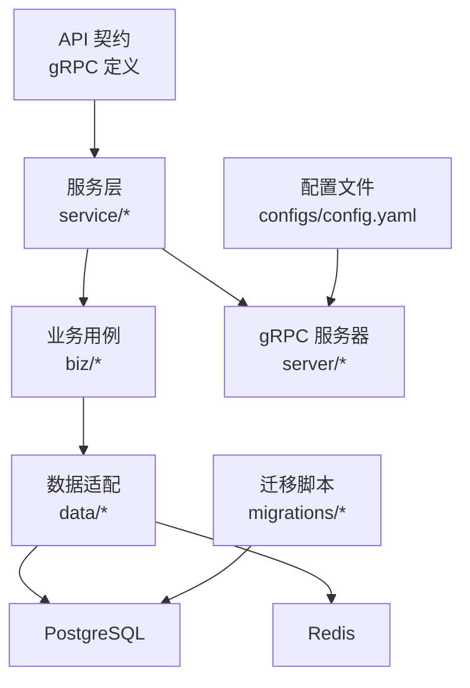
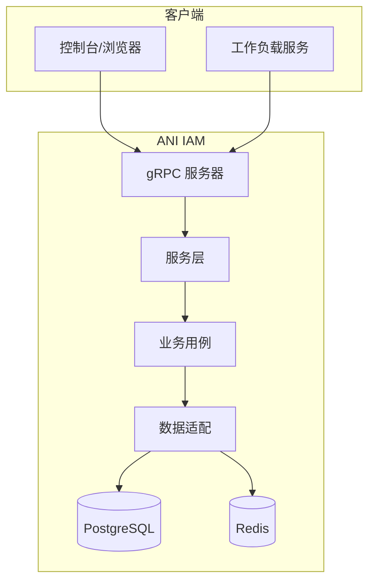
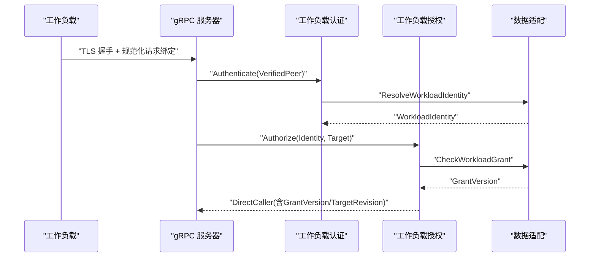
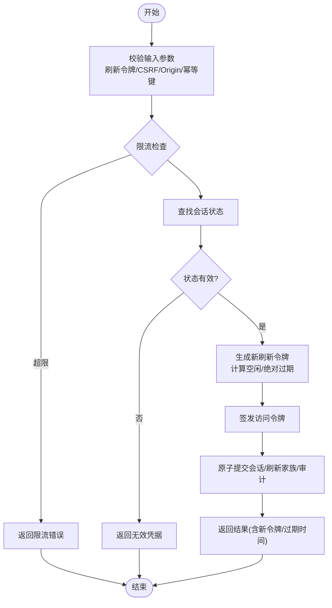
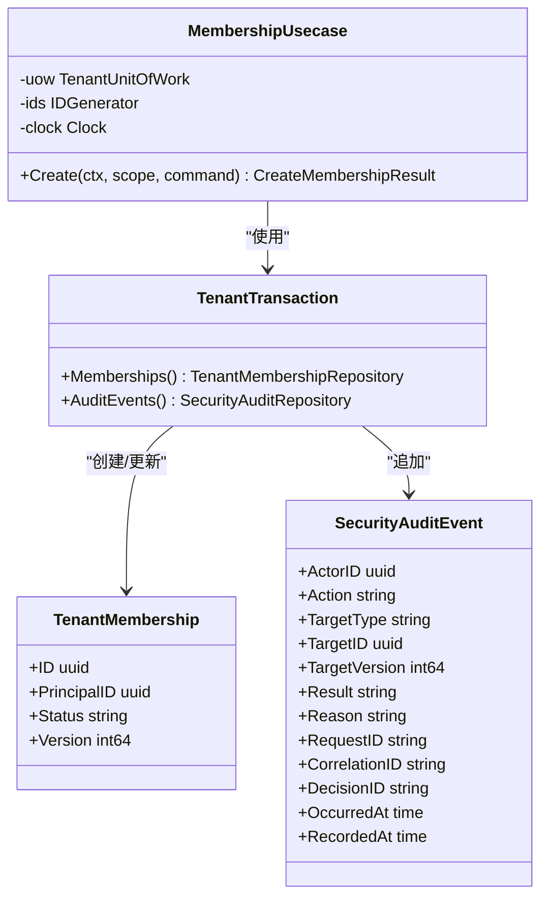
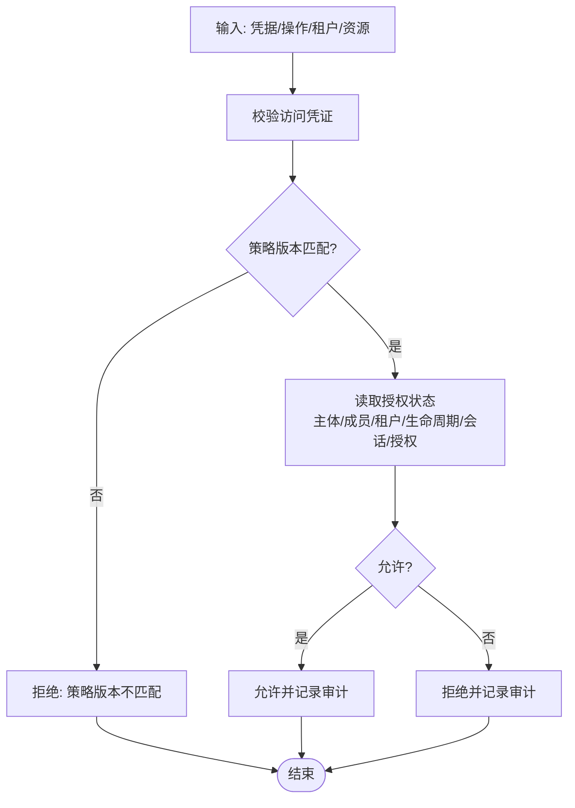
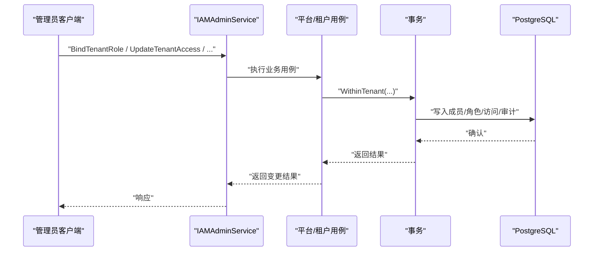
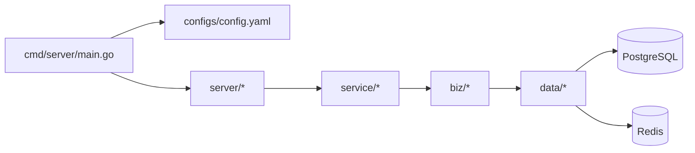

# 项目介绍

<cite>
**本文引用的文件**
- [README.md](file://README.md)
- [api/README.md](file://api/README.md)
- [cmd/server/main.go](file://cmd/server/main.go)
- [configs/config.yaml](file://configs/config.yaml)
- [internal/biz/workload.go](file://internal/biz/workload.go)
- [internal/biz/session.go](file://internal/biz/session.go)
- [internal/biz/membership.go](file://internal/biz/membership.go)
- [internal/biz/authorization.go](file://internal/biz/authorization.go)
- [internal/biz/tenant_authorization.go](file://internal/biz/tenant_authorization.go)
- [internal/data/platform_administration.go](file://internal/data/platform_administration.go)
- [api/iam/v1/iam_admin_service_grpc.pb.go](file://api/iam/v1/iam_admin_service_grpc.pb.go)
- [tests/integration/workload_runtime_test.go](file://tests/integration/workload_runtime_test.go)
- [tests/integration/tenant_authorization_test.go](file://tests/integration/tenant_authorization_test.go)
- [docs/adr/0002-separate-tenant-lifecycle-from-iam-access.md](file://docs/adr/0002-separate-tenant-lifecycle-from-iam-access.md)
</cite>

## 目录
1. [简介](#简介)
2. [项目结构](#项目结构)
3. [核心组件](#核心组件)
4. [架构总览](#架构总览)
5. [详细组件分析](#详细组件分析)
6. [依赖关系分析](#依赖关系分析)
7. [性能考虑](#性能考虑)
8. [故障排查指南](#故障排查指南)
9. [结论](#结论)
10. [附录](#附录)

## 简介
ANI IAM 是一个独立的身份与访问控制服务，聚焦于 Human/Workload 主体、凭据、会话、成员资格、角色/绑定与权限判定。它不拥有租户业务生命周期，而是通过权威状态进行访问控制决策；资源服务（Governance）保持自身状态与执行逻辑的独立性与幂等性。该设计将“治理”与“访问控制”解耦：治理负责租户创建、配额与生命周期；IAM 负责谁能在何时以何种身份访问哪些资源，并在必要时拒绝操作或限制能力。

本项目的价值主张在于：
- 明确边界：IAM 专注安全边界与授权策略，不侵入资源服务内部状态机。
- 可组合：通过 gRPC 契约与 SDK 暴露稳定接口，便于多语言消费与演进。
- 可审计：所有关键变更附带不可变审计事件，支持追溯与合规。
- 可扩展：工作负载身份、短期令牌与刷新家族机制支撑微服务间调用与浏览器场景。
- 高内聚低耦合：数据层与业务用例通过接口隔离，替换存储或外部依赖不影响上层语义。

**章节来源**
- [README.md:1-13](file://README.md#L1-L13)
- [docs/adr/0002-separate-tenant-lifecycle-from-iam-access.md:1-10](file://docs/adr/0002-separate-tenant-lifecycle-from-iam-access.md#L1-L10)

## 项目结构
仓库采用分层与领域驱动的组织方式：
- api：对外 gRPC 契约与生成代码，不含服务端实现与存储依赖。
- cmd/server：服务入口、配置加载、运行时日志与子命令。
- internal：按职责划分 biz（领域用例）、data（持久化与外部依赖适配）、server（gRPC 与服务装配）、service（服务层编排）。
- migrations：数据库迁移脚本，覆盖基础表、会话、权限目录、工作负载运行态等。
- tests：集成测试覆盖认证、授权、通知、工作负载运行时等关键路径。
- configs：运行时配置，包含 TLS、PostgreSQL、Redis、OIDC、通知、策略版本等。

**图表来源**
- [cmd/server/main.go:34-101](file://cmd/server/main.go#L34-L101)
- [configs/config.yaml:1-61](file://configs/config.yaml#L1-L61)

**章节来源**
- [api/README.md:1-8](file://api/README.md#L1-L8)
- [cmd/server/main.go:34-101](file://cmd/server/main.go#L34-L101)
- [configs/config.yaml:1-61](file://configs/config.yaml#L1-L61)

## 核心组件
- 工作负载身份与会话：工作负载通过传输层验证证书链与身份后，解析为可信身份；会话管理支持刷新、登出与租户切换，保证短令牌与刷新家族的原子更新与审计。
- 成员资格与角色/绑定：成员资格在租户边界内管理，角色与绑定由管理员 API 维护，权限目录约束可授予的权限集合。
- 权限判定系统：基于策略注册表、访问凭证校验与读取器聚合主体验证、成员资格、租户访问、生命周期与会话/授权状态，输出允许/拒绝决策并记录审计。
- 平台与租户管理：平台角色与权限列表、租户访问与成员资格查询/变更，均通过事务与审计事件保障一致性。

**章节来源**
- [internal/biz/workload.go:17-118](file://internal/biz/workload.go#L17-L118)
- [internal/biz/session.go:154-478](file://internal/biz/session.go#L154-L478)
- [internal/biz/membership.go:75-125](file://internal/biz/membership.go#L75-L125)
- [internal/biz/authorization.go:108-223](file://internal/biz/authorization.go#L108-L223)
- [internal/data/platform_administration.go:138-168](file://internal/data/platform_administration.go#L138-L168)
- [api/iam/v1/iam_admin_service_grpc.pb.go:85-90](file://api/iam/v1/iam_admin_service_grpc.pb.go#L85-L90)

## 架构总览
ANI IAM 采用微服务架构，对外仅暴露稳定的 gRPC 契约与 SDK。服务启动时加载配置、初始化日志与追踪，并启动 gRPC 端口。业务用例通过接口抽象访问 PostgreSQL 与 Redis，避免直接耦合具体实现。工作负载身份与授权在传输层与业务层双重校验，确保请求绑定、过期与失败关闭行为符合契约。

**图表来源**
- [cmd/server/main.go:34-101](file://cmd/server/main.go#L34-L101)
- [configs/config.yaml:17-61](file://configs/config.yaml#L17-L61)

**章节来源**
- [cmd/server/main.go:34-101](file://cmd/server/main.go#L34-L101)
- [configs/config.yaml:1-61](file://configs/config.yaml#L1-L61)

## 详细组件分析

### 工作负载身份与授权
工作负载身份在传输层完成证书链与用途校验后，进入业务层解析为主键与绑定信息；授权阶段检查目标注册表是否启用，并查询授权版本，最终产出可直接使用的调用者上下文。

**图表来源**
- [internal/biz/workload.go:62-106](file://internal/biz/workload.go#L62-L106)

**章节来源**
- [internal/biz/workload.go:17-118](file://internal/biz/workload.go#L17-L118)
- [tests/integration/workload_runtime_test.go:103-158](file://tests/integration/workload_runtime_test.go#L103-L158)

### 会话管理（刷新、登出、租户切换）
会话流程强调刷新令牌的原子旋转、防重放与审计；登出会撤销当前会话并记录审计；租户切换会在同一会话下生成新的授权与刷新家族，并严格校验源/目标状态。

**图表来源**
- [internal/biz/session.go:154-286](file://internal/biz/session.go#L154-L286)

**章节来源**
- [internal/biz/session.go:154-478](file://internal/biz/session.go#L154-L478)

### 成员资格与审计
成员资格在租户边界内创建、更新与查询，所有变更伴随不可变的安全审计事件，审计事件与业务实体在同一事务中写入，保证一致性与可追溯性。

**图表来源**
- [internal/biz/membership.go:155-240](file://internal/biz/membership.go#L155-L240)

**章节来源**
- [internal/biz/membership.go:75-125](file://internal/biz/membership.go#L75-L125)
- [internal/biz/membership.go:155-240](file://internal/biz/membership.go#L155-L240)

### 权限判定系统
权限判定聚合策略注册表、访问凭证校验与读取器，综合主体验证、成员资格、租户访问、生命周期与授权状态，输出允许/拒绝决策并记录审计。策略版本不匹配将导致拒绝，防止策略漂移。

**图表来源**
- [internal/biz/authorization.go:108-223](file://internal/biz/authorization.go#L108-L223)

**章节来源**
- [internal/biz/authorization.go:108-223](file://internal/biz/authorization.go#L108-L223)

### 平台与租户管理
平台角色与权限列表、租户访问与成员资格管理通过管理员 gRPC 暴露，且声明不拥有租户生命周期。这些操作在事务中执行，并附带审计事件，确保可审计与可回滚。

**图表来源**
- [api/iam/v1/iam_admin_service_grpc.pb.go:85-90](file://api/iam/v1/iam_admin_service_grpc.pb.go#L85-L90)
- [internal/data/platform_administration.go:138-168](file://internal/data/platform_administration.go#L138-L168)

**章节来源**
- [api/iam/v1/iam_admin_service_grpc.pb.go:85-90](file://api/iam/v1/iam_admin_service_grpc.pb.go#L85-L90)
- [internal/data/platform_administration.go:138-168](file://internal/data/platform_administration.go#L138-L168)

### 资源服务独立性
资源服务（Governance）保留自身的状态与执行逻辑，IAM 仅作为访问控制与审计侧车。这种设计带来以下优势：
- 风险隔离：IAM 故障不会直接破坏资源服务的业务状态机。
- 可演进：资源服务可独立升级与优化，IAM 通过契约保持稳定。
- 可观测：IAM 提供统一的审计与决策记录，便于跨服务追踪。
- 可组合：不同资源服务可按需接入 IAM，无需复制身份实现。

**章节来源**
- [docs/adr/0002-separate-tenant-lifecycle-from-iam-access.md:1-10](file://docs/adr/0002-separate-tenant-lifecycle-from-iam-access.md#L1-L10)

## 依赖关系分析
- 服务入口依赖配置与日志框架，启动 gRPC 并加载配置。
- 业务用例依赖数据适配接口，避免直接耦合存储。
- 数据适配依赖 PostgreSQL 与 Redis，封装连接、查询与缓存。
- 管理员 API 暴露平台与租户管理能力，但不触碰租户生命周期。

**图表来源**
- [cmd/server/main.go:34-101](file://cmd/server/main.go#L34-L101)
- [configs/config.yaml:17-61](file://configs/config.yaml#L17-L61)

**章节来源**
- [cmd/server/main.go:34-101](file://cmd/server/main.go#L34-L101)
- [configs/config.yaml:17-61](file://configs/config.yaml#L17-L61)

## 性能考虑
- 会话刷新与租户切换采用原子更新与刷新家族，减少并发冲突与重放风险。
- 登录与刷新限流通过 Redis 实现，保护后端免受暴力攻击。
- 策略版本与目标注册表校验前置，快速失败降低无效请求处理成本。
- 审计事件与业务变更同事务写入，保证一致性的同时避免额外往返。

[本节为通用指导，不直接分析具体文件]

## 故障排查指南
- 策略版本不匹配：当策略修订不一致时，权限判定将拒绝访问，需检查策略部署与客户端期望版本。
- 租户生命周期陈旧：若生命周期投影过时，授权读取器会返回陈旧错误，需等待同步或刷新。
- 依赖不可用：当认证/授权/外部依赖不可用时，返回统一不可用状态，便于网关降级与重试。
- 工作负载身份无效：传输层或解析失败将返回身份无效错误，需检查证书链、信任域与身份值。
- 权限被拒绝：当主体/成员/租户访问/生命周期/授权任一条件不满足时，返回拒绝并附带决策 ID，便于审计定位。

**章节来源**
- [internal/service/authentication.go:645-683](file://internal/service/authentication.go#L645-L683)
- [tests/integration/tenant_authorization_test.go:41-62](file://tests/integration/tenant_authorization_test.go#L41-L62)
- [tests/integration/workload_runtime_test.go:103-158](file://tests/integration/workload_runtime_test.go#L103-L158)

## 结论
ANI IAM 通过清晰的职责分离与稳定的契约，提供了可组合、可审计、可扩展的身份与访问控制能力。它将治理与访问控制解耦，使资源服务保持独立的状态与执行逻辑，同时通过工作负载身份、会话管理与权限判定系统，支撑微服务间的可信调用与用户交互。配合策略版本控制、刷新家族与审计事件，系统在安全性与可运维性方面具备坚实基础。

[本节为总结性内容，不直接分析具体文件]

## 附录
- 技术选型理由
  - gRPC 契约：类型安全、跨语言、易于演进与版本管理。
  - Kratos 框架：模块化、可观测、配置与日志标准化。
  - PostgreSQL：强一致事务与审计事件落盘。
  - Redis：限流、会话辅助与缓存。
- 微服务架构优势
  - 边界清晰：IAM 专注安全，资源服务专注业务。
  - 独立演进：契约稳定，双方可独立发布与测试。
  - 可观测性：统一审计与追踪，便于问题定位。
- 安全性考虑
  - 传输层证书校验与信任域约束。
  - 短令牌与刷新家族，减少长期凭据风险。
  - 策略版本与目标注册表校验，防止策略漂移与越权。
  - 审计事件不可变且与业务变更同事务，确保可追溯。

[本节为概念性内容，不直接分析具体文件]