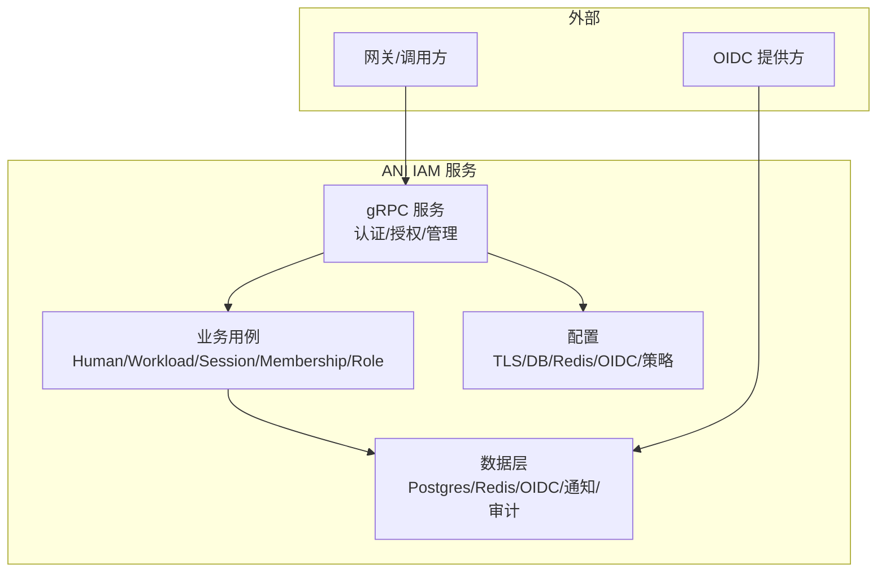
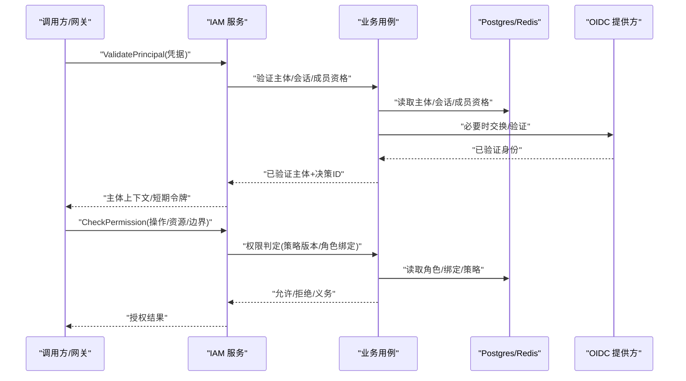
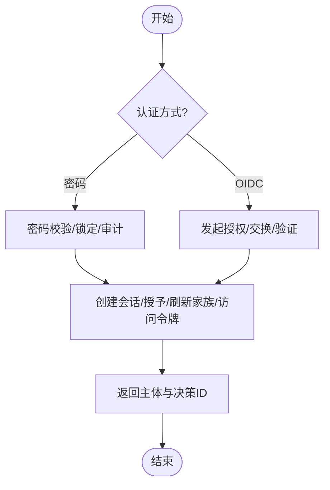
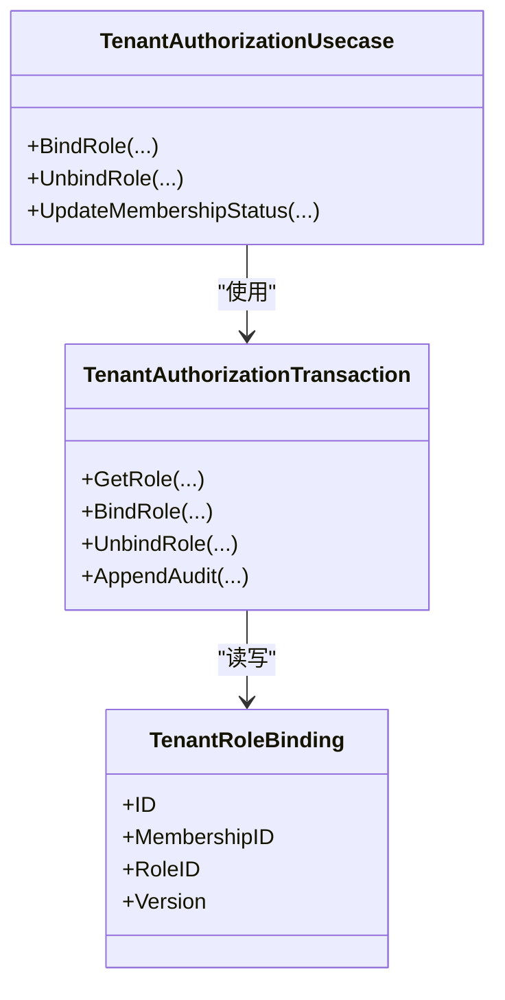
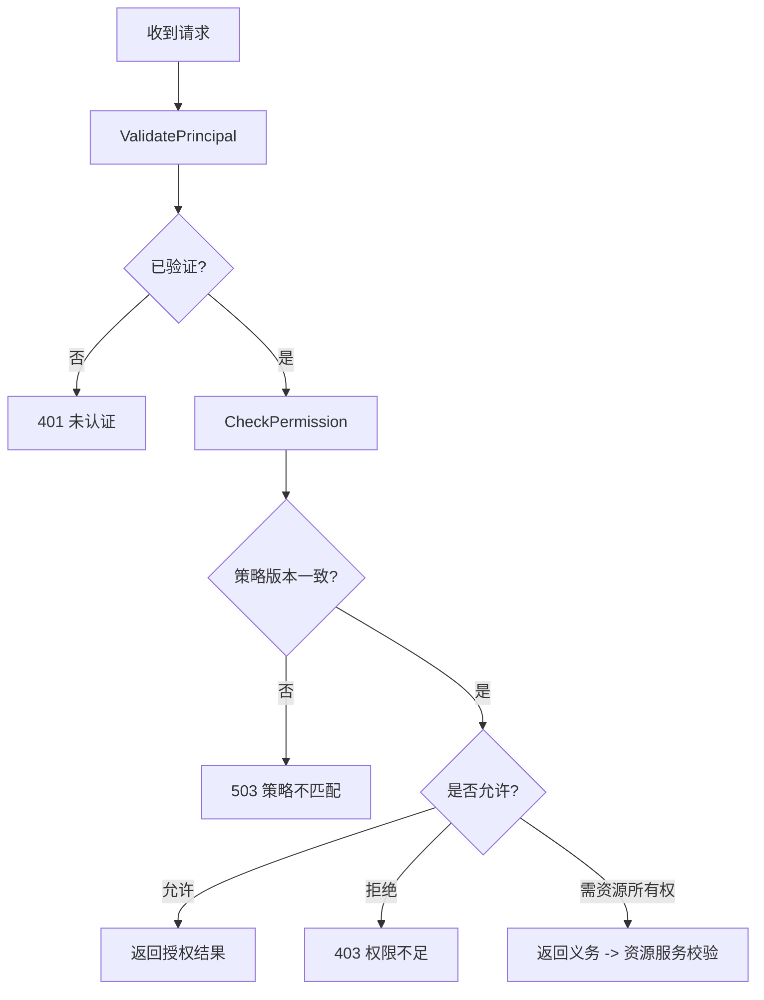
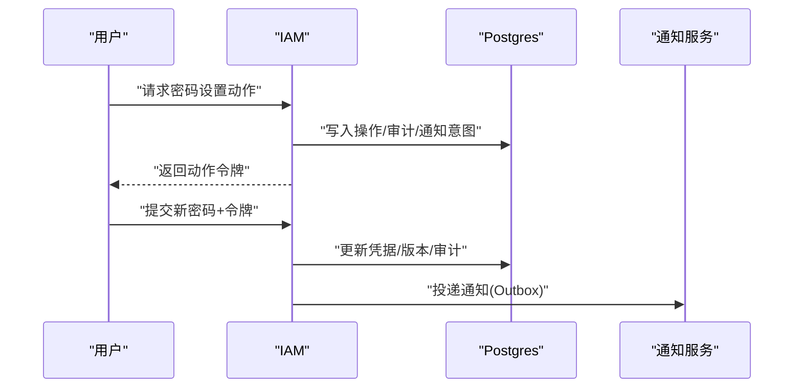
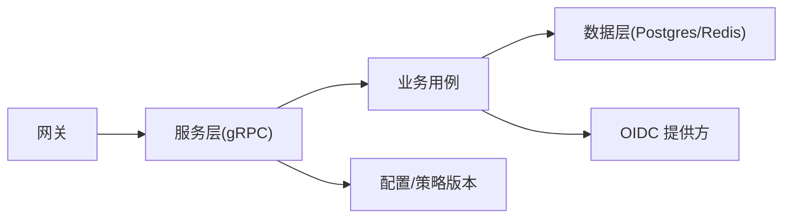

# 项目概述

<cite>
**本文引用的文件**
- [README.md](file://README.md)
- [api/README.md](file://api/README.md)
- [cmd/server/main.go](file://cmd/server/main.go)
- [configs/config.yaml](file://configs/config.yaml)
- [internal/biz/biz.go](file://internal/biz/biz.go)
- [internal/service/service.go](file://internal/service/service.go)
- [internal/server/server.go](file://internal/server/server.go)
- [internal/service/authentication.go](file://internal/service/authentication.go)
- [internal/biz/tenant_authorization.go](file://internal/biz/tenant_authorization.go)
- [internal/data/tenant_authorization.go](file://internal/data/tenant_authorization.go)
- [internal/biz/oidc.go](file://internal/biz/oidc.go)
- [internal/biz/password_action.go](file://internal/biz/password_action.go)
- [internal/conf/conf.pb.go](file://internal/conf/conf.pb.go)
- [api/iam/v1/contract.pb.go](file://api/iam/v1/contract.pb.go)
- [docs/adr/0002-separate-tenant-lifecycle-from-iam-access.md](file://docs/adr/0002-separate-tenant-lifecycle-from-iam-access.md)
- [docs/adr/0016-use-one-generated-authorization-gate-at-the-gateway.md](file://docs/adr/0016-use-one-generated-authorization-gate-at-the-gateway.md)
</cite>

## 目录
1. [简介](#简介)
2. [项目结构](#项目结构)
3. [核心组件](#核心组件)
4. [架构总览](#架构总览)
5. [详细组件分析](#详细组件分析)
6. [依赖关系分析](#依赖关系分析)
7. [性能与可用性考虑](#性能与可用性考虑)
8. [故障排查指南](#故障排查指南)
9. [结论](#结论)
10. [附录](#附录)

## 简介
ANI IAM 是一个独立的身份与访问控制服务，负责 Human/Workload 主体管理、凭据管理、会话管理、成员资格管理、角色与绑定以及权限判定。IAM 与 Governance 职责分离：Governance 拥有租户业务与生命周期，资源服务保留自身资源状态、执行逻辑与幂等性；IAM 仅基于权威的生命周期状态进行访问控制决策，不写入生命周期状态。

本仓库提供公开 gRPC 契约、服务端实现、配置与部署模板、迁移脚本、测试与工具链，面向独立服务集成与联合验收。

**章节来源**
- [README.md:1-13](file://README.md#L1-L13)

## 项目结构
项目采用分层与领域切面组织：
- api：公开的 gRPC 契约与生成代码（无服务器实现与存储依赖）
- cmd/server：进程入口、命令行子命令、运行时日志与配置加载
- internal：
  - biz：框架无关的业务实体、用例与端口定义
  - service：传输到用例的映射层（gRPC 服务实现）
  - server：Kratos gRPC 与内部 admin 传输构建
  - data：持久化、缓存、OIDC、通知、审计、令牌编解码等实现
  - conf：配置结构与校验
- configs：运行配置（TLS、Postgres、Redis、OIDC、策略版本等）
- migrations：数据库迁移脚本
- deploy：容器镜像与部署模板
- tests：单元、集成与合同测试
- sdk：工作负载调用 SDK

**图表来源**
- [cmd/server/main.go:34-101](file://cmd/server/main.go#L34-L101)
- [internal/service/service.go:1-4](file://internal/service/service.go#L1-L4)
- [internal/biz/biz.go:1-4](file://internal/biz/biz.go#L1-L4)
- [internal/data/postgres.go:1-200](file://internal/data/postgres.go#L1-L200)
- [configs/config.yaml:1-61](file://configs/config.yaml#L1-L61)

**章节来源**
- [cmd/server/main.go:34-101](file://cmd/server/main.go#L34-L101)
- [configs/config.yaml:1-61](file://configs/config.yaml#L1-L61)
- [api/README.md:1-8](file://api/README.md#L1-L8)

## 核心组件
- 主体与凭据
  - Human/Workload 主体类型与状态由业务模型定义，支持密码与 OIDC 等多种认证方式，并维护凭据版本与审计事件。
- 会话与授权授予
  - 会话包含 Grant、Refresh Token Family、Access Token 签发与续期，支持设备名、空闲/绝对过期与重认证时间戳。
- 成员资格与角色绑定
  - 租户级成员资格、角色与绑定变更通过事务与乐观锁保证一致性，审计事件记录目标版本。
- 权限判定与策略
  - 使用生成的操作注册表与策略版本进行严格匹配；策略不一致或操作未注册时失败关闭。
- 通知与出站消息
  - 密码设置、邀请等通过 Outbox 与通知服务异步投递，具备加密与重试能力。

**章节来源**
- [internal/biz/tenant_authorization.go:40-201](file://internal/biz/tenant_authorization.go#L40-L201)
- [internal/biz/oidc.go:45-160](file://internal/biz/oidc.go#L45-L160)
- [internal/biz/password_action.go:15-114](file://internal/biz/password_action.go#L15-L114)
- [api/iam/v1/contract.pb.go:1494-1575](file://api/iam/v1/contract.pb.go#L1494-L1575)

## 架构总览
IAM 作为独立服务暴露认证与授权接口，网关统一进行鉴权门控，业务服务保持独立状态与执行逻辑。

**图表来源**
- [internal/service/authentication.go:91-106](file://internal/service/authentication.go#L91-L106)
- [internal/biz/oidc.go:100-160](file://internal/biz/oidc.go#L100-L160)
- [internal/data/tenant_authorization.go:338-360](file://internal/data/tenant_authorization.go#L338-L360)
- [docs/adr/0016-use-one-generated-authorization-gate-at-the-gateway.md:1-24](file://docs/adr/0016-use-one-generated-authorization-gate-at-the-gateway.md#L1-L24)

## 详细组件分析

### 认证与会话（人类与工作负载）
- 支持密码与 OIDC 登录流程，创建 Session、Grant、Refresh Token Family 与 Access Token。
- 会话携带设备名、空闲/绝对过期、重认证时间戳；刷新令牌家族支持原子轮换与撤销。
- 错误映射将业务异常转换为稳定 gRPC 状态码与原因，便于网关统一处理。

**图表来源**
- [internal/biz/oidc.go:45-160](file://internal/biz/oidc.go#L45-L160)
- [internal/biz/oidc.go:690-716](file://internal/biz/oidc.go#L690-L716)
- [internal/service/authentication.go:549-683](file://internal/service/authentication.go#L549-L683)

**章节来源**
- [internal/biz/oidc.go:45-160](file://internal/biz/oidc.go#L45-L160)
- [internal/biz/oidc.go:690-716](file://internal/biz/oidc.go#L690-L716)
- [internal/service/authentication.go:549-683](file://internal/service/authentication.go#L549-L683)

### 成员资格与角色绑定（租户范围）
- 成员资格、角色与绑定在租户范围内管理，变更需通过事务与乐观锁保护。
- 绑定/解绑会提升成员资格版本并记录审计事件，审计目标指向被操作的绑定版本。
- 管理员变更受平台治理守卫保护，确保关键路径串行化。

**图表来源**
- [internal/biz/tenant_authorization.go:129-201](file://internal/biz/tenant_authorization.go#L129-L201)
- [internal/data/tenant_authorization.go:338-360](file://internal/data/tenant_authorization.go#L338-L360)

**章节来源**
- [internal/biz/tenant_authorization.go:129-201](file://internal/biz/tenant_authorization.go#L129-L201)
- [internal/data/tenant_authorization.go:338-360](file://internal/data/tenant_authorization.go#L338-L360)

### 权限判定与策略版本
- 网关对每个热路径调用 ValidatePrincipal/CheckPermission，带超时与限流。
- 操作注册表与策略版本在启动时校验，不匹配则 503 失败关闭，避免降级为默认允许。
- 当需要资源所有权等 IAM 无法直接读取的信息时，CheckPermission 返回“义务”，由资源服务强制校验。

**图表来源**
- [docs/adr/0016-use-one-generated-authorization-gate-at-the-gateway.md:1-24](file://docs/adr/0016-use-one-generated-authorization-gate-at-the-gateway.md#L1-L24)
- [api/iam/v1/contract.pb.go:1494-1575](file://api/iam/v1/contract.pb.go#L1494-L1575)

**章节来源**
- [docs/adr/0016-use-one-generated-authorization-gate-at-the-gateway.md:1-24](file://docs/adr/0016-use-one-generated-authorization-gate-at-the-gateway.md#L1-L24)
- [api/iam/v1/contract.pb.go:1494-1575](file://api/iam/v1/contract.pb.go#L1494-L1575)

### 密码设置动作与通知
- 密码设置动作以短时效令牌驱动，请求阶段对未知账户仅存摘要，已知账户在同一事务中写入通知意图。
- 完成阶段更新凭据哈希与版本，并记录审计事件；通知通过 Outbox 异步投递。

**图表来源**
- [internal/biz/password_action.go:15-114](file://internal/biz/password_action.go#L15-L114)
- [internal/biz/password_action.go:167-199](file://internal/biz/password_action.go#L167-L199)

**章节来源**
- [internal/biz/password_action.go:15-114](file://internal/biz/password_action.go#L15-L114)
- [internal/biz/password_action.go:167-199](file://internal/biz/password_action.go#L167-L199)

### 配置与运行时
- 服务监听 gRPC 与 admin 端口，启用 TLS 与客户端 CA 校验。
- 运行时配置包括 Postgres、Redis、OIDC、访问令牌密钥、通知服务地址与策略版本。
- 进程入口支持多种初始化子命令（如安装工作负载注册表、预置首管理员等）。

**章节来源**
- [configs/config.yaml:1-61](file://configs/config.yaml#L1-L61)
- [cmd/server/main.go:34-101](file://cmd/server/main.go#L34-L101)
- [internal/conf/conf.pb.go:964-988](file://internal/conf/conf.pb.go#L964-L988)

## 依赖关系分析
- 传输层（service/server）依赖业务用例（biz），业务用例依赖数据层（data）与外部系统（OIDC、通知）。
- 配置通过 Kratos 加载，策略版本与操作注册表在启动时校验，避免运行时漂移。
- 网关作为唯一授权入口，IAM 不对外暴露公共路由，内部监听通过网络策略与白名单保护。

**图表来源**
- [internal/service/service.go:1-4](file://internal/service/service.go#L1-L4)
- [internal/biz/biz.go:1-4](file://internal/biz/biz.go#L1-L4)
- [configs/config.yaml:1-61](file://configs/config.yaml#L1-L61)
- [docs/adr/0016-use-one-generated-authorization-gate-at-the-gateway.md:1-24](file://docs/adr/0016-use-one-generated-authorization-gate-at-the-gateway.md#L1-L24)

**章节来源**
- [internal/service/service.go:1-4](file://internal/service/service.go#L1-L4)
- [internal/biz/biz.go:1-4](file://internal/biz/biz.go#L1-L4)
- [configs/config.yaml:1-61](file://configs/config.yaml#L1-L61)
- [docs/adr/0016-use-one-generated-authorization-gate-at-the-gateway.md:1-24](file://docs/adr/0016-use-one-generated-authorization-gate-at-the-gateway.md#L1-L24)

## 性能与可用性考虑
- 网关对认证/授权调用设置 500ms 超时，避免级联雪崩。
- 策略版本与操作注册表在启动时校验，不匹配即失败关闭，防止降级风险。
- 会话刷新令牌家族支持原子轮换，减少并发冲突与撤销成本。
- 通知与审计通过 Outbox 异步处理，降低主路径延迟。

[本节为通用指导，无需特定文件引用]

## 故障排查指南
- 常见错误映射
  - 未认证：凭证无效或依赖不可用
  - 权限不足：成员资格/主体/租户访问处于非活动状态
  - 策略不匹配：策略版本与网关不一致
  - 操作未注册：操作未在注册表中登记
  - 资源不存在：成员资格、角色、绑定、审计事件等
- 定位建议
  - 检查网关策略版本与服务端 policy_revision 是否一致
  - 确认 OIDC 提供商可达性与回调地址
  - 查看审计事件与 Outbox 状态，确认通知是否投递成功
  - 核对 Redis 限流与登录次数限制是否触发

**章节来源**
- [internal/service/authentication.go:549-683](file://internal/service/authentication.go#L549-L683)
- [docs/adr/0016-use-one-generated-authorization-gate-at-the-gateway.md:1-24](file://docs/adr/0016-use-one-generated-authorization-gate-at-the-gateway.md#L1-L24)

## 结论
ANI IAM 通过清晰的职责分离与严格的策略版本控制，实现了独立且可演进的权限体系。IAM 专注身份与会话、成员资格与权限判定，Governance 负责租户生命周期，资源服务保持独立状态与执行逻辑。配合网关单一授权门控、失败关闭策略与审计追踪，系统在安全性、可观测性与可维护性方面具备良好基础。

[本节为总结性内容，无需特定文件引用]

## 附录
- 技术选型理由
  - gRPC：强类型契约、跨语言、易于生成客户端与文档
  - Kratos：模块化服务框架，便于配置、日志与可观测性集成
  - Postgres：事务与行级并发控制，适合复杂权限与审计
  - Redis：高吞吐计数与限流，支撑登录限制与 API Key 使用聚合
  - OIDC/Dex：标准化身份源，支持浏览器与后端流程
- 微服务优势
  - 职责清晰、演进独立、可单独扩容与发布
  - 通过网关统一安全边界，降低各服务安全实现复杂度
- 安全设计原则
  - 最小权限、失败关闭、策略版本一致、审计可追溯
  - 会话与令牌短效、家族轮换、明确边界与受众
  - 资源所有权由资源服务强制校验，IAM 不持有业务数据

[本节为概念性内容，无需特定文件引用]