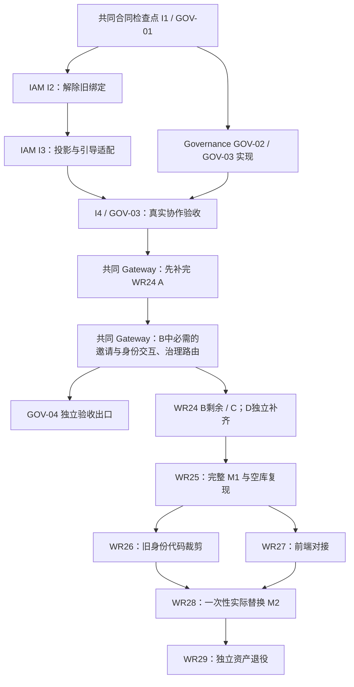

# IAM 与 Governance 并行实施及 WR24 恢复计划

日期：2026-09-16。状态：计划已落盘，产品实施未启动；本次未恢复 WR24、变更事项状态、提交推送或操作运行现场。事项状态仍只由 [ticket-plan][tickets] 与对应事项维护，本文不建立第二套 tracker。

执行更新：随后用户 Goal 已授权 I1～I4，当前由 [WR33](../../.scratch/ani-iam-workload-refoundation/issues/33-integrate-governance.md)唯一领取；WR24 已保存完整 checkpoint 并释放领取，等待 WR33。本文下方“本轮只规划”是原计划交付时点记录，当前产品结果以 WR33 及其 [HANDOFF](../../.scratch/ani-iam-workload-refoundation/evidence/iam-governance-transition/HANDOFF.md)为准；不据执行启动推定任何联合门禁通过。

## 1. 结论与目标

**先共同冻结一份目标合同，IAM 与 Governance 分别实现；真实协作链汇合后，恢复 WR24 并共同完成 GOV-04 所需 Gateway 接线，再补齐完整 M1。** IAM 不等待 Governance 全部实现后才动工，Governance 也不需要兼容旧 Core 的协议才能启动。

采用用户已明确的方向：只有一个目标协议版本、一个 Tenant 业务 owner，不维护 Core/Governance 双协议、双来源或自动回退。保留现有可靠消息与鉴权机制；替换旧 owner 的协议绑定和环境假设。IAM 保留必要的 TenantLifecycle 投影与身份引导业务，通用鉴权不因服务叫 Core、Governance 或其他名字而分支。

本轮只交付 IAM 项目中的计划及导航修订。下文 I1–I4 是待实施工作包，不是已经领取或完成的事项，不自动授权部署、发布、切流、删除或兄弟仓库写入。既有发布授权及其待固定范围单列处理，不因本文失效，也不扩大到所有 dirty 内容。

## 2. 已核对的状态与应保留成果

依据 IAM 当前规格、WR24 事项及最新交接、WR25–29 计划，以及 Governance 当前实施计划。应用中的任务 **「阻塞等待ani-governance重构」**（`01a0a4da-1afd-7f70-a2d5-d765c227b61c`）本次查询为 idle；原 Goal 的 blocked 状态来自 WR24 交接。本次未检查历史 Pod/PID/数据库是否仍存活。

| 对象 | 当前事实 | 对本计划的约束 |
| --- | --- | --- |
| WR32 / WR23 | 已 resolved，证明各自冻结候选；WR23 为旧 Core owner 的真实链 | 保留历史证据，不能将其 pass 改称新 Governance 通过 |
| WR24 | 事项仍 `claimed`；A 未完成，B/C 未开始，D 延期且 `not_verified` | 保留全部剩余分母，不恢复旧 Core 接线，不提前 resolved |
| WR24 A 已有成果 | 六项 Human/Session 契约及 Gateway adapter/middleware/handler；交接记录 BOSS、refresh、浏览器负向、依赖故障与审计原子性验证 | 保留候选与证据，按新旧输入差异决定定向重验，不从零重做，也不自动继承所有 pass |
| WR24 A 剩余 | Console 真 Tenant 登录全链、Tenant/Cookie/故障/审计与 legacy 观察、适用 409、最终覆盖和聚合门禁 | 等待真实 Governance 投影及身份引导；不直写表或造 Tenant 让 Console 先通过 |
| WR24 发布 | 最新交接授权先提交推送再等待 Governance；记录尚未提交推送，精确仓库/候选范围待固定 | 与产品接线分开；先形成可独立消费的精确发布集合，不能直接推送整个工作树 |
| Governance | GOV-00 骨架已交付；GOV-01～03 为首个可运行交付，GOV-04 为第二个；业务能力尚未实现 | 合同检查点先行；第一交付通过正式服务 API 验证，不等 Gateway 完成 |
| WR25～29 | WR25/26/27 为 needs-triage；WR28/29 为 needs-info | 保留 M1、代码裁剪、前端、实际切换、资产退役的不同边界 |

WR24 [HANDOFF][handoff] / [CHECKPOINT][checkpoint] 顶部最新指令已覆盖正文中历史的“补齐旧 Core 接线后继续”步骤。后者只供追溯，不是恢复命令。详细剩余分母见 [WR24][wr24]、[A 合同][a-contract] 与 [Envoy 延期记录][envoy]。

当前默认 IAM 工作树 HEAD 是 `6e9688bb002d1916bc894fd281ba1974f57b7eaa`，但包含大量既有未提交内容；这不是可以仅靠 checkout HEAD 复原的完整候选。实施 I1 时需核对以下来源的差异，形成完整新快照：

- IAM WR23 候选：`/home/chabking/workspace/ani-iam-wr23-resume-20260913T201049Z-9a57a8c9`，来源见 [WR23 交接][wr23-handoff] 与相邻 `final-candidate.json`。
- WR24 ANI 本地源码镜像：`/home/chabking/workspace/ANI-wr24-fedora-20260915T113643Z`；Fedora 工作目录：`/home/chabking/workspace/ani-iam-runs/wr24-fedora-20260915T113643Z/ANI`，相关 `source-iam` 与 `candidates` 以该轮 manifest 为准。
- WR24 集群交接目录：`ani-test-1:/home/ubuntu/workspace/ani-iam-runs/wr24-k8s-20260915T113643Z`，namespace 为 `wr24-20260915-113643`。路径仅标识既有现场，不授权复用或清理。

本地 WR24 镜像 `repo/go.work` 仍将 IAM `api`、`sdk`、`workloadregistry` 指向 `../../candidates/iam/...`。该事实已按源码核对；脱离任务目录的依赖消费验证尚未完成，不能把这些路径原样作为 main 的交付结果。

## 3. 目标架构与边界

| 模块/合同 | 权威归属 | 对方如何消费 |
| --- | --- | --- |
| Tenant 身份、业务资料、生命周期、Lifecycle/heartbeat 与 Snapshot | Governance | IAM 通过固定公开合同获取事实并保存投影；不跨库读取，不调用旧 Core 回退 |
| Human/Workload、凭据、Access/Membership/Role、Session、身份引导与处理结果 | IAM | Governance 通过 IAM 正式合同提交可靠引导意图、查询结果引用；不创建身份表或自己建立成员关系 |
| Snapshot 消费、投影一致性、gap/新鲜度与重建 | IAM 的 TenantLifecycle 领域模块 | 明确的 source adapter 负责 DTO 转换，领域逻辑不感知 Core/Governance 服务名 |
| mTLS、WAT、target registry、Binding/Grant、receiver 校验 | 既有 IAM/SDK 安全机制 | owner 声明权限，生成受审核注册；每个服务有独立身份和最小 Grant，不新增服务名特例 |
| 公网 REST、Cookie/CSRF/Origin、回调和必要聚合 | Gateway | 治理行为进入 Governance，登录与身份管理进入 IAM；不持有两个服务的数据库事务 |
| 真实资源及其操作、状态、provider、幂等和恢复 | 各资源 owner | 消费 Tenant/Principal 及授权结论，不将资源执行状态移入 IAM |

**单一目标合同不等于所有交互强行采用同一种传输。** 本计划沿用已经接受的 NATS 可靠异步协作及 REST Snapshot + mTLS/WAT；更换的是 owner、目标注册和领域 wire 合同，不增加旧版兼容端点或双 decoder。若未来另行决定替换传输，也只能整体替换唯一目标，不能偷偷多养一套协议。

协议文件只有一个权威来源：Governance 拥有 Lifecycle/heartbeat/Snapshot 定义；IAM 拥有身份引导的接收语义、结果及查询合同。若引导通过 Governance outbox 投递，Governance 引用 IAM 的固定公开定义，不复制 schema。两仓通过一份组合 manifest 关联各自合同摘要，不为“共同合同”另造一个同时存放两套 DTO 的服务或大一统 SDK。

Snapshot 只重建 Tenant 生命周期事实，不能顺带创建 Membership、Role 或首管理员。首管理员沿用已接受的邀请、独立邮箱验证/密码激活和独立接受 Invitation 的流程；账号激活不等于建立 Membership。治理创建不要求管理员密码、套餐或 Quota 就绪。Quota 属于 Governance 后续治理职责，不塞入本次首期接线，也不让 IAM 接管它。

## 4. 工作包与并行顺序

建议将 I1–I4 纳入一个范围明确的 **IAM Governance 接入前置事项**，以有界检查点顺序交付；正式编号在执行准备时按 tracker 分配，不在本文虚构已领取的新票。这个前置事项完成后再恢复 WR24。每仓有各自实现者；一个 IAM 实现线和一个 Governance 实现线可以并行。

图中箭头是验收/交付依赖，不要求所有局部测试等到上游总体验收结束。WR24 B/C 的只读清点和 harness 整理可以提前；产品执行仍受当前暂停和唯一领取规则约束。WR26/27 图上独立也不改变 IAM 单事项领取规则。

### I1：冻结可独立实施的合同和输入

与 GOV-01 同一个检查点对齐，退出条件是双方拿到固定制品即可编写各自实现，不是等待其中一方服务先上线。

1. 固定 Tenant ID、Lifecycle 状态及版本、producer epoch/序列与 heartbeat/watermark、时间与新鲜度、幂等键、冲突/重复/乱序/gap/重试/终止语义。冻结禁用、冻结、解冻的实际授权效果；不隐含资源停机或删除。
2. 固定 Snapshot Begin/Page 路径、operation、audience、请求响应、分页与 cursor 的 reader/权限绑定、有效期、一致性截点和增量衔接。不沿用旧 `ani-core-control` 或 `core.snapshot.*` 作为新 owner 的别名；具体新值由 Governance 权威合同生成，不能由调用者随意传入来扩大权限。
3. 固定 Bootstrap 请求、receipt/operation/结果查询、等待与成功的区别、身份验证与邀请接受流程。Lifecycle 与 Bootstrap 分开建模和授权；冻结 IAM 接收/worker/replay 各阶段的当前权限复核。
4. 固定 NATS subject/revision/可信 producer 映射、独立 NKey 与精确 ACL、IAM 消费身份、publish/receive/execute Grant，以及 Snapshot caller/receiver 的 Binding、WAT 和当前权限检查。注册是可调用的目标定义，不自行授予权限。
5. 输出按 owner 分工的合同制品、必要生成产物、权限注册、无秘密的配置 schema、测试向量与逐场景验收矩阵。把生成器版本、合同摘要、候选文件清单/模式/摘要和来源 commit 一并写入组合 manifest；不可只记录 HEAD 或 latest。
6. 确定制品消费方式：未发布候选可以是可校验的不可变归档；正式发布需可获取的固定 module 版本。先核对 WR24 发布 payload 和当前已发布事实，不为解决依赖把四仓全部未提交内容合并推送。
7. 同步 IAM 当前 spec/decisions/capability-matrix、必要 ADR 与当前事项中的目标 owner/验收映射；保留 WR23 及历史证据原文。Governance 当前计划由其实现方同步引用同一 manifest。旧规则的安全不变量保留，旧 Core 作为当前 Tenant owner 的指令退出。

I1 不重新发明 Principal、OIDC、Session 或授权模型，不建设任意协议插件框架。只冻结有实际消费者的接口；尚未用到的通用扩展不成为交付前置。

### I2：解除旧绑定和测试环境限制

以下是已定位的有限修改面，实施前依据完整候选确认路径与依赖闭包，不以文件名全仓搜索替换作为验收：

| 已有绑定 | 目标处理 | 保留的不变量 |
| --- | --- | --- |
| `internal/data/core_snapshot_http.go` 固定旧 audience/operation/path | 替换为唯一目标合同的 Snapshot 客户端，由 composition 注入受校验的目标/endpoint；删除活跃旧分支 | 真实 mTLS/WAT、精确目标注册、reader/cursor 约束与撤权 |
| `cmd/server/core_lifecycle.go` 的 Snapshot/IAM 地址局限于 loopback | 按部署配置与 TLS 身份校验支持任务内 VM/K8s 服务地址 | 不是放开任意 URL、跳过证书或依赖 Host/header 宣称身份 |
| `internal/data/notification_grpc_client.go` 的 loopback 假设 | 支持固定 Notification 部署目标，复用既有 SDK | Notification 独立身份与最小权限，不新造邮件实现 |
| `internal/data/core_nats.go` 的 `_WR23...consumer` inbox 命名及固定部署参数 | 改为经校验的任务/部署配置；确实影响部署的参数按 profile 固定 | 精确 ACL、持久消费、ACK/重投/DLQ、一致性和来源约束不降级；不在本次承诺 HA |
| `core_broker.go` / `core_lifecycle` 的 owner 命名、路由和 DTO 绑定 | 活跃领域边界改为 TenantLifecycle/Bootstrap，并消费权威合同；精确 subject 集合可保留 | 不做任意主题的无类型消息总线，不为每个 owner 增加一种鉴权模式 |

WR32 解决了同步 Workload 可注册接入；Snapshot 绑定是在后续 WR23 的 HTTP 协作中形成。本次按具体依赖修正，不把所有有服务名的 wrapper 当作安全缺陷。仅转发现有 registry 的 Notification/Inference 等 wrapper，如不阻碍本目标，留待相称的命名整理，不扩大成第二次 IAM 全量重构。

退出条件：目标构建不需要旧 Core lifecycle/Snapshot 合同或运行端点；只有一个领域解码/恢复路径；新增 owner 不需要修改通用 IAM/SDK 的服务名分支。必要数据库迁移、配置、生成产物与既有消费者定向回归齐全。

### I3：IAM 投影和引导实现，可与 Governance 并行

在 I1 固定的合同下，IAM 实现并验证自己的持久接收、TenantLifecycle 投影、版本/gap/新鲜度、Snapshot 重建与增量衔接，以及 Bootstrap worker/邀请/结果查询。通用授权、领域恢复、传输解码各有明确模块边界；不要把状态机拆散到大量配置回调中。

- 在真实 IAM 数据库验证幂等、原子审计、并发与 crash/restart。Tenant-owned 关系保持 `tenant_id`、Tenant 谓词及保租户复合约束；跨租户读取/写入/外键越界必须失败。
- 局部测试可以消费固定协议向量或明确标注的测试替身；只记局部 pass。Governance 正式 producer、Snapshot 服务及正式创建到首管理员链保持 `not_verified`，不能用 fixture 冒充权威 owner。
- 验证未经注册/未授权目标、错误 audience/operation、错误 producer/reader、Grant/Binding 撤销、签名或凭据无效、依赖不可用时的拒绝与恢复；不能为连通性降级安全机制。
- 固定 API/SDK/registry 的可消费制品；在脱离 WR23/WR24 任务目录的干净消费目录验证依赖解析。内部试验 overlay 与可发布内容分别列明，不能带临时路径交付。

同时 Governance 实现 GOV-02 的 Tenant/operation/audit/outbox 原子事务，以及 GOV-03 的 producer、Lifecycle/heartbeat、Snapshot 权威服务和 IAM 调用。两仓仅消费对方公开合同，不互相写入对方业务目录或引用 `internal`。

### I4：与 GOV-03 共用的真实协作验收

固定 Governance + IAM + 必要 Notification/身份基础设施的完整版本组合，在新的隔离运行空间验证以下必需链。同一份联合证据可以映射到双方相应验收格，不能把一个格的成功提升为两个项目全部完成。

| 验收面 | 必需证据 |
| --- | --- |
| 正式开通 | 经授权的 Governance API → Tenant/operation/audit/outbox 同事务 → 真实 NATS → IAM durable receipt/worker → 正式查询；重试与响应丢失不重复创建 Tenant/关系 |
| 身份引导 | 真实 Notification/SMTP、邀请、独立邮箱验证与激活、独立接受邀请、首管理员 Membership/Access；等待验证和通知接受不能记为已就绪 |
| 生命周期 | 冻结/解冻/禁用的目标语义，IAM 投影版本与新鲜度，适用授权入口真实拒绝/恢复；不能只检查数据库行或 HTTP 200 |
| 恢复 | 重复、乱序、gap、heartbeat 中断、Snapshot 一致性截点、分页 reader 绑定、全量重建+增量衔接、DLQ、crash/restart 与依赖故障 |
| 当前权限 | producer 归因、NKey/ACL、receipt/worker/replay 权限复核、mTLS/WAT、目标和 reader 错配、跨租户拒绝、撤权后的拒绝与合法恢复 |
| 运行与证据 | worker 真正就绪/健康/退出、不可变输入、真实调用和业务结果、恢复记录；日志不暴露凭据或通知 token |

观察与强制启用门禁在 I1 明列。现行未被修订的基准仍包含连续 24h；WR23 专属的 ≥12.5h/≥3000 采样/重建后 ≥30min 不能自动继承给新组合。没有新范围的明确修订时按原基准计划；若获修订，保留原项 `not_verified` 和批准范围。10s heartbeat、30s stale、p99≤5s、无未解释 gap/授权差异及相关真实执行端拒绝/恢复仍保留。允许在观察期间推进独立文档或实现工作，不得缩短实际观察或用合成时间冒充。

已有 Envoy/Session 的定向生命周期回归可以用于 I4 的启用门禁，不等于 WR24 D 的完整程序入口接线验收。所有新组合联合结果在执行前均为 `not_verified`。

## 5. WR24 如何暂停、发布与恢复

### 唯一领取和源码保留

本次只写计划，WR24 继续 `claimed`，产品执行仍暂停；不同时领取一个新的 IAM 实施事项。正式启动前置事项时，按 [issue-tracker][tracker] 先给 WR24 保存完整 checkpoint，再释放领取、登记前置依赖，并只领取新的 IAM 前置事项。WR24 按实际准备程度使用既有单值状态；依赖未完成时不得进入 frontier。不得自造 `paused` 状态、使用复合状态或把暂停当 resolved。

checkpoint 必须覆盖完整未提交源文件及模式/摘要、各仓 provenance、A 已验/待验、B/C/D 分母、发布阻塞、资源 UID/配置摘要/恢复入口。状态调整只改变领取与依赖，不删除历史 claim、runner 失败或证据。执行时先核对依赖图无环，保留 WR25 → WR24 等现有关系。

### 发布作为独立交付门禁

尊重“先提交推送相关代码，再等待 Governance”的既有指令。恢复前核对它后来是否已执行；未执行则先固定相关代码的精确仓库/路径/依赖版本。若上下文仍不足以确定四仓还是仅 ANI，准备好可评审清单和可独立消费结果后，只澄清这个发布范围，不重新请求已经给出的笼统发布授权。

不能为了先发布就恢复 Core 接线，不能把 WR24 发布与 Governance 切流混为一件事，也不能原样发布 `../../candidates/iam/...`。可公开获取的固定版本、干净目录依赖消费验证和对应定向回归是发布制品门禁；未发布但已冻结的源码归档可以支持隔离并行开发，不冒充 main 已可用。

### 一个共同 Gateway 工作包

I4 / GOV-03 通过后，恢复 WR24，并与 GOV-04 使用 **同一 Gateway 候选、同一写入方、同一浏览器合同**。内部先补完 A 的 Console 与剩余门禁，再推进 B 中 GOV-04 必需的邀请/激活等身份交互及治理路由；GOV-04 完成不是启动 B 的前置。建议延续 WR24 的 ANI 写入方负责合入，Governance 方提供 owner 契约、配套清单与验收用例。

- WR24 负责复用并补齐 Human/Session、身份管理 adapter/middleware、浏览器入口及通用安全回归。
- GOV-04 增量接入 Governance 创建/查询/生命周期及引导状态展示；验证平台管理员开通 → 首管理员邀请/接受 → Gateway 登录 → 冻结拒绝/解冻恢复。
- 既有六项 A 契约和 Cookie/CSRF/Origin/回调不能再实现一份。重叠场景引用同一固定组合证据；Governance 通过 GOV-04 不代表 WR24 B/C/D 或 M1 通过。
- 在 A→B→C 顺序下，GOV-04 到达自己的验收出口后，继续 WR24 B 剩余与 C；不将 B 提前到 A 未完成时执行，也不等待完整 B/C/D 才交付 GOV-04。C 中旧 Core Tenant 协作对象映射为 Governance；其余必需 Session Gateway/Inference/资源 owner 逐 hop 验收不删除。
- D Envoy 保留独立工作范围、版本组合和完整分母；未完成或未获最终范围修订时，WR24/WR25 均不能整体完成。

## 6. 后续 IAM 路线保持哪些门槛

| 后续事项 | 经过本次调整后的职责 | 前置/退出 |
| --- | --- | --- |
| [WR25][wr25] | 对最终固定 IAM/Governance/Gateway/必需 owner 组合做 C01–C14 汇总和独立空库复现，形成 M1 | 完整 WR24，包括 D；局部 Gov 协作和历史 WR23 均不能替代 |
| [WR26][wr26] | M1 后裁剪 Core/Auth 旧身份 writer 和失效接线；按目标 owner 区分删除/保留/改写 | 不操作运行数据库、凭据或流量；不机械删除 Core 的所有业务资产，也不把 Tenant 搬入 IAM |
| [WR27][wr27] | M1 后接入 Console/BOSS 页面和真实前端行为 | 与 WR26 无功能上的先后依赖；Gateway 接口通过不代表页面已完成 |
| [WR28][wr28] | WR26/27 汇合后，针对精确环境停止旧 writer、新库初始化、一次性消费者切换和 M2 | 分别固定批准范围、关键验证和失败处理；不做双写/旧协议回退，不覆盖启用后的新数据 |
| [WR29][wr29] | M2 后独立退役旧数据、凭据和运行资产 | 精确消费者、保留/恢复条件和动作确认；不是 M1/M2 的隐含前置 |

能力矩阵 C09 的当前 owner 改为 Governance，既有 Lifecycle/Bootstrap/恢复/真实执行门禁保留。旧 Core 的 Quota 实现不作为新首期创建 Tenant 的前置，后续治理 Quota 能力另外实施。C01–C14 的密码/OIDC、Session、身份管理、安全审计、API Key、S2S、通知、租户隔离、重试恢复、调用方和安装复现不能因此删减。

本次 I2 的有限旧绑定替换与 WR26 的全面旧身份代码裁剪不同；为目标服务可运行而必需的适配在 M1 前做，全仓清理和实际环境替换仍按后续事项执行。

## 7. 写入范围、远端运行与并行预算

| 工作方 | 写入责任 | 边界 |
| --- | --- | --- |
| IAM 实现线 | IAM 公开 Bootstrap 合同、Snapshot 消费与领域投影、配置/生成产物/迁移/注册、IAM 定向测试与文档 | 精确 Allowed paths 在新事项冻结；不把本计划当作整个 IAM 任意改写许可 |
| Governance 实现线 | Governance 公开 Lifecycle/Snapshot 合同、Tenant 持久化/outbox/producer、测试与文档 | 可读固定 IAM 公开输入；IAM 配套修改全部交给 IAM 线，撤销此前由 Gov 任务顺带修改数个 IAM 文件的做法 |
| 共同 Gateway 工作包 | 固定 ANI/Gateway 依赖闭包及正式入口用例 | 一个写入方，不在 WR24 与 GOV-04 两个工作树各写一套相同 adapter |

本机仅做必要源码/文档阅读、编辑及 SSH 传输。格式化、生成、编译、测试、运行服务/容器、证据计算与验证全部放在 `ssh fedora`；真实 K8s 验证通过 `ssh ani-test-1`～`ssh ani-test-3`。先只读核对入口是否属于同一集群及实际容量，再选择固定 context/namespace。历史 Ubuntu 主机不作为替代运行环境。

两仓代码可以并行，重型运行共享预算和锁，不能各自声称独占同一台 VM。参考 WR24 已有上限：总 CPU 4、总 RAM 8192 MiB、可用内存下限 4096 MiB、任务磁盘占用预算 60 GiB（实际剩余容量另核对），Go 单进程 `GOMAXPROCS=2`、`-p=2`、`GOMEMLIMIT=1536MiB`，一次最多一个重型阶段；实施前按实际占用重新固定，不能叠加成两倍。长时观察计入持续负载；其他生成/测试必须服从剩余预算。

每次运行使用新任务目录、隔离 DB/role、NATS account/subject/consumer、身份/Grant、namespace 与端口，记录 UID/所有权。不覆盖 WR23/WR24 的目录、PVC、数据库、凭据或现存服务；不重跑旧成功 runner、重复 bootstrap 或重建旧身份。旧现场的存活/配置只读核对，任务收尾只清理明确列入本次清单且获准的资源。

## 8. 完成、停止与交接

每个工作包交接：目标与实际修改范围、不可变组合 manifest、命令/退出码/场景证据、`pass`/`fail`/`not_verified`、局部替身与真实链的区别、未完成分母、资源与恢复状态。历史通过只在输入等价或相称重验后引用，失败证据保持可追溯。

I1 完成即可两仓并行实现；I2/I3 局部通过不宣称联合链完成；I4 完成成为 GOV-03 与 WR24 恢复输入；共同 Gateway 工作包内部按 A→B 推进并分别验收 GOV-04 与 WR24 对应子集；完整 WR24 后才进入 WR25。不存在一个“Gov 对接成功”就自动解除所有后续门槛的总开关。

出现新身份/授权语义、合同歧义导致双方实现不一致、基线冲突、需修改未列 owner、只能靠兼容回退或降低安全才能通过、资源隔离/预算无法满足时，保存证据并暂停受影响分支，继续不依赖它的有界工作。切流、删除、凭据失效、既有数据库重建按精确目标另外处理；不能以计划完成代替执行授权。

本次计划文档的完成只代表评估和写入，不代表上述任何产品验收已经运行或通过。

## 9. 当前依据

- [IAM 规格][spec]、[事项图][tickets]、[能力矩阵][matrix]、[决定表][decisions]、[API 授权声明规范][auth-contract]。
- [WR24 事项][wr24]、[最新 HANDOFF][handoff]、[CHECKPOINT][checkpoint]、[A 合同][a-contract]、[Envoy 延期记录][envoy]。
- [WR23 候选交接][wr23-handoff]、[Broker/Snapshot 接受记录][broker]、[Lifecycle/Bootstrap ADR][lifecycle-adr]；这些材料中旧 owner 的实现与 pass 是历史，不是新 Governance 的完成证明。
- [Governance 首期规格][gov-spec]、[实施计划][gov-plan]、[执行状态][gov-status]。本文件位于 IAM，未修改 Governance 仓库的计划或实现状态。

[spec]: ../../.scratch/ani-iam-workload-refoundation/spec.md
[tickets]: ../../.scratch/ani-iam-workload-refoundation/ticket-plan.md
[matrix]: ../../.scratch/ani-iam-workload-refoundation/capability-matrix.md
[decisions]: ../../.scratch/ani-iam-workload-refoundation/decisions.md
[tracker]: ../agents/issue-tracker.md
[auth-contract]: ../api-authorization-contract.md
[wr24]: ../../.scratch/ani-iam-workload-refoundation/issues/24-verify-backend-callers.md
[wr25]: ../../.scratch/ani-iam-workload-refoundation/issues/25-accept-isolated-api-replacement.md
[wr26]: ../../.scratch/ani-iam-workload-refoundation/issues/26-trim-legacy-identity-code.md
[wr27]: ../../.scratch/ani-iam-workload-refoundation/issues/27-integrate-console-boss.md
[wr28]: ../../.scratch/ani-iam-workload-refoundation/issues/28-complete-system-replacement.md
[wr29]: ../../.scratch/ani-iam-workload-refoundation/issues/29-retire-legacy-assets.md
[handoff]: ../../.scratch/ani-iam-workload-refoundation/evidence/24-verify-backend-callers/wr24-fedora-20260915T113643Z/HANDOFF.md
[checkpoint]: ../../.scratch/ani-iam-workload-refoundation/evidence/24-verify-backend-callers/wr24-fedora-20260915T113643Z/CHECKPOINT.md
[a-contract]: ../../.scratch/ani-iam-workload-refoundation/evidence/24-verify-backend-callers/wr24-fedora-20260915T113643Z/A-contract.md
[envoy]: ../../.scratch/ani-iam-workload-refoundation/evidence/24-verify-backend-callers/wr24-fedora-20260915T113643Z/ENVOY-DEFERRED.md
[wr23-handoff]: ../../.scratch/ani-iam-workload-refoundation/evidence/23-integrate-core-lifecycle-bootstrap/wr23-resume-20260913T201049Z-9a57a8c9/HANDOFF.md
[broker]: ../../.scratch/ani-iam-workload-refoundation/evidence/23-integrate-core-lifecycle-bootstrap/broker-snapshot-accepted.md
[lifecycle-adr]: ../adr/0004-coordinate-tenant-lifecycle-and-iam-asynchronously.md
[gov-spec]: ../../../ani-governance/docs/specs/tenant-iam-first-slice.md
[gov-plan]: ../../../ani-governance/docs/plans/implementation.md
[gov-status]: ../../../ani-governance/docs/execution/status.md
